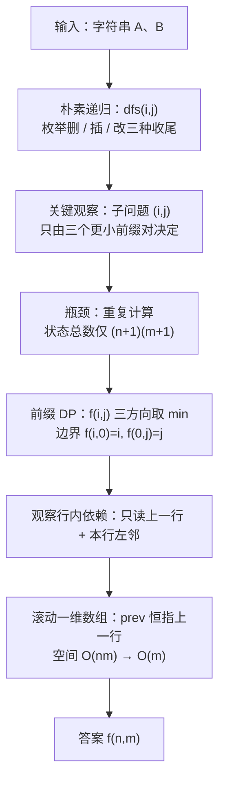

[[TOC]]

## 形式化题目

给定字符串 $A$ 与 $B$，每次可以对 $A$ 执行三种操作之一：

1. 删除一个字符；
2. 插入一个字符；
3. 把一个字符改成另一个字符。

求把 $A$ 变成 $B$ 所需的最少操作次数（即编辑距离）。

样例：$A = \texttt{sfdqxbw}$，$B = \texttt{gfdgw}$，答案为 $4$。

## 正解

### 思路

**从朴素想法说起。** 递归地看：设 $f(i,j)$ 表示"$A$ 的前 $i$ 个字符变成 $B$ 的前 $j$ 个字符"的最少操作数，每次枚举三种收尾——删掉 $A$ 的末字符、往 $A$ 末尾插 $B$ 的末字符、把 $A$ 末字符对上 $B$ 末字符（相同则零代价，不同则改写花 1 代价）。这样搜索是指数级的，但子问题 $(i,j)$ 只由三个更小的前缀对决定，与"怎么走到这里"无关——**瓶颈是重复计算，而不是状态太多**。状态总数只有 $(n+1)(m+1) \leqslant 2001^2$，把结果记下来从小到大递推，就是 DP：

$$f(i,j) = \begin{cases} f(i-1,j-1), & a_i = b_j \\ 1 + \min\big(f(i-1,j),\, f(i,j-1),\, f(i-1,j-1)\big), & a_i \neq b_j \end{cases}$$

三个转移方向恰好一一对应三种操作：$f(i-1,j)$ 是**删掉** $a_i$，$f(i,j-1)$ 是**插入** $b_j$，$f(i-1,j-1)$ 是把 $a_i$ **改写**成 $b_j$（字符相同时代价为 0，直接对上）。边界是 $f(i,0)=i$（全删光）和 $f(0,j)=j$（全插进来）。

**用样例过一遍 DP 表。** 下表行是 $A=$ `sfdqxbw` 的前缀（含空前缀 $\varnothing$），列是 $B=$ `gfdgw` 的前缀，格子里是 $f(i,j)$：

| $A \backslash B$ | $\varnothing$ | g | f | d | g | w |
| --- | --- | --- | --- | --- | --- | --- |
| $\varnothing$ | 0 | 1 | 2 | 3 | 4 | 5 |
| s | 1 | 1 | 2 | 3 | 4 | 5 |
| f | 2 | 2 | **1** | 2 | 3 | 4 |
| d | 3 | 3 | 2 | **1** | 2 | 3 |
| q | 4 | 4 | 3 | 2 | **2** | 3 |
| x | 5 | 5 | 4 | 3 | 3 | **3** |
| b | 6 | 6 | 5 | 4 | 4 | 4 |
| w | 7 | 7 | 6 | 5 | 5 | **4** |

看三处转移：`f` 行与 $B$ 的第 2 个字符 $b_2=$ `f` 相同，所以 $f(2,2)=f(1,1)=1$（对角线零代价，加粗）；`q` 行与 $b_4=$ `g` 不同，$f(4,4)=1+\min\big(f(3,4),f(4,3),f(3,3)\big)=1+\min(2,2,1)=2$（三个方向里左上角最小，取改写）；末行 `w` 与 $b_5=$ `w` 相同，$f(7,5)=f(6,4)=4$ 沿对角线滑到右下角，即样例答案。沿表格从右下角回溯一条代价和为 4 的路径，可得具体方案：把 `s` 改成 `g`、删掉 `q`、删掉 `x`、把 `b` 改成 `g`，即 `sfdqxbw` → `gfdqxbw` → `gfdxbw` → `gfdbw` → `gfdgw`，恰好 4 步。

**压缩成一行。** 逐行观察依赖：算第 $i$ 行时只读到第 $i-1$ 行（上方、左上）和本行左边一格。于是二维表可以滚动成两行，再进一步压成**一行**：行内从左往右算，更新前 `prev[j]` 还是上一行的值（对应删除），`prev[j-1]` 是还没被覆盖的左上角（对应改写），`cur[j-1]` 是本行刚算出的左边（对应插入）。这正是 `main.py` 的写法——`prev` 恒指"上一行"，空间从 $O(nm)$ 降到 $O(m)$。

### 代码

@include-code(./main.py, python)

### 复杂度

- 时间复杂度：$O(nm)$，两层循环扫满前缀网格，$n,m \leqslant 2000$ 时至多约 $4 \times 10^6$ 次转移；实测最慢单点（1000 × 1000）0.079 s（限制 1000 ms）。
- 空间复杂度：$O(m)$，滚动两行各 $m+1$ 个整数；实测峰值 14.7 MB（限制 128 MB，其中约 14 MB 是 Python 解释器基础开销）。

## 总结

- 编辑距离是"**末位三选一**"的前缀 DP：删、插、替换分别对应 $f(i-1,j)$、$f(i,j-1)$、$f(i-1,j-1)$ 三个相邻状态，相同字符时对角线转移零代价。
- 暴力递归的瓶颈是重复计算而非状态规模——$(n+1)(m+1)$ 个前缀对存下来递推即可，这就是从朴素搜索到 DP 的全部推导。
- 行内从左往右更新时，"上一行的值还没被覆盖"这一性质让二维表能压成一行，空间 $O(nm) \to O(m)$；边界 `range(m+1)` 与行首 `i` 分别是全插、全删。
- 输入用 `read().split()` 取前两个 token，天然兼容 CRLF 行尾和末行无换行。

## 图示解析

这张图串起本题从"朴素搜索"到"一行 DP"的主线：

顺着箭头看：每个节点都是对上一个节点瓶颈的回答——搜索慢是因为重复计算，重复计算用 DP 表消除，DP 表的行内依赖只涉及两行所以可以滚动。图中不放具体数值，样例的逐格推演以上面的 DP 表为准。
