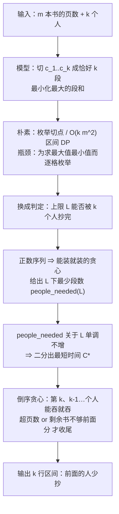

[[TOC]]

## 形式化题目

给定一个正整数序列 $a_1, a_2, \dots, a_m$（第 $i$ 本书的页数）和人数 $k \leqslant m$，选择一个划分

$$0 = c_0 < c_1 < \dots < c_k = m,$$

把第 $i$ 个人分到第 $c_{i-1}+1$ 到第 $c_i$ 本书。要求：

1. 最小化**复制时间** $C = \max_i \big(\mathrm{pre}[c_i] - \mathrm{pre}[c_{i-1}]\big)$（$\mathrm{pre}$ 是页数前缀和），也就是"抄得最多的人"的页数；
2. 在 $C$ 取到最小值的前提下，使前面的人尽量少抄，即字典序最小化 $(load_1, load_2, \dots, load_{k-1})$。

样例：$m = 9$，$k = 3$，页数为 $1,2,\dots,9$，最优复制时间是 $17$，对应划分 `1 5 / 6 7 / 8 9`（三段分别 $15, 13, 17$ 页）。

## 正解

### 思路

**朴素做法想清楚瓶颈。** 划分由 $k-1$ 个切点决定，直接枚举是 $\binom{m-1}{k-1}$ 种，$m = 500$ 时完全不可行。换成 DP 是标准做法：设 $f(i,j)$ 为"前 $j$ 本书分给前 $i$ 个人"的最短复制时间，枚举第 $i$ 个人从第 $t+1$ 本抄起：

$$f(i,j) = \min_{i-1 \leqslant t < j} \max\big(f(i-1,t),\ \mathrm{pre}[j]-\mathrm{pre}[t]\big)$$

答案就是 $f(k,m)$。这个式子没错——本题目所在目录的 `std.cpp` 就是这么写的——但它是 $O(km^2)$：$m = 500$ 时约 $6 \times 10^7$ 次内层运算，C++ 勉强能过，Python 非常吃紧。更关键的是，它没有用到"页数是正数"这个结构性事实。

**换个问法：判定"复制时间能不能不超过 $L$"。** 目标函数是 $\min \max$ 的形状——最大值最小。这类问题通常先把它翻译成一个判定问题：**给定上限 $L$，能不能用 $k$ 个人抄完？**

判定比最优化简单得多：从头往右扫，每人手里能装就装，装不下才换人。这样得到的段数就是在上限 $L$ 下**最少**需要的人数 `people_needed(L)`。判定只需要数段数，**完全不需要决定切在哪**——这正是它能绕开 $km^2$ DP 的原因。

**判定关于 $L$ 单调，所以能二分。** 上限放宽时，原来的抄法依然合法，所以 `people_needed(L)` 只会变小或不变。于是"最少人数 $\leqslant k$"这个条件一旦成立就不会再变回不成立，可以对 $L$ 二分，取最小的可行值就是答案 $C^*$：

- 下界 $\max\big(\max_i a_i,\ \lceil \mathrm{pre}[m]/k \rceil\big)$：至少要放得下最厚的那本书，也不能低于人均页数；
- 上界 $\mathrm{pre}[m]$：一个人全抄完，必然可行。

**为什么 $L = C^*$ 一定能切成正好 $k$ 段？** 二分只保证段数 $\leqslant k$：$C^*$ 下贪心可能只用 $t < k$ 段。但 $m \geqslant k > t$，$t$ 段里必有一段长度 $\geqslant 2$；把它从中劈开，两段的和都**小于**原段和 $\leqslant C^*$。反复劈就能补到 $k$ 段。所以"每人恰好一段"不会把 $C^*$ 顶高，人手也一定够分。

**重建方案：从后往前贪心。** 题目还要求"多解时让前面的人少抄"。总量固定，前面少抄就是后面多抄，所以从最后一本往前扫，让第 $k$ 个人能吞就吞，把页数尽量推给后面。两个必须收尾的条件缺一不可：

- `used + pages[i] > limit`：再吞这本书就超过 $C^*$，这一段的复制时间会变长；
- `i < person - 1`：位置 $0..i$ 只剩 $i+1$ 本书，而前面还有 `person-1` 个人，必须每人至少一本。

用样例 $1,2,\dots,9$、$k=3$、$C^*=17$ 走一遍倒序扫描（`limit = 17`）：

| 扫到的书 $i$ | 页数 | 当前的人 | 累计页数 | 动作 |
| --- | --- | --- | --- | --- |
| 9 | 9 | 3 | 9 | 继续吞 |
| 8 | 8 | 3 | 17 | 继续吞（正好装满 17） |
| 7 | 7 | 2 | 7 | $17+7 > 17$，第 3 人收尾为 `8 9` |
| 6 | 6 | 2 | 13 | 继续吞 |
| 5 | 5 | 1 | 5 | $13+5 > 17$，第 2 人收尾为 `6 7` |
| 4 | 4 | 1 | 9 | 继续吞 |
| 3 | 3 | 1 | 12 | 继续吞 |
| 2 | 2 | 1 | 14 | 继续吞 |
| 1 | 1 | 1 | 15 | 继续吞，最后第 1 人收尾为 `1 5` |

读者可以重点看第 3 和 5 行（扫到第 7 本、第 5 本时）：收尾都发生在"再加一本就超过 17"的那一刻，这就是"后面的人尽量多抄"的含义；而最后一行第 1 个人的 `1 5` 只有 15 页，是把余量全留给了前面的人。

为什么这样贪心就是"前面的人少抄"？把题目那句话严格化：在所有使复制时间等于 $C^*$ 的 $k$ 段划分中，让 $load_1$ 尽可能小，再在此基础上让 $load_2$ 尽可能小……因为页数为正、前缀和严格递增，这等价于让切点向量 $(q_1, \dots, q_{k-1})$ 字典序最小。

**贪心的最后一个切点已经是所有合法方案里最小的。** 任何一个合法的 $k$ 段划分都同时满足"末段和 $\leqslant C^*$"和"$q_{k-1} \geqslant k-1$"（前 $k-1$ 个人每人至少一本）。倒序扫描停在满足前者中最小的位置，`i < person - 1` 那条保护又把它抬到不低于 $k-1$，所以贪心的 $q_{k-1}$ 就是这两个约束下的最小值——没有更靠左的可能。

**字典序最小的方案也只能在这里切。** 设 $O$ 是字典序最小的合法划分，且 $O_{k-1} > q_{k-1}$：

- 若 $O_{k-2} < q_{k-1}$，把书 $q_{k-1}+1 \ldots O_{k-1}$ 挪给第 $k$ 个人。第 $k$ 个人拿到后缀 $q_{k-1}+1..m$，和 $\leqslant C^*$；前 $k-2$ 位切点不变，第 $k-1$ 位变小——得到一个字典序更小的合法方案。
- 若 $O_{k-2} \geqslant q_{k-1}$，把 $O$ 的前 $k-2$ 段（恰好覆盖前缀 $1..O_{k-2}$，而 $O_{k-2} \geqslant k-1 > k-2$）中某个长度 $\geqslant 2$ 的段劈成两段：劈出的两段和都严格小于原段和 $\leqslant C^*$，人数就从 $k-2$ 补成 $k-1$，写出的切点向量前 $k-2$ 位里有一位变小，同样比 $O$ 字典序更小。

两种情形都与 $O$ 的最小性矛盾，所以 $O_{k-1} = q_{k-1}$。接下来对前缀 $1..q_{k-1}$ 上的"$k-1$ 个人"重复同样的论证——贪心在继续扫描时用的判定条件（超限 + `i < person - 1`）完全一样，所以它对这个前缀做的事正是同一个子问题的贪心——逐个人从后往前固定切点，两个方案完全重合。

作为对照，同一组样例用区间 DP 算出的 $f(i,j)$ 如下表（行是人数 $i$，列是前 $j$ 本书，格子是 $f(i,j)$）：

| 人数 \ 前 $j$ 本 | 1 | 2 | 3 | 4 | 5 | 6 | 7 | 8 | 9 |
| --- | --- | --- | --- | --- | --- | --- | --- | --- | --- |
| $i=1$ | 1 | 3 | 6 | 10 | 15 | 21 | 28 | 36 | 45 |
| $i=2$ | — | 2 | 3 | 6 | 9 | 11 | 15 | 21 | 24 |
| $i=3$ | — | — | 3 | 4 | 6 | 9 | 11 | 15 | **17** |

网格里填不了 $j < i$ 的格子（人比书多，题面保证 $k \leqslant m$，用 `—` 占位）。右下角 $f(3,9) = 17$ 就是 $C^*$，与二分得到的结果一致；两者在全部 10 组测试数据和 400 组随机数据上都相同。这个表同时说明了为什么 DP 慢：它逐格枚举 $t$，而二分只需要在每层扫描一遍数段数。

### 代码

@include-code(./main.py, python)

### 复杂度

- 求 $C^*$：判定一次 $O(m)$，在 $[\max a_i, \mathrm{pre}[m]]$ 上二分，共 $O(\log \mathrm{pre}[m])$ 次，合计 $O(m \log \mathrm{pre}[m])$。
- 重建方案：一次倒序扫描 $O(m)$，输出 $O(k)$。
- 总时间复杂度 $O(m \log \mathrm{pre}[m] + k)$，空间复杂度 $O(m + k)$。

$m \leqslant 500$ 时主流程约 $1.2 \times 10^4$ 次基本运算；实测单测例 0.016–0.018 s、峰值内存 14.7 MB（限制 1000 ms / 128 MB）。作为对比，$O(km^2)$ 的区间 DP 在 $m = 500$ 时要 $6 \times 10^7$ 次内层比较。

## 总结

- 本题是"**最小化最大段和**"的 min-max 划分：答案的判定形式（"上限 $L$ 够不够 $k$ 个人抄完"）比最优化形式好算得多，因为判定只需数段数、不必决定切点。
- 页数为正 $\Rightarrow$ 段和随段变长严格增大 $\Rightarrow$ 贪心得到最少段数，且这个段数关于 $L$ 单调不增，于是可以二分出 $C^*$。这把 $O(km^2)$ 降到 $O(m \log \mathrm{pre}[m])$。
- 有了 $C^*$ 后，"前面的人少抄"等价于"后面的人多抄"，所以**倒序贪心**：每人能吞就吞，遇到超上限、或剩余书不够前面的人分，就收尾换人。这就是字典序最小的负载分配。
- 两个收尾条件缺一不可：只判超页数会让前面有人无书可抄；只判人手会让复制时间变长。
- `books5.in` 是 $m = k = 0$ 的空输入，代码在 `m == 0` 时直接返回，不输出任何行。

## 图示解析

这张图串起本题从建模到输出方案的主线：

顺着箭头看，每个节点都是对上一个节点瓶颈的回答：枚举太慢，所以换问法；判定之所以快，是因为它只数段数；数段数之所以能二分，是因为页数为正带来的单调性；而拿到 $C^*$ 之后，方案必须从后往前重建，才能满足"前面的人少抄"这条附加要求。图中不写具体数值，样例的逐本推演以上面的倒序扫描表为准。
