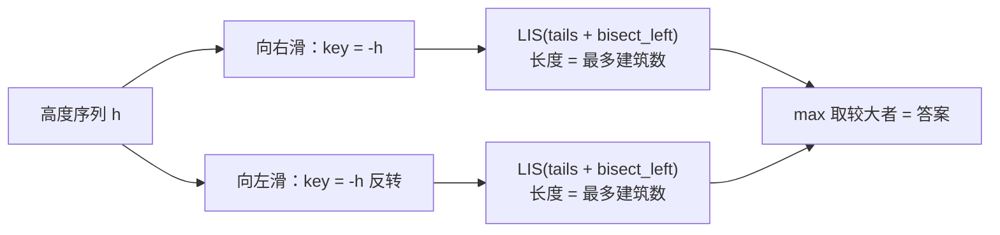

[[TOC]]

## 形式化题目

给定长度 $N$ 的互异高度序列 $h_1, h_2, \dots, h_N$（建筑排成一条线，$h_i$ 是第 $i$ 幢的高度）。一次滑翔要选一组下标

$$i_1,\ i_2,\ \dots,\ i_k \qquad \text{存在方向}\ d \in \{+1, -1\}: \quad d \cdot (i_{t+1} - i_t) > 0 \ \text{且}\ h_{i_{t+1}} < h_{i_t}$$

也就是说：起点 $i_1$ 任选，方向一经选定不能改变，每一步都必须飞向**更低**的建筑（中途可以跳过中间建筑）。求所有起点、两个方向下最大的 $k$。

于是答案等于下面两个量中的较大者：

$$R = \text{下标递增、高度递减的最长子序列长度},\qquad L = \text{下标递减、高度递减的最长子序列长度}$$

题面样例给出三组答案 $6$、$6$、$9$：其中第三组的高度序列 $2,1,3,4,5,6,7,8,9,10$ 靠向左滑取得 9，说明"起点任选 + 方向任选"两者缺一不可。

## 正解

### 思路

**先写最直白的做法。** 只看向右滑，设 $f_i$ 表示"必须停在建筑 $i$ 时最多经过的建筑数"：

$$f_i = 1 + \max\{\, f_j \mid j < i,\ h_j > h_i \,\}$$

每个 $i$ 回头扫一遍前缀找合法前驱，答案取 $\max_i f_i$；把 $h$ 反转再算一遍就覆盖向左滑。这是 $O(N^2)$ 的朴素 DP，在本题 $N < 100$ 的数据上完全能过——但它暴露了一个清晰的结构问题：**每一步都在同一个前缀里重复查询"高度 $> h_i$ 的那些 $j$ 里 $f_j$ 的最大值"**，而"高度"与"$f$"的关系从未被组织起来。

**换一个状态视角：按长度归类。** 不再追问"以哪个下标结尾"，而是维护

> $tails[L]$ := 当前已扫描前缀中，所有长度为 $L$ 的上升子序列里**最小的那个结尾值**。

只保留最小结尾不会丢答案：若同长度有两个结尾 $x < y$，任何能接在 $y$ 后面的元素必然也能接在 $x$ 后面，所以 $y$ 没有任何额外价值。进一步地，$tails$ **天生严格递增**——取一条长度为 $L{+}1$、结尾恰为 $tails[L{+}1]$ 的上升子序列，去掉末元素得到一条长度 $L$ 的上升子序列，记其结尾为 $x$；由严格上升有 $x < tails[L{+}1]$，由最小性有 $tails[L] \leqslant x$，串联得 $tails[L] < tails[L{+}1]$。既然有序，"一个值该顶替哪一层"就能二分。

**两个必要的翻译。**

1. 题目要"下降"，标准 LIS 处理"上升"。令 $key_i = -h_i$，则 $h_j > h_i \iff key_j < key_i$，"下标递增、高度递减"就变成 $key$ 上的严格上升子序列。
2. 向左滑不必另写代码：把序列反转，向左滑就变成反转序列上的向右滑。

于是每个方向的答案就是 `len(tails)`，而 `len(tails)` 本身就记录了全局最长长度——不必像朴素 DP 那样再维护一个 `best` 变量。每个新值 $key$ 只有两种动作：

| 二分位置 | 含义 | 动作 |
| :--- | :--- | :--- |
| $p = \text{len}(tails)$ | $key$ 比所有层的结尾都大，能接在最长的上升子序列后面 | **追加** `tails.append(key)`，长度 $+1$ |
| 否则 | $key$ 顶替第 $p{+}1$ 层；由 $tails[p-1] < key \leqslant tails[p]$ 保证替换后仍严格递增 | **替换** `tails[p] = key`，长度不变、结尾更小 |

用样例 1 的高度序列 $300, 207, 155, 299, 298, 170, 158, 65$ 走一遍向右滑（表内 $tails$ 已换回高度显示，方便对照；实际存的是相反数）：

| 扫描的 $h_i$ | $key_i$ | 二分位置 $p$ | 动作 | 动作后的 $tails$（长度 $L$ 的最小结尾） |
| :---: | :---: | :---: | :---: | :--- |
| 300 | $-300$ | 0 | 追加 | $[300]$ |
| 207 | $-207$ | 1 | 追加 | $[300, 207]$ |
| 155 | $-155$ | 2 | 追加 | $[300, 207, 155]$ |
| 299 | $-299$ | 1 | 替换 | $[300, 299, 155]$ |
| 298 | $-298$ | 2 | 替换 | $[300, 299, 298]$ |
| 170 | $-170$ | 3 | 追加 | $[300, 299, 298, 170]$ |
| 158 | $-158$ | 4 | 追加 | $[300, 299, 298, 170, 158]$ |
| 65 | $-65$ | 5 | 追加 | $[300, 299, 298, 170, 158, 65]$ |

观察重点有三处。其一，$tails$ 每一行都**严格递减**（实际存的是相反数，对应 $key$ 上严格递增），这正是能二分的前提。其二，`299`、`298` 这两步**没有让长度增加**，看似“白做”，其实把同长度的结尾压低了，后面的 170、158、65 才有地方追加——替换动作是整张表的关键。其三，结束时的 `len(tails) = 6` 就是答案；表里这一列最终恰好也等于最优滑翔路线，但这是本次追踪的巧合（每次新值都走了“追加”分支），一般情况下 $tails$ 只是各长度的最小结尾，不保证本身是原序列的子序列。

同一组数据向左滑只能得到 2（下标 4 的 $299$ 飞向下标 2 的 $207$，共 2 幢），两个方向取较大值 $6$，与题面样例一致。

严格性的细节藏在 `bisect_left` 的语义里：当某个值与 $tails[p]$ 相等时，二分落回 $p$ 并原地替换、**不追加**，等值元素永远不会被接成更长的序列。本题保证高度互不相同，但这条性质让实现即使拿到含重复值的数据，给出的仍是"严格下降"的正确答案。

### 代码

`lis_length` 承载 `tails` 不变式与两种动作，`best_glide` 负责两个方向与取较大值，`solve` 只做多组数据的读入切分与输出。

@include-code(./main.py, python)

### 复杂度

- 时间复杂度：$O(K \cdot N \log N)$——每组数据两个方向各扫一遍序列，每个元素一次 `bisect_left`（$O(\log N)$）加 $O(1)$ 的追加或替换。相比朴素 DP 的 $O(K \cdot N^2)$，省掉的正是"每步回头扫描整个前缀"。真实数据（$K \le 10$、$N \le 98$）单点约 0.016 s。
- 空间复杂度：$O(N)$——高度序列、两份取负后的 key 序列、以及长度至多 $N$ 的 `tails`；没有二维 DP 表。实测峰值约 14.7 MB，远低于 128 MB。

## 总结

本题的解法路线是"**翻译 + 换状态**"。翻译：方向不能改，所以两条路线互不相干，左右各算一次；高度只能下降，取负之后就是标准的最长上升子序列，"向左滑"则等价于把序列反转。换状态：把 LIS 的状态从"以哪个下标结尾"改成"每个长度保留最小结尾"后，$tails$ 自动严格递增，查询退化为一次二分，$O(N^2)$ 变成 $O(N \log N)$。落地时要注意 `bisect_left` 同时承担了两条语义——定位层号，以及严格上升时"等值只能替换不能追加"。实测 10 个评测点全部与标准答案一致，相对 1000 ms / 128 MB 的限制十分宽裕。

## 图示解析

下图概括从题面到答案的计算路线，说明"两个方向"是并列的两条独立分支，最后才合并。

观察重点：取负与反转都发生在进入 LIS 之前，两条分支此后用的是同一段代码逻辑（`lis_length`），只是喂进去的序列不同；LIS 内部每个元素只做一次二分，返回的 `len(tails)` 就是该方向的答案。
