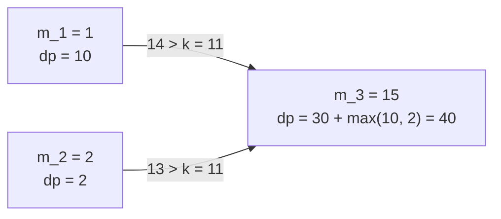
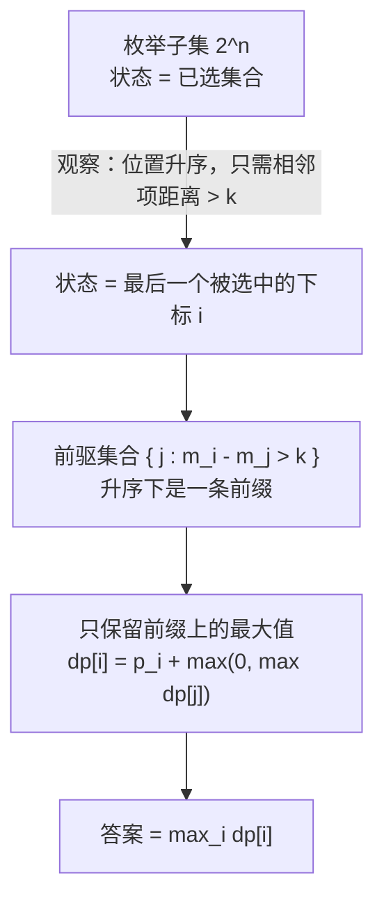

[[TOC]]

## 形式化题目

给定升序整数序列 $m_1 < m_2 < \dots < m_n$（地点位置）与权值 $p_1, \dots, p_n$
（在 $m_i$ 开店的利润），以及限制 $k > 0$。求下标子集 $S$ 的最大 $\sum_{i \in S} p_i$，
使得对任意两个不同的 $i, j \in S$ 都有

$$|m_i - m_j| > k.$$

## 正解

### 思路

**先看朴素做法。** 每个地点只有「开」和「不开」两种状态，最直接的做法是枚举所有
$2^n$ 个子集，逐个检查任意两家店的间距是否都大于 $k$，取利润和最大。`n` 可以到 99，
$2^{99}$ 根本无法枚举；而且这些子集之间大量前缀完全重复——比如「已经在 $m_1$ 开了店」
这件事，会在后续 $2^{n-1}$ 个子集里被反复检查。真正的瓶颈是：

> 朴素做法把「已选了哪些地点」当作状态，而约束其实并不需要知道整个已选集合。

**约束只跟相邻的两个被选项有关。** 位置已经升序排列。设被选中的地点按位置依次是
$i_1 < i_2 < \dots < i_t$，那么「任意两家距离大于 $k$」等价于「每一对相邻的两家距离
大于 $k$」，因为不相邻的两家位置差只会更大：

$$m_{i_{s+1}} - m_{i_s} > k \quad (s = 1, \dots, t-1) \iff |m_i - m_j| > k \ \ (\forall i \ne j \in S).$$

**于是状态可以压成一维。** 换个视角，按位置从小到大依次决定每家店开不开，并强制当前
这家店 `i` 成为方案中最后一家店。这样只需要知道「上一家开在哪」，就能判断 `i` 能不能接上去：

- 若 `i` 前面一家都不开，收益就是 $p_i$；
- 若 `i` 接在 `j` 后面，要求 $m_i - m_j > k$，收益是 $dp[j] + p_i$。

定义 $dp[i]$ 为「以第 $i$ 个地点作为最后一家店时的最大利润」，则有转移

$$
dp[i] = p_i + \max\Bigl(0,\ \max_{j < i,\ m_i - m_j > k} dp[j]\Bigr).
$$

这个式子为什么不会丢解？设某个以 `i` 收尾的最优方案倒数第二家是 `j`，把它去掉后剩下的
部分一定是以 `j` 收尾的**最优**方案：否则换成一个利润更高的、以 `j` 收尾的合法方案，
前半段内部依然合法、`j` 到 `i` 的距离没变，就得到了以 `i` 收尾的更优方案，矛盾。

**答案取 $\max_i dp[i]$ 而不是 $dp[n-1]$。** 题面不要求最后一家店开在最右边，位置最靠后的
那一段可能挤在一起、谁都接不上，所以要在所有收尾位置里取最大值。

以样例 1 为例，位置 $1, 2, 15$，利润 $10, 2, 30$，$k = 11$。注意合法前驱集合
$\{j : m_i - m_j > k\}$ 在位置升序下是一条**前缀**：

| $i$ | $m_i$ | $p_i$ | 合法前驱 $j$（要求 $m_i - m_j > 11$） | $\max dp[j]$ | $dp[i]$ |
| --- | --- | --- | --- | --- | --- |
| 0 | 1 | 10 | 无 | 0 | 10 |
| 1 | 2 | 2 | 无（$2-1=1 \leqslant 11$） | 0 | 2 |
| 2 | 15 | 30 | $j=0$（$15-1=14>11$）、$j=1$（$15-2=13>11$） | 10 | 40 |

表格每行的含义：格子 `dp[i]` 等于本行利润 $p_i$ 加上前驱列中的最大 $dp$ 值。
$\max_i dp[i] = 40$，与样例输出一致。把同一组数据换成 $k = 16$，第 2 行的合法前驱变成空集
（$14 \leqslant 16$、$13 \leqslant 16$），$dp = [10, 2, 30]$，答案是 $30$，正对应样例 2。

下图画出样例 1 里的前驱关系，箭头方向表示「可以作为前驱」：

观察重点是：两条箭头都指向同一家店 `m_3`，说明转移只需要前驱里的**最大值** `10`，
不需要知道这个最大值来自哪一家；而 `m_1` 与 `m_2` 之间没有箭头，因为 $2 - 1 = 1 \leqslant 11$。

### 代码

@include-code(./main.py, python)

### 复杂度

- 时间复杂度：单组 $O(n^2)$（外层枚举收尾位置 $n$ 次，内层枚举前驱 $i$ 次），
  总计 $O(T \cdot n^2)$，最坏约 $10^7$ 次比较，与题面标准解同阶。
- 空间复杂度：$O(n)$（`dp`、`spots`、`profits` 各一个数组），另加输出缓存的 $O(T)$。

## 总结

本题是**带最小间隔约束的最大权不相交选点**。抓住「位置升序 + 只看相邻项」这个性质后，
指数级的子集状态就能压成「最后一家店开在哪」的一维状态，转移变成在前驱前缀里取最大值。

同样的模型可以推广：把「相邻两项距离大于 $k$」换成任意单调可判定的前驱条件，
只要合法前驱仍随 $i$ 单调右移，就能进一步维护前缀最大值把单组复杂度降到 $O(n)$。

## 图示解析

最后用一张流程图收束整条思路，说明状态是怎么被压缩下来的：

读者应重点观察第二、三步：合法前驱是一条前缀，是把「枚举所有前驱」简化为「取一个最大值」
的关键；如果位置没有升序，这个性质就不成立，转移就必须退化成对全部 $j$ 的检查。
