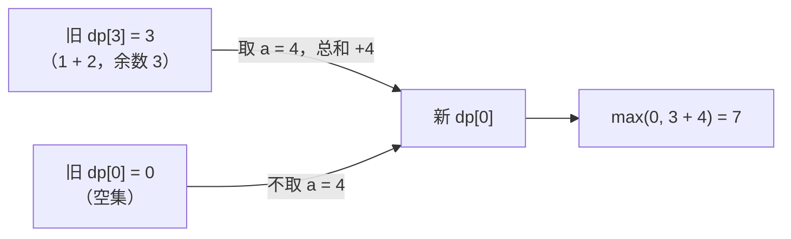

[[TOC]]

## 形式化题目

给定 $N$ 个正整数 $a_1, a_2, \dots, a_N$ 和正整数 $K$，从中选出一个子集 $S \subseteq \{1, 2, \dots, N\}$（每个下标至多选一次，允许空集），最大化

$$\sum_{i \in S} a_i \quad \text{满足} \quad \sum_{i \in S} a_i \equiv 0 \pmod K$$

空集的和为 $0$，总能满足整除条件，所以问题一定有可行解；当只有空集可行时答案为 $0$。

样例：$K = 7$，$a = (1, 2, 3, 4, 5)$。全集和 $1 + 2 + 3 + 4 + 5 = 15 \equiv 1 \pmod 7$，不合要求；去掉 $1$ 后 $2 + 3 + 4 + 5 = 14 = 2 \times 7$，是最大的可行子集，答案为 $14$。

## 正解

### 思路

**一句话本质**：把「已选糖果总数模 $K$ 的余数」当作背包状态，每个余数只保留最大的总和。

**朴素做法与它的规模**。最直接的方法是枚举所有子集，共 $2^N$ 个，$N = 100$ 时约 $1.3 \times 10^{30}$ 种，完全不可行。这条路不是「慢一点」，而是规模上就不可能，因此本题没有值得单独教学的暴力层，直接讲正解。

**一个很容易踩的贪心**。先取走全部糖果，总和记为 $T$。若 $T \bmod K = 0$，答案就是 $T$；否则总得丢掉一些。直觉会想「只丢最小的那一件」，但丢掉 $a$ 之后总和变成 $T - a$，它模 $K$ 的值由 $a$ 决定，只有「恰好存在某件 $a \equiv T \pmod K$」时才成立。真实数据里就有反例：某个测点总和 $36522387 \equiv 63 \pmod{83}$，最小的糖果是 $1993$，而正确答案丢弃的是 $88461 + 25727 = 114188$（这个和恰好 $\equiv 63 \pmod{83}$）。可见必须让余数显式进入状态。

**关键观察**。判断一个子集是否合法，只需要 $\sum_{i \in S} a_i \bmod K$ 这一个量，而它只有 $K$ 种取值。也就是说，$2^N$ 个子集被压进了 $K$ 个等价类；又因为目标就是「总和越大越好」，而「再加一件固定的糖果」是单调的（大的和加上同一个数后仍然更大），所以每个等价类里只需要保留**总和最大**的那一个。状态数于是从 $2^N$ 降到 $N \times K$。

**状态与转移**。设

$$dp[j] = \text{考虑完前面若干件产品后，糖果总数} \bmod K = j \text{ 时的最大总数}$$

初值只允许空集：$dp[0] = 0$，其余 $dp[j] = -\infty$（表示这种余数还凑不出来）。逐件加入糖果 $a$，令 $r = a \bmod K$：

$$dp'[j] = \max\Bigl(\underbrace{dp[j]}_{\text{不取这件}},\ \underbrace{dp[(j - r) \bmod K] + a}_{\text{取这件}}\Bigr)$$

- 不取：余数和总和都不变，继承旧值；
- 取：这件糖果把余数从 $(j - r) \bmod K$ 推到 $j$，总和增加 $a$。来源余数用 `(j - r) % K` 在 $0 \sim K-1$ 内回绕，Python 的 `%` 对正模数总返回非负值，负数下标不用特判。

样例 $K = 7$、$a = (1, 2, 3, 4, 5)$ 的完整过程如下，`−` 表示该余数还不可达：

| 已处理 | $dp[0]$ | $dp[1]$ | $dp[2]$ | $dp[3]$ | $dp[4]$ | $dp[5]$ | $dp[6]$ |
| --- | --- | --- | --- | --- | --- | --- | --- |
| 初始（空集） | 0 | − | − | − | − | − | − |
| $a = 1$（$r = 1$） | 0 | 1 | − | − | − | − | − |
| $a = 2$（$r = 2$） | 0 | 1 | 2 | 3 | − | − | − |
| $a = 3$（$r = 3$） | 0 | 1 | 2 | 3 | 4 | 5 | 6 |
| $a = 4$（$r = 4$） | **7** | 8 | 9 | 10 | 4 | 5 | 6 |
| $a = 5$（$r = 5$） | **14** | 15 | 9 | 10 | 11 | 12 | 13 |

读表时注意三点。第一，每一行都是「上一行整体读完」之后才写出来的：例如处理 $a = 3$ 时，$dp[4]$ 只能由上一行的 $dp[1] = 1$ 加上 $3$ 得到，绝不会用到同一行刚写出的 $dp[1]$，这保证每件糖果至多被取一次（0/1 背包而非完全背包）。第二，一个余数桶里只留下最大值，所以 $dp[3] = 3$ 同时代表子集 $\{3\}$ 与 $\{1,2\}$——值相同就等价，不需要记录是哪个子集。第三，最后一行 $dp[0] = 14$ 由上一行的 $dp[2] = 9$（即 $2+3+4$）加上 $5$ 得到，对应子集 $\{2,3,4,5\}$，与题面答案一致。

「$dp[0]$ 从 $0$ 变成 $7$」这一轮的两条来路可以画成一张示意图：



箭头方向就是余数的方向：取这件糖果时，来源余数 $3$ 经过 $+4$ 回绕到余数 $0$（$(3 + 4) \bmod 7 = 0$）；不取则停在自己的余数上。两条边汇入同一个新状态后取较大值，这就是「一个余数只留最大值」的全部动作。

**为什么这件糖果只能用一次**。代码把整行写成列表推导：

```python
dp = [max(keep, dp[(j - r) % k] + value) for j, keep in enumerate(dp)]
```

右侧读的 `dp` 是这一轮开始前的旧列表，整个列表推导求值完毕后才把结果绑定回 `dp`。若改成按 $j$ 递增的原地 `for` 循环，刚写好的新值可能被同一件糖果再次使用，那就成了「无限件」的完全背包，答案会偏大。

**不可达怎么表示**。用哨兵 `NEG = -(1 << 60)`（约 $-1.15 \times 10^{18}$）。所有合法总和不超过 $100 \times 10^6 = 10^8$，与哨兵相差十个数量级，所以带着它再加一件糖果后依然是负数，不会「侥幸」变成可行解。

**答案与「输出 0」的关系**。最终输出 $dp[0]$。空集保证 $dp[0] \geqslant 0$，而任何可行子集的和都 $\geqslant 0$，所以 $dp[0]$ 天然就是题面要的「最大可行总数；若只有空集可行则为 $0$」，不需要额外的无解判断。

**C++ 对照**。标准写法是二维的 `f[i][j] = max(f[i-1][j], f[i-1][(k + j - a[i] % k) % k] + a[i])`，答案 `f[n][0]`，复杂度同为 $O(NK)$。Python 版把物品维滚动掉、把 $-\infty$ 换成哨兵、把内层循环压进列表推导，状态定义和转移方程一字未改。

### 代码

`best_multiple()` 就是上面的状态定义：`dp[j]` 对应 $dp[j]$，列表推导一行完成「不取 / 取」的取大，返回的 `dp[0]` 即答案；`solve()` 只负责读入与输出。

@include-code(./main.py, python)

### 复杂度

- 时间复杂度：$O(N \cdot K)$。外层 $N \leqslant 100$ 件糖果，内层 $K \leqslant 100$ 个余数各做一次常数运算，最多 $10^4$ 次状态转移，与 C++ 正解同阶；朴素枚举子集是 $O(2^N \cdot N)$，$N = 100$ 时完全不可行。
- 空间复杂度：$O(K)$。滚动数组只保留当前这一行的 $K$ 个值（$K \leqslant 100$），比二维的 $O(NK)$ 少一维。

## 总结

本题是「带同余约束的 0/1 背包」：合法性只取决于总和模 $K$ 的余数，于是把 $2^N$ 个子集按余数压成 $K$ 个桶，每桶只留最大总和，得到 $dp[j] = \max\bigl(dp[j],\ dp[(j - a \bmod K) \bmod K] + a\bigr)$ 与 $O(NK)$ 的复杂度。三个实现要点：列表推导整体读旧表保证 0/1 语义、用远小于总和上界的哨兵表示不可达、直接输出 $dp[0]$ 就同时覆盖了「只有空集可行则输出 0」。样例中 $dp[0]$ 最终为 $14$；真实数据 10 个测点全部一致，单点约 $0.017$ s、峰值内存约 $14.6$ MB，相对 1000 ms / 128 MB 的限制十分宽裕。
