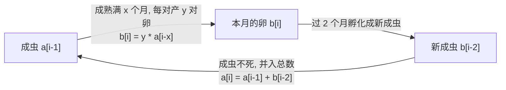

[[TOC]]

## 形式化题目

去掉故事背景，题面就是一条按月演化的计数规则。设第 $i$ 个月末有 $a_i$ 对成虫、
第 $i$ 个月新产下 $b_i$ 对卵：

1. 第 1 个月 $a_1 = 1$；成虫永不死亡，所以 $(a_i)$ 只增不减。
2. 在第 $i$ 个月，成熟满 $x$ 个月的成虫每对产 $y$ 对卵。成虫不死，"成熟满 $x$ 个月"
   恰好等价于"第 $i-x$ 个月末已经存在"，故 $b_i = y \cdot a_{i-x}$（$i \geqslant x+1$，
   更早的月份无产卵）。产卵口径的两种读法与数据验证见「思路」。
3. 卵要过 2 个月才长成成虫：第 $i-2$ 个月的 $b_{i-2}$ 对卵在第 $i$ 个月全部变成新成虫；
   新成虫成熟后的第一个月不产卵，已被规则 2 的"满 $x$ 个月"涵盖（$x \geqslant 1$）。

求**从第 1 个月再过 $z$ 个月**（即第 $z+1$ 个月）的成虫对数 $a_{z+1}$。

样例 `1 2 8` 输出 `37`：第 1 个月 1 对成虫；它成熟满 1 个月后在第 2 个月产 2 对卵；
这批卵第 4 个月孵化成 2 对新成虫……逐月推演见下文样例表。

## 正解

### 思路

**朴素做法与它的瓶颈。** 最直白的写法是**个体级模拟**：每月枚举每对成虫是否产卵，
并给每批卵记一个孵化倒计时。逻辑上没问题，但成虫只增不减、每月新增正比于存量：
$z = 50$、$y = 20$ 时成虫数可达 $1.4 \times 10^{24}$ 对，个体级状态既存不下也跑不完。
慢的根源不是"算了重复的东西"，而是**存了用不上的信息**——题面所有规则都只依赖
"有多少对"，从不依赖"具体哪一对"。

**从规则读出两条依赖。** 把个体身份扔掉，只按月记两个计数：

- **产卵端**：第 $i$ 月成熟满 $x$ 个月的成虫，就是第 $i-x$ 个月末已存在的
  $a_{i-x}$ 对（成虫不死），所以 $b_i = y \cdot a_{i-x}$；
- **孵化端**：第 $i$ 月新增的成虫恰好是两月前的卵，所以 $a_i = a_{i-1} + b_{i-2}$。

两条规则各贡献一项**固定月数**的依赖，这正是一维线性递推（一维 DP）的形态：
按月下标从小到大扫一趟即可，第 $i$ 月只需回看 $i-x$ 与 $i-2$ 两个位置。

**产卵口径：由真实数据锁定。** "每对成虫过 $x$ 个月产 $y$ 对卵"有两种读法——
成熟满 $x$ 个月后**每月**都产（口径 A），或**每隔 $x$ 个月**才产一次（口径 B）。
题库 5 组真实数据全部命中口径 A：$x=3,\ y=4,\ z=50$ 时口径 A 得
$7289152393$，与官方输出一致；口径 B 只得 $32843472$。所以下文按口径 A 推导。

**初值与答案位置。** 前 $x$ 个月没有成虫到产卵时间，$a_1 = a_2 = \cdots = a_x = 1$，
$b_i = 0\ (i \leqslant x)$；于是 $a_{x+1} = a_x + b_{x-1} = 1$、
$a_{x+2} = a_{x+1} + b_x = 1$，初值段就是 $a_1 = a_2 = \cdots = a_{x+2} = 1$。把 $b$ 代入 $a$，
$i \geqslant x+3$ 时合并成单序列：

$$a_i = a_{i-1} + y \cdot a_{i-x-2}$$

答案取 $a_{z+1}$：第 1 个月的那对成虫是起点，从第 1 个月再过 $z$ 个月落在第 $z+1$ 个月。

**样例逐月推演。** 下表按两条转移计算样例 $x=1,\ y=2$：$a[i-1]$ 是上月成虫数，
$b[i]$ 是本月产卵数，$b[i-2]$ 是两月前产的卵在本月孵化出的新成虫，最后一列是
本月累计成虫数 $a[i]$（0 号位哨兵让第 1 行的回看项自动为 0）：

| 月份 $i$ | $a[i-1]$ 上月成虫 | $b[i]=y\cdot a[i-x]$ 本月产卵 | $b[i-2]$ 两月前的卵孵化 | $a[i]=a[i-1]+b[i-2]$ |
| --- | --- | --- | --- | --- |
| 1 | 0 | 0 | 0 | 1 |
| 2 | 1 | 2 | 0 | 1 |
| 3 | 1 | 2 | 0 | 1 |
| 4 | 1 | 2 | 2 | 3 |
| 5 | 3 | 6 | 2 | 5 |
| 6 | 5 | 10 | 2 | 7 |
| 7 | 7 | 14 | 6 | 13 |
| 8 | 13 | 26 | 10 | 23 |
| 9 | 23 | 46 | 14 | **37** |

读这张表要注意三点：前 3 行孵化列为 0，成虫停在 1 对，因为第 2 行产的卵要到第 4 行
才孵化；第 5 行产卵数是 $6 = 2 \times 3$——3 对成虫**全部**在本月产卵，这正是口径 A
（成熟满 $x$ 个月后每月一产）；第 9 行 $23 + 14 = 37$ 即"过 8 个月"的答案，也解释了
代码为什么取 $a[z+1]$ 而不是 $a[z]$。

### 代码

@include-code(./main.py, python)

### 复杂度

时间复杂度 $O(z)$：主循环从 $i = x+1$ 推到 $i = z+1$，每步两次整数乘加，与标程
`std.cpp` 同阶。空间复杂度 $O(z)$：两个长度 $z+3$ 的列表，`b[i-2]`、`a[i-x]`
需要回看，`z \leqslant 50` 时不值得滚动压缩。真实数据实测单测例 $\leqslant 0.02$s、
峰值内存约 14.5MB，远低于 1000ms / 128MB 限制。答案可达 $7289152393 > 2^{31}$，
Python 整数自动扩位；同样的代码在 C++ 里要用 `long long` 存 `a`、`b`。

## 总结

- **个体模拟 → 按月计数**：成虫只增不减，产卵只看 $x$ 个月前的成虫数、孵化只看
  2 个月前的卵数，身份信息无用，压成两个长度 $O(z)$ 的计数序列。
- **递推**：$b_i = y \cdot a_{i-x}$、$a_i = a_{i-1} + b_{i-2}$，初值 $a_1 = \cdots = a_{x+2} = 1$，
  合并式 $a_i = a_{i-1} + y \cdot a_{i-x-2}$，答案 $a_{z+1}$。
- **边界**：$z = x$ 时答案 1（尚无产卵孵化）；$x = 0$ 与题库标程同口径输出 0；
  大数无溢出。
- **验证**：样例 `1 2 8` 得 37，题库 5 组真实数据全部一致（`verify.sh` 5/5 PASS）。

## 图示解析

这张图串起本题从建模到答案的月度循环：

先看每条边对应哪条题面规则，再顺着循环检查递推的两项依赖：向右一步是"产卵"依赖
$x$ 个月前的成虫数，向左一步是"孵化"依赖 $2$ 个月前的卵数；成虫节点既是循环的
起点也是累加的结果，所以总数只增不减。图中只保留正文已证明的两条转移，不替代
正文中的样例逐月推演和正确性说明。
