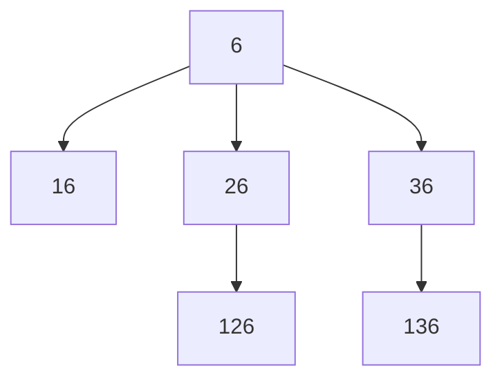

[[TOC]]

## 形式化题目

给定自然数 $n$。从一个数 $i$ 出发，允许的操作是：在 $i$ 的**左边**再写一个自然数
$x$，要求

$$x \leqslant \left\lfloor \frac{i}{2} \right\rfloor$$

也可以停止不再写。每次把新写的数拼在最左边，于是从 $n$ 出发得到的每个结果都对应一条序列

$$a_0 = n,\quad a_1, \dots, a_k, \qquad a_j \leqslant \left\lfloor \frac{a_{j-1}}{2} \right\rfloor$$

拼成的整数是 $a_k a_{k-1} \cdots a_1 a_0$（$k = 0$ 时就是 $n$ 本身）。
要求出这样的序列有多少条，即能得到多少个不同的数。

样例 $n = 6$：合法的序列是 $(6)$、$(6,1)$、$(6,2)$、$(6,2,1)$、$(6,3)$、$(6,3,1)$，
拼成的数依次为 $6, 16, 26, 126, 36, 136$，共 $6$ 个，输出 `6`。

下图把 $n = 6$ 的所有生成结果画成一棵生成树，每个节点写的就是拼接完成的那个数，
父子之间连一条边表示“在父节点的左边再写一个数”（新写的那一位就是子节点比父节点多出来的首位）：



读图重点：$6$ 左边可以写 $1, 2, 3$（上限 $\lfloor 6/2 \rfloor = 3$），所以根有三个孩子；
$2$ 的孩子上限是 $\lfloor 2/2 \rfloor = 1$，只能写 $1$ 得到 $126$；$3$ 的孩子上限是 $1$，
得到 $136$；而 $1$ 的上限是 $0$，不能再写，是叶子。树共有 $6$ 个节点，正是样例答案。

## 正解

### 思路

**朴素做法与它的瓶颈。** 最直接的做法是照着题面枚举：从 $n$ 开始，给当前数试所有可补的
$x$，递归下去，每走到一个数就计数。它的问题不在实现，而在**枚举对象的规模**：从 $n$
出发可补的有 $\lfloor n/2 \rfloor$ 个，每层都大约减半，但分支累积起来的条数仍然呈指数级增长——
题库真实数据里 $n = 903$ 时答案已经是 $10^9$ 量级，逐条枚举不可能跑完。

真正需要的是**直接算出个数**：具体已经拼了哪几个数并不重要，决定后续可能性的只有
“现在最右端的那个数”，把它当作状态就能合并大量重复子问题。

**子结构。** 设 $f(i)$ 表示“从 $i$ 出发”（把 $i$ 当作当前最右端的数）能拼出的不同数的个数，
包含不再往左补、只保留 $i$ 本身。
从 $i$ 出发第一步只有两类选择：

- 什么都不写：$1$ 个结果，就是 $i$；
- 在左边写 $x$（$1 \leqslant x \leqslant \lfloor i/2 \rfloor$）：拼完 $x$ 之后，
  剩下的可能性完全由 $x$ 决定，与 $i$ 无关，贡献 $f(x)$ 个。

两类不重不漏（$x \geqslant 1$，不会出现前导 $0$ 造成的重复），于是

$$f(i) = 1 + \sum_{x=1}^{\lfloor i/2 \rfloor} f(x)$$

**把求和差分成一步加法。** 上式每次要枚举到 $i/2$，虽然对 $n \leqslant 1000$ 也能接受，
但相邻两项相减可以把整段求和消掉：

$$f(i) - f(i-1) = \sum_{x=1}^{\lfloor i/2 \rfloor} f(x) - \sum_{x=1}^{\lfloor (i-1)/2 \rfloor} f(x)$$

- $i$ 为奇数：$\lfloor i/2 \rfloor = \lfloor (i-1)/2 \rfloor$，两个和式一模一样，差是 $0$；
- $i$ 为偶数：$\lfloor i/2 \rfloor = i/2$ 恰好比前一项多一个 $x = i/2$，差是 $f(i/2)$。

所以本题的递推式只有两种形态：

$$f(i) = \begin{cases} f(i-1), & i \text{ 为奇数} \\[2pt] f(i-1) + f(i/2), & i \text{ 为偶数}\end{cases}
\qquad f(0) = f(1) = 1$$

边界 $f(0) = f(1) = 1$：$0$ 和 $1$ 左边都补不了任何正整数，只能算自己。
转移里出现的 $i-1$ 和 $i/2$ 都严格小于 $i$，所以从 $2$ 到 $n$ 顺序递推一遍即可。

**样例推演（$n = 6$）。** 下表逐项列出递推过程，第三列"$f(i/2)$"只在 $i$ 为偶数时存在：

| $i$ | $i$ 是偶数？ | $f(i-1)$ | $f(i/2)$ | $f(i)$ |
| --- | --- | --- | --- | --- |
| 1 | — | — | — | 1（边界） |
| 2 | 是 | 1 | $f(1)=1$ | 2 |
| 3 | 否 | 2 | — | 2 |
| 4 | 是 | 2 | $f(2)=2$ | 4 |
| 5 | 否 | 4 | — | 4 |
| 6 | 是 | 4 | $f(3)=2$ | **6** |

读表要注意两点：奇数行的值一定等于上一行（$f(3)=f(2)$、$f(5)=f(4)$），这正是差分为 $0$ 的含义；
偶数行的增量是"一半处的值"，例如 $f(6) = f(5) + f(3) = 4 + 2 = 6$，与样例输出一致。
把上表继续算到 $i = 8$ 得到 $f(8) = f(7) + f(4) = 6 + 4 = 10$。
注意 $f$ 只在偶数 $i$ 上增长，而 $\lfloor i/2 \rfloor$ 本身也随 $i$ 增大，
所以平均每隔两步就多出一整份子答案，这就是答案随 $n$ 快速增长的原因。

### 代码

@include-code(./main.py, python)

### 复杂度

- 时间复杂度 $O(n)$：一层从 $2$ 到 $n$ 的循环，每次只做一次加法和一次半数取值。
  $n \leqslant 1000$ 时不足 $1000$ 次加法。差分式的前缀和版本会多出一个 $O(n)$ 的前缀数组，
  这里靠相邻相减把它省掉了。
- 空间复杂度 $O(n)$：需要保留全部 $f(1 \dots n)$，因为计算 $f(j)$ 时随时可能回头取 $f(j/2)$，
  不能只留常数个历史值（无法滚动数组）。
- Python 侧风险很低：$n = 1000$ 时答案约 $1.98 \times 10^9$，虽然仍小于 `int` 上限
  $2147483647$，但已接近边界，所以 C++ 实现应确认用够宽的类型；Python 大整数自动处理。

## 总结

- **把"数"看成序列**：拼接只约束相邻两个数，于是"数的个数"= 合法序列条数，可以按最左边
  补谁递归。
- **子结构**：$f(i) = 1 + \sum_{x=1}^{\lfloor i/2 \rfloor} f(x)$，含义是"自己"加"每个可选左邻的
  子答案"。
- **差分**：相邻两项相减把整段求和消掉，得到 $f(i) = f(i-1) + [i \text{ 偶}]\,f(i/2)$，
  一次加法转移。偶数才增加一个可用前缀，奇数不变。
- **边界**：$f(0) = f(1) = 1$；转移的两个下标都更小，顺序递推即可。
- **易错点**：补数从 $1$ 开始而不是 $0$（补 $0$ 不产生新数还会造成重复）；奇数行要老老实实
  等于上一行。
- **验证**：题面样例 $n = 6$ 输出 `6`；题库 10 组真实数据（$n$ 从 42 到 903）
  在 `verify.sh` 下 `PASS=10, FAIL=0`。

## 图示解析

下图串起本题从"拼接整数"到"一遍递推"的主线：

```text
n 左边补数
`- 合法结果 = 一条序列 a_k ... a_1 a_0，约束 a_j <= a_{j-1} / 2
   |- 每条序列由「最左边补谁」唯一分解  -> f(i) = 1 + sum_{x<=i/2} f(x)
   |  `- 相邻两项相减（奇数不减、偶数多 f(i/2)）
   |     `- f(i) = f(i-1) + (i 偶 ? f(i/2) : 0),  f(0)=f(1)=1
   `- 从 2 到 n 顺序递推                            -> 答案 f(n)，O(n)
```

先看第一步如何把"整数的拼接"变成"序列计数"，它保证了 $f$ 只依赖最左边的数；
再看中间一步差分在做什么：奇偶两类 $i$ 的求和上限相同或相差一项，所以只需 $O(1)$ 转移；
最后一步说明为什么顺序递推就够了——两个下标 $i-1$、$i/2$ 都比 $i$ 小。
图中只保留正文已证明的结论，具体的样例推演与正确性说明见上文。
