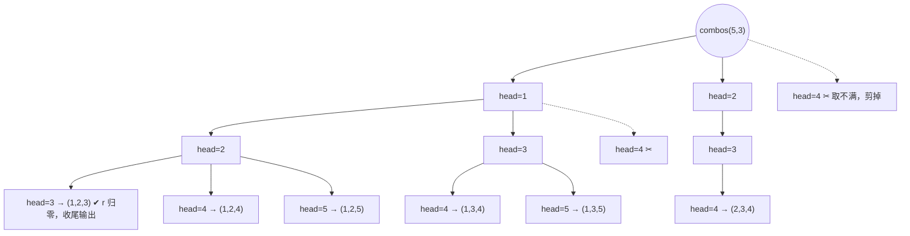

[[TOC]]

## 形式化题目

给定 $n$、$r$（$1 \leqslant r \leqslant n$，真实数据 $n \leqslant 19$），按**字典序**输出集合 $\{1, 2, \dots, n\}$ 的全部 $\binom{n}{r}$ 个 $r$ 元子集。每个子集写成一行递增序列；输出格式按标准程序为"每个数前固定两个空格"（两位数自然占三列）。题面同时要求用**递归**的方法实现。

样例：$n=5, r=3$ 时共 $10$ 个组合，从 `1 2 3` 到 `3 4 5`。

## 正解

### 思路

照最直接的思路，可以模仿经典的全排列模板：`dfs(step)` 逐位选数，配一个 `vis[]` 数组标记"用过的数"，回溯时清零。但这里有个值得停一下的观察：**组合和全排列的本质区别，恰恰在 vis 数组该不该存在**。

组合是"不分顺序"的——$\{1,2,3\}$ 只算一次。如果要求每个子集**只用递增序列表示**（即第 $k$ 个选的数必须大于第 $k-1$ 个），那么每个子集恰好对应一条选择路径：同一个子集不会被第二种顺序重复生成，也不会漏。**递增性本身就是 vis 数组**，而且是不需要清零的 vis。

于是递归的结构变成：设"从 $x+1$ 到 $n$ 里再取 $h$ 个递增数"是一个子问题。对它再做一步平移——把值域 $x+1..n$ 整体减 $x$，就变成"$1..n-x$ 里取 $h$ 个递增数"，和原问题**同构**。这条**平移不变性**让递归函数的签名退化成只剩规模 $(n, r)$，不需要"起点"和"上界"两个额外参数：

```text
combos(n, r) 的分叉：枚举首元 head ∈ 1..n-r+1，
每个 head 的剩余部分 = combos(n-head, r-1) 平移加 head
```

两点补充说明：

- **顺序**：层内 `head` 从小到大枚举，首元更小的组合整体排在首元更大的之前——递归的前序遍历顺序恰好就是字典序，正确性与顺序一次论证完毕，不需要事后排序。
- **剪枝**：当还要取 $h$ 个数时，下一个数最大只能到 $n-h+1$，否则剩下的数不够取。经典写法靠"循环跑到 $n$ 但子层循环为空"隐式浪费掉这些分叉；`range(1, n-h+2)` 把它显式砍掉。

最后是**输出格式**——本题真正的陷阱。"每个元素占三个字符的位置"最容易让人写成 `f"{v:>3}"`，但用真实数据核对会发现两者在两位数处分岔：

| 写法 | $n=15$ 的相邻两数 | 与真实答案（`problem2`）是否一致 |
| --- | --- | --- |
| `f"{v:>3}"`（右对齐宽 3） | `  9 10`（`10` 只补 1 个空格） | ❌ |
| `f'  {value}'`（固定两空格） | `  9  10`（两位数占 3 列） | ✅ 与 `std.cpp` 的 `cout << "  " << a[i]` 逐字节一致 |

标准程序是"两个空格 + 十进制"：一位数占 3 列、两位数自然占 3 列，与题面描述相容。这类格式题必须以真实数据为准，不能按字面猜。

下面用 $n=5, r=3$ 的递归树前两个分支展示整个结构（虚节点为被剪枝砍掉的分叉）：



观察三点：`r` 归零的前缀就是完整组合（收尾条件）；每个节点的剩余部分都是"值域右段平移到 $1..m$"的同构子问题；同一层内从左到右的顺序直接对应输出行的先后。$n=5, r=3$ 的全部输出与分叉的对应：

| 输出行 | 生成路径 |
| --- | --- |
| `  1  2  3` | head 1 → 2 → 3 |
| `  1  2  4` | head 1 → 2 → 4 |
| `  1  2  5` | head 1 → 2 → 5 |
| `  1  3  4` | head 1 → 3 → 4 |
| … | … |
| `  3  4  5` | head 3 → 4 → 5 |

Python 实现上，把递归写成**生成器**：每层 `yield` 拼接后的组合，外层直接对 `combos(n, r)` 做格式化与拼接，一次写出。递归深度只有 $r \leqslant 15$，没有栈溢出风险。

### 代码

`combos` 是递归主体：收尾、剪枝、平移三处注释对应上文推导；`solve` 只做读入、格式化与缓冲输出。

@include-code(./main.py, python)

### 复杂度

- 时间复杂度：$O\!\left(\binom{n}{r} \cdot r\right)$——生成全部组合、每个拼接 $r$ 个元素，与输出规模同阶，已是理论下界。真实最大测例 $(19,8)$：$75582$ 行、约 $2.2$ MB 输出，实测耗时 $0.02$ s 量级。
- 空间复杂度：输出缓冲 $O\!\left(\binom{n}{r} \cdot r\right)$ 字符（$(19,8)$ 约 $2.2$ MB，峰值内存约 $14.5$ MB），递归栈深度 $O(r) \leqslant 15$。

## 总结

- 组合 = 严格递增序列：**递增性天然替代 vis 数组**，不重不漏且免回溯——这是组合枚举与全排列枚举的分水岭。
- 平移不变性把"起点 + 上界"两个参数折叠成一个规模参数，递归签名只剩 $(n, r)$，正确性论证也随之缩短。
- 层内从小到大枚举 ⇒ 前序遍历即字典序，无需排序。
- 格式题以真实数据为准：本题"占三个字符"实为"固定两空格 + 十进制"，`f"{v:>3}"` 会在两位数处翻车。
- 生成器递归是 Python 里最不易错的递归枚举形态：边生成边消费，代码量集中在一条平移公式上。
