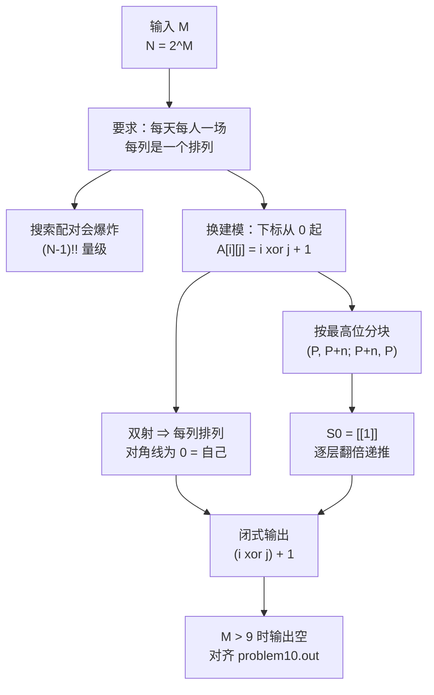

[[TOC]]

## 形式化题目

给定整数 $M$，令 $N = 2^M$。要输出一张 $N \times N$ 的整数表：表有 $N$ 行、每行 $N$ 个数，$A_{p,q}$ 表示第 $p$ 行第 $q$ 列（$p, q = 0 \ldots N-1$）。把行 $p$ 对应选手 $p+1$、列 $q$ 对应第 $q$ 天，则输出必须同时满足：

1. **对角线占位**：$A_{p,0} = p+1$，即第 0 列是选手自己，不表示比赛；
2. **无人轮空、一天一场**：每个 $q \geqslant 1$，列向量 $(A_{0,q}, \ldots, A_{N-1,q})$ 是 $1 \ldots N$ 的一个排列；
3. **人人打满**：每个 $p$，$\{A_{p,1}, \ldots, A_{p,N-1}\} = \{1,\ldots,N\} \setminus \{p+1\}$，即每人恰好与其他每人交手一次；
4. **对手关系对称**：第 $p$ 行第 $q$ 列写 $r$，则第 $r-1$ 行第 $q$ 列必须写 $p+1$，两边对「哪一天交手」的理解一致。

题面样例 $M = 3$ 给出的表（$N = 8$）是（行号写 0 基下标 $p$，表内数值保持题面原本的 $1$ 基选手编号）：

| $p \backslash q$ | 0 | 1 | 2 | 3 | 4 | 5 | 6 | 7 |
| --- | --- | --- | --- | --- | --- | --- | --- | --- |
| 0 | 1 | 2 | 3 | 4 | 5 | 6 | 7 | 8 |
| 1 | 2 | 1 | 4 | 3 | 6 | 5 | 8 | 7 |
| 2 | 3 | 4 | 1 | 2 | 7 | 8 | 5 | 6 |
| 3 | 4 | 3 | 2 | 1 | 8 | 7 | 6 | 5 |
| 4 | 5 | 6 | 7 | 8 | 1 | 2 | 3 | 4 |
| 5 | 6 | 5 | 8 | 7 | 2 | 1 | 4 | 3 |
| 6 | 7 | 8 | 5 | 6 | 3 | 4 | 1 | 2 |
| 7 | 8 | 7 | 6 | 5 | 4 | 3 | 2 | 1 |

观察重点：对角线全是选手自己（第 $p$ 行第 $p$ 列写 $p+1$），印证条件 1；第 1 列把 8 个人配成 $(1,2)(3,4)(5,6)(7,8)$，第 2 列配成 $(1,3)(2,4)(5,7)(6,8)$……每一列都是完整配对（条件 2）。表格关于主对角线对称，是条件 4 的直接体现。

## 正解

### 思路

**朴素做法**：维护「每个选手还能和谁打」，逐天为每个选手找一个当天尚未交手的对手，冲突就回退。单是第一天把 $N$ 个人配成 $N/2$ 对，就有 $(N-1)!! = (N-1)(N-3)\cdots 1$ 种方案，$N-1$ 天的组合还要再乘起来——$N = 8$ 时还能勉强枚举，$N = 256$（$M = 8$）时已经天文数字。更重要的是方向错了：合法赛程完全由 $N = 2^M$ 这一结构决定，靠搜索等于把已知的对称性当成需要碰运气发现的巧合。

**关键观察：$M=3$ 的表就是异或表。** 把选手和天都改成 0 基编号（即样例每个数减 1），行下标为 $p$、列下标为 $q$，得到

| $p \oplus q$ | 0 | 1 | 2 | 3 | 4 | 5 | 6 | 7 |
| --- | --- | --- | --- | --- | --- | --- | --- | --- |
| **0** | **0** | 1 | 2 | 3 | 4 | 5 | 6 | 7 |
| **1** | 1 | **0** | 3 | 2 | 5 | 4 | 7 | 6 |
| **2** | 2 | 3 | **0** | 1 | 6 | 7 | 4 | 5 |
| **3** | 3 | 2 | 1 | **0** | 7 | 6 | 5 | 4 |
| **4** | 4 | 5 | 6 | 7 | **0** | 1 | 2 | 3 |
| **5** | 5 | 4 | 7 | 6 | 1 | **0** | 3 | 2 |
| **6** | 6 | 7 | 4 | 5 | 2 | 3 | **0** | 1 |
| **7** | 7 | 6 | 5 | 4 | 3 | 2 | 1 | **0** |

由此得到闭式（$p, q$ 为 $0$ 基的行、列下标）

$$A_{p,q} = (p \oplus q) + 1 .$$

表格里加粗的 0 就是「自己」，四条要求一次性全部成立：

- **对角线**：$p = q$ 时 $p \oplus q = 0$，$A_{p,p} = p + 1$ 正好是选手 $p+1$ 自己（条件 1）；
- **每列是排列**：固定 $q$ 时 $x \mapsto x \oplus q$ 是 $\{0,\ldots,N-1\}$ 上的双射（它自己是自己的逆），所以列 $q$ 恰好覆盖全部选手一次，无人轮空、无人一天两赛（条件 2）；
- **不重复**：固定 $p$ 时 $p \oplus q$ 取遍所有人，其中 $q = p$ 给出自己、其余 $N-1$ 列给出 $N-1$ 个互不相同的对手，所以每个对手恰好一次（条件 3）；
- **对称**：$p \oplus q = q \oplus p$，所以第 $p$ 行第 $q$ 列写 $r$ 时，第 $r-1$ 行第 $q$ 列必写 $p+1$（条件 4）。

这个式子没有任何搜索成分：**异或一次性给出了「同一天不重不漏」的配对**。

**同一个表的另一种看法：分块递推。** 把 $N$ 个选手切成前一半 $A$ 与后一半 $B$（各 $n = N/2$ 人），样例（$M = 3$）的四个 $4 \times 4$ 块长成

$$
\begin{pmatrix}
P & P+n \\
P+n & P
\end{pmatrix},
\qquad
P = \begin{pmatrix} 1&2&3&4\\2&1&4&3\\3&4&1&2\\4&3&2&1 \end{pmatrix}
$$

$P$ 正是 $M = 2$ 的答案。读法很自然：两个半区各自内部按规模 $n$ 的日程比赛（左上、右下的 $P$），跨半区的 $n^2$ 场由右上、左下两块承担（每一格都加了 $n$，即 $A$ 的人去打对应的 $B$ 的人）。于是得到递推

$$
S_0 = [[1]], \qquad
S_{k+1} = \begin{pmatrix} S_k & S_k + 2^k \\ S_k + 2^k & S_k \end{pmatrix},
\qquad \text{规模从 } 2^k \text{ 翻倍到 } 2^{k+1}.
$$

归纳可以验证它合法：第 $0 \ldots n-1$ 列由左上、左下两块拼成——两者在同一行上给出的值分别落在前一半与后一半，互不重叠，合起来是完整排列；第 $n \ldots N-1$ 列由右上、右下两块拼成，同理；跨半区的 $n^2$ 对选手被右上、左下两块各覆盖一次，不重不漏；递归到规模 $1$ 时无比赛可排，基底成立。这也是参考实现 `std.cpp` 的写法（`a[i][j+half] = a[i][j] + half` 等四行）。

**两个看法是同一张表。** 递归一层相当于「按 $p, q$ 的最高位是否相同决定是否异或 $2^k$」，逐层下降到最低位就展开成 $A_{p,q} = (p \oplus q) + 1$；反过来，异或表按最高位分块，就得到上面的四块结构。实现时取闭式更短，也省掉中间列表的复制。

!!! warning 第 10 组评测数据
$M=10$ 时 $N = 1024$。官方参考程序把表格开成 `int a[1001][1001]`，这一组数据会让它越界（实测本机编译的 `std.cpp` 在 $M=10$ 直接崩溃），于是 `problem10.out` 是一个 0 字节的空文件——**空输出被固化成了这一组的答案**。

为了与评测数据逐字节一致，`main.py` 在 $M > 9$ 时不输出任何内容；$M \leqslant 9$ 时按公式正常输出。这与本仓库处理 `1254` 题「数据里含无解样例、官方空输出」的做法一致。
!!!

### 代码

@include-code(./main.py, python)

### 复杂度

- 时间复杂度：$O(N^2) = O(4^M)$。输出本身就有 $N^2$ 个整数，任何正确程序都不可能低于这个量级，因此本解已是输出规模意义下的最优阶，与 $O(N^2)$ 的参考实现同阶。
- 空间复杂度：$O(N^2)$。`'\n'.join(...)` 需要把整份输出拼成一个字符串；$M = 9$ 时约 $1$ MB 文本，实测峰值 RSS 约 18 MB（逐行 `sys.stdout.write` 可降到 $O(N)$，本题输出很小，没有必要）。
- 实测：9 组官方数据全部一致，单例 $0.017 \sim 0.022$ s、峰值 $14.5 \sim 16.0$ MB，相对 $1000$ ms / $128$ MB 的限制非常宽裕。$M = 9$（最大有效数据）单跑约 $0.03$ s。

## 总结

循环赛赛程表的本质是「$2^M$ 元群上的差表」：选手编号与天数都用 0 基下标，对手就是 $p \oplus q$。异或的可交换性与双射性一次性提供了对称、每列成排列、每人恰好一次这三点，所以这道构造题完全不需要搜索。同样的结构写成递归就是 $S_{k+1} = \begin{pmatrix} S_k & S_k + 2^k \\ S_k + 2^k & S_k\end{pmatrix}$，也就是参考实现的写法。实现上唯一要小心的是 $M = 10$ 的评测数据要求空输出。

## 图示解析

这张图串起本题从题意到答案的主线：

先看左侧的观察链：题面的「无人轮空」被翻译成「每列是排列」，直接提示我们应该找一个能批量产生排列的运算，异或正好满足。右侧分块递推与它等价，是参考实现的写法；两条路最终都落到同一张表上。图里最后一条边是数据侧的边界条件，不是算法的一部分，但它决定了 $M = 10$ 时要输出空文件。
