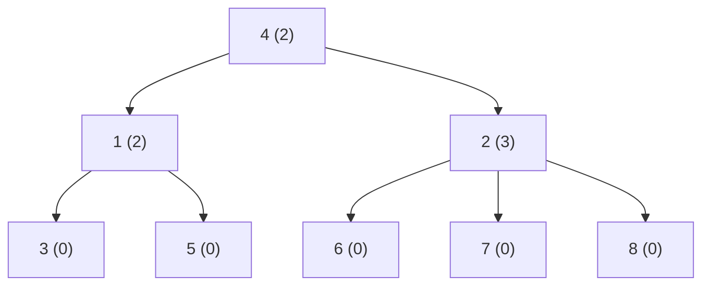

[[TOC]]

## 形式化题目

给定 $n$ 个结点（编号 $\leqslant 1000$，不一定连续）和 $m = n - 1$ 条有向边 $(x, y)$，表示 $y$ 是 $x$ 的孩子，这些边构成一棵以某结点为根的树。求

1. 树根 `root`：唯一没有父亲的结点；
2. `max`：孩子个数最多的结点，若并列则取编号最小者；
3. `max` 的全部孩子编号，按升序排列。

## 正解

### 思路

先看朴素做法：把 $m$ 条边存进数组 `edges`，然后对每个结点 $v$ 扫一遍 `edges` 判断"有没有哪条边的第二个数是 $v$"来定根，再扫一遍数"第一个数是 $v$"的边有几个来定孩子数，最后再扫一遍收集孩子。每扫一遍边表只回答一个结点的一个问题，总计 $O(n \cdot m)$。

**瓶颈在哪里？** 一条边 $(x, y)$ 的两端只提供了两条信息——"$y$ 的父亲是 $x$"和"$x$ 多了一个孩子"。朴素做法把同一批边反复重读，每次都在重新解析已经见过的信息；而这两条信息各自只需要被记一次。

于是把"扫边"从 $O(n)$ 次压缩到 **1 次**：读入 $(x, y)$ 时就地写入两张表，

$$parent[y] = x, \qquad children[x] \mathrel{+}= y$$

之后所有问题都变成对这两张表的直接读取。为什么这样就够？

- **根**：树中每个非根结点恰有一条入边，所以它必然作为某条边的 $y$ 出现在 `parent` 里；根没有父亲，是唯一"没当过孩子"的编号。于是从 $1$ 到 $n$ 找第一个不在 `parent` 里的编号即可。
- **孩子最多的结点**：就是 `children` 里列表最长的键，即 $\arg\max_v |children[v]|$。
- **并列取编号最小**：Python 的 `max` 只在**严格更大**时替换当前最优值；从 $1$ 到 $n$ 递增扫描时，并列的后者无法替换前者，于是天然留下编号最小的那个。这条规则不需要额外写 `if len(...) >= best` 之类的判断。

以样例为例，8 个结点、7 条边，逐条写入两张表：

| 输入的边 $(x, y)$ | 写入 `parent` | 写入 `children` |
| --- | --- | --- |
| 4 1 | `parent[1] = 4` | `children[4] = [1]` |
| 4 2 | `parent[2] = 4` | `children[4] = [1, 2]` |
| 1 3 | `parent[3] = 1` | `children[1] = [3]` |
| 1 5 | `parent[5] = 1` | `children[1] = [3, 5]` |
| 2 6 | `parent[6] = 2` | `children[2] = [6]` |
| 2 7 | `parent[7] = 2` | `children[2] = [6, 7]` |
| 2 8 | `parent[8] = 2` | `children[2] = [6, 7, 8]` |

扫描结束后 `parent = {1:4, 2:4, 3:1, 5:1, 6:2, 7:2, 8:2}`，键集合是 $\{1,2,3,5,6,7,8\}$，缺失的 $4$ 就是根；`children` 中长度最大的是 `children[2]`，长度为 $3$，故 `max = 2`，孩子排序后输出 `6 7 8`，与样例输出一致。

下面这棵树就是样例的形态，括号里是该结点的孩子个数：

图中可以看到：$4$ 没有任何入边，是根；$2$ 的出度为 $3$，是全场最大。注意"根"与"孩子最多"是两个彼此独立的量——样例里根是 $4$，而孩子最多的却是它的孩子 $2$，所以这两问必须分别扫描 `parent` 与 `children` 得到，不能混用。

代码里 `pairs` 这个生成器负责把扁平的数字流两两配对，`solve` 只做"读入 $\to$ 建表 $\to$ 三次输出"，与上面的推导逐句对应。

### 代码

`parent` 即父亲函数，`children` 即出边表；`max` 的并列语义与 `range(1, n + 1)` 的递增顺序共同实现"并列取编号小"，代码中已用注释标出这两处不变量。

@include-code(./main.py, python)

### 复杂度

- 时间复杂度：建表 $O(m)$，找根 $O(n)$，找最大 $O(n)$，孩子排序 $O(k \log k) \subseteq O(n \log n)$，合计 $O(n \log n + m)$；排序之外的部分是 $O(n + m)$，与 C++ 标准做法同阶（$n \leqslant 100$ 时 $\log n$ 可以视作常数）。
- 空间复杂度：$O(n + m)$，两张表各存 $m$ 条信息。

## 总结

本题的关键不是"树"本身，而是**把每条边一次性解析成两张表**：`parent[y] = x` 负责回答"谁是根"，`children[x].append(y)` 负责回答"谁的孩子最多、孩子是谁"。这样做把朴素做法的 $O(n \cdot m)$ 降到 $O(n + m)$（输出前再花一次 $O(k \log k)$ 排序），也顺手用上了"根就是唯一没有父亲的结点"这个结构性质。实现上还有两个容易踩的细节：并列取编号最小依赖 `max` 的严格比较语义（改成 `>=` 或先排序都会改变结果），以及孩子必须显式排序，不能指望输入恰好升序。数据仓 10 组真实评测点全部逐字节一致，单点约 0.017 s、峰值内存约 14.7 MB。
