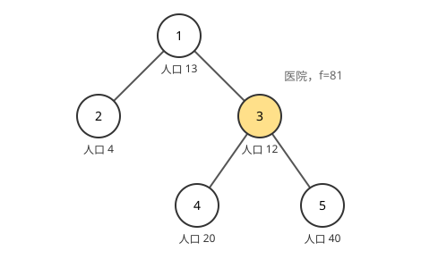

[[TOC]]

## 形式化题目

给定一棵有 $n$ 个结点的二叉树，结点编号为 $1, 2, \dots, n$。第 $i$ 个结点上住着 $p_i$ 个居民，它的左孩子是 $l_i$、右孩子是 $r_i$，值为 $0$ 表示没有这个孩子。

相邻结点之间的距离规定为 $1$，记 $d(u, v)$ 为从 $u$ 沿边走到 $v$ 的最少步数。若把医院建在结点 $u$，所有居民走的总路程为

$$
f(u) = \sum_{v=1}^{n} p_v \cdot d(u, v),
$$

要求在 $1 \leqslant u \leqslant n$ 中选一个位置，使 $f(u)$ 最小。

## 正解

### 思路

**朴素做法与它的重复。** 直接照定义办：枚举医院的位置 $u$，再对每个居民 $v$ 单独算出 $d(u, v)$，加权求和。对固定的 $u$，从 $u$ 出发做一次 BFS（或 DFS）就能得到它到所有点的距离，所以总共要做 $n$ 次遍历，复杂度 $O(n^2)$。这个做法完全正确，但它把同一对点之间的距离算了两次：$d(u, v)$ 在"以 $u$ 为起点"和"以 $v$ 为起点"的两次遍历里各出现一次。

**真正的坑不在算法，而在建图。** 题面用“左链接 / 右链接”描述树，这是**父亲指向孩子**的方向。但题目问的是距离，而树上距离是**对称**的：$d(u, v) = d(v, u)$。如果只把 $(i, l_i)$、$(i, r_i)$ 当成有向边存下来，那么"孩子走回父亲"这一侧的路就整条丢失了，算出来的距离会偏大甚至被判为不可达。样例 2 里 $f(3) = 81$ 就依赖 $2 \to 1 \to 3$ 这条路，只存单向边是算不出来的。

所以第一步是**把每条链接当成无向边**：链接 $(i, c)$（$c \neq 0$）表示 $i$ 与 $c$ 之间有一条长度为 $1$ 的边，两个方向都要登记。

**一次算完所有点对。** 本题 $n \leqslant 100$，规模很小；既然枚举医院时要用到任意 $u$ 到所有 $v$ 的距离，就该一次性把整张距离表算出来。由于所有边的长度都是 $1$，"最短路"就等于"最少经过几条边"，可以直接在邻接矩阵上松弛：

$$
\text{dist}[i][j] \leftarrow \min\bigl(\text{dist}[i][j],\ \text{dist}[i][k] + \text{dist}[k][j]\bigr).
$$

这就是 Floyd。要说明的是它并不比"每个起点一次 BFS"更快——Floyd 是 $O(n^3)$，反而高了一阶；但在 $n \leqslant 100$ 时只有约 $10^6$ 次比较，毫秒级就能跑完，换来的好处是：一次得到完整的对称距离矩阵，后面的枚举不再需要任何图遍历，而且这正是本题标准解法的路线。树上两点之间的简单路径唯一，算出的 $\text{dist}[u][v]$ 就是那条路径的边数，不存在并列最短路的歧义。

**最后一步。**距离矩阵 $D$ 到手后，"枚举医院"退化成一次逐行加权求和：

$$
\text{ans} = \min_{u} \sum_{v} p_v \cdot D[u][v].
$$

样例 2 的树形与人口如下，黄色结点是最优的医院位置：

医院设在结点 3 时，四条路径分别是 $3 \to 1$（长度 1，人口 13）、$3 \to 1 \to 2$（长度 2，人口 4）、$3 \to 4$（长度 1，人口 20）、$3 \to 5$（长度 1，人口 40），总路程 $13 + 8 + 20 + 40 = 81$。可以把医院搬到每个结点上都试一遍，距离矩阵与对应的 $f(u)$ 如下，表格最后一列的最小值就是答案：

| 医院位置 $u$ | $d(u,1)$ | $d(u,2)$ | $d(u,3)$ | $d(u,4)$ | $d(u,5)$ | $f(u)$ |
| :-: | :-: | :-: | :-: | :-: | :-: | :-: |
| 1 | 0 | 1 | 1 | 2 | 2 | $0 + 4 + 12 + 40 + 80 = 136$ |
| 2 | 1 | 0 | 2 | 3 | 3 | $13 + 0 + 24 + 60 + 120 = 217$ |
| **3** | 1 | 2 | 0 | 1 | 1 | $13 + 8 + 0 + 20 + 40 = \mathbf{81}$ |
| 4 | 2 | 3 | 1 | 0 | 2 | $26 + 12 + 12 + 0 + 80 = 130$ |
| 5 | 2 | 3 | 1 | 2 | 0 | $26 + 12 + 12 + 40 + 0 = 90$ |

观察重点有两个：一是第 1 行第 2 列的 $d(1,2) = 1$ 与第 2 行第 1 列的 $d(2,1) = 1$ **必须相等**，这正是双向建边要求的对称性；二是 $f(u)$ 是距离矩阵第 $u$ 行与人口数组的点积，最小值 81 与样例输出一致（题目文字里 136 也对应表格第 1 行）。

实现上把两件事分开：一个函数只回答"任意两点最少走几条边"，主流程负责读入、调用、再枚举取最小。

### 代码

@include-code(./main.py, python)

### 复杂度

- 时间：建图 $O(n)$（每个结点的两个链接各写一次矩阵，值为 $0$ 的链接被跳过），Floyd $O(n^3)$，枚举医院 $O(n^2)$，总计 $O(n^3)$。$n = 100$ 时实测约 $0.03$ s。
- 空间：距离矩阵 $O(n^2)$，其余 $O(n)$，总计 $O(n^2)$。

## 总结

本题的关键只有一句话：**题目给的是"父子链接"，但要求的是"无向距离"**。把每个链接双向登记成边、把边权为 1 的最短路交给 Floyd，剩下的就只是一个 $O(n^2)$ 的枚举求和。$n \leqslant 100$ 使 $O(n^3)$ 绰绰有余（若 $n$ 放大到 $10^4$，就该换成 $n$ 次 BFS 或换根 DP，而不是 Floyd）；真正容易失分的不是算法复杂度，而是漏掉"孩子走回父亲"这个方向。同一模型在 C++ 里就是 `a[i][l] = a[l][i] = 1;` 加三重 `for` 的 Floyd，Python 版的区别仅在于用列表推导构造矩阵、并用生成器表达式完成最后的取最小值。
