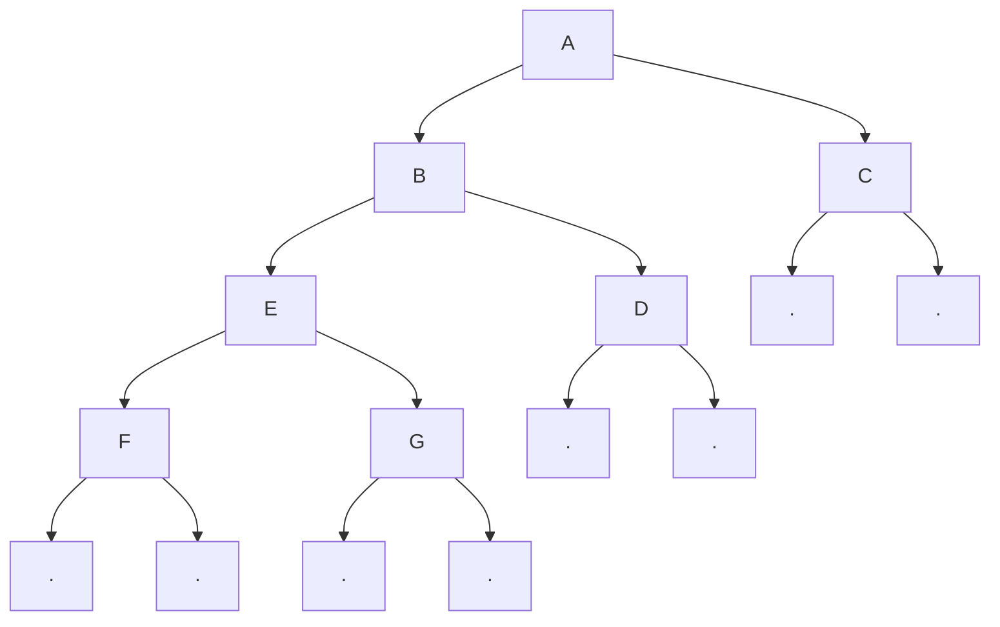

[[TOC]]

## 形式化题目

给出一个扩展二叉树的先序遍历序列：大写字母表示真实结点，`.` 表示空结点。要求还原这棵二叉树，并输出它的中序遍历序列和后序遍历序列。

## 正解

### 思路

扩展先序序列的结构天然是递归的：

$$
\text{树} = \text{根字符} + \text{左子树} + \text{右子树} \qquad \text{空树} = \ .
$$

从左到右扫描字符串，遇到字母就建立根结点并递归构造左右子树；遇到 `.` 就返回空。树还原后，分别做一次**中序遍历**（左—根—右）和**后序遍历**（左—右—根）即可得到答案。

下面以样例 `ABD..EF..G..C..` 为例画出还原后的二叉树：

- 中序遍历顺序：D → B → F → E → G → A → C，输出 `DBFEGAC`。
- 后序遍历顺序：D → F → G → E → B → C → A，输出 `DFGEBCA`。

### 代码

@include-code(./main.py, python)

### 复杂度

设输入序列长度为 $n$（包含所有字母与 `.`）。每个字符被迭代器恰好消费一次，每个结点被访问常数次。

- 时间复杂度：$O(n)$
- 空间复杂度：$O(n)$，主要用于递归栈和树结点表示

## 总结

本题的关键在于认识到“扩展先序序列”已经把子树的边界用 `.` 标记清楚，因此**不需要中序序列**就可以唯一还原二叉树。实现上用一个迭代器顺序消费字符，配合递归即可完成建树和两种遍历。
