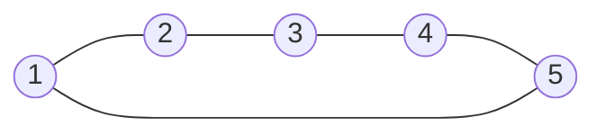

[[TOC]]

## 形式化题目

给定无向图 $G=(V,E)$，$|V| = n$，$|E| = m$，顶点编号为 $1 \sim n$。
求一条顶点序列 $v_0, v_1, \dots, v_m$，使得：

- 对每个 $i \in [1, m]$，$(v_{i-1}, v_i)$ 都是 $G$ 中的一条边；
- $G$ 中每条边恰好作为相邻点对出现一次。

输出该序列；欧拉路与欧拉回路均可，任意一条合法路径都接受。

## 正解

### 思路

**先判存在性，再定起点。** 无向图有一笔画（欧拉路）的经典条件是：奇度顶点
个数为 $0$ 或 $2$。本题数据保证有解，所以只需据此选起点：

- 存在奇点：从任一奇点出发（本解取编号最大的奇点）；
- 全为偶点（欧拉回路）：从任意非孤立点出发（本解取 $1$）。

**朴素做法为什么不可行。** 最直觉的写法是「深搜 + 回溯尝试所有走法」，
但那是指数级的；真正的洞察是：**从正确起点出发时，贪心走哪条未用边都不会出错**。
于是问题不再是「搜索一条路径」，而是「把边一条不剩地全部消掉」。

**Hierholzer：走与记分离。** 关键在于把「走」和「记录路径」解耦：

1. 从起点出发，**能走就走**，走过的边打标记，沿途点压入栈；
2. 当栈顶点 $v$ 已无可用边时，把 $v$ **弹出并追加到答案序列**；
3. 回到新的栈顶继续找可走的边，直到栈空。

为什么「无路可走」时记录就是对的？因为那一刻 $v$ 的所有边都已在更深的步骤里
被用光，记录 $v$ 的时机正好是它**最后一条边被走完**的时刻。这意味着
**出栈顺序本身就是最终输出顺序，不需要再反转**——这正是本题最容易搞反的细节。

下面看样例 1，它是 5 个点的环，所有点度为 2，是一条欧拉回路：

从 1 出发，先把环走完再逐层出栈，得到 `1 5 4 3 2 1`，是一条合法的欧拉回路。
这也说明答案不唯一，绕环的任一方向都行。

**平行边是最大的坑。** 数据里存在两点之间的重边（样例 5 中点 1 与点 2 有两条边），
若用邻接集合或邻接矩阵「删边」，一条会被另一条连带吃掉，导致边数对不上。
正确做法是给每条**无向边**一个编号 $e$，邻接表存 `(邻居, 边编号)`，
用 `used[e]` 标记这条边是否走过，平行边互不影响。

下面是样例 2 的完整走边过程（$n=6$，奇点为 1 和 4，起点取 4）：

| 步 | 栈顶 $v$ | 动作（取最小可用边） | 栈 | 路径（出栈顺序） |
| --- | --- | --- | --- | --- |
| 1 | 4 | 走边 $(4,1)$ | `4 1` | — |
| 2 | 1 | 走边 $(1,2)$ | `4 1 2` | — |
| 3 | 2 | 走边 $(2,3)$ | `4 1 2 3` | — |
| 4 | 3 | 走边 $(3,4)$ | `4 1 2 3 4` | — |
| 5 | 4 | 走边 $(4,5)$ | `4 1 2 3 4 5` | — |
| 6 | 5 | 走边 $(5,6)$ | `4 1 2 3 4 5 6` | — |
| 7 | 6 | 走边 $(6,1)$ | `4 1 2 3 4 5 6 1` | — |
| 8 | 1 | 无边可走，出栈 | `4 1 2 3 4 5 6` | `1` |
| 9 | 6 | 无边可走，出栈 | `4 1 2 3 4 5` | `1 6` |
| 10 | 5 | 无边可走，出栈 | `4 1 2 3 4` | `1 6 5` |
| 11 | 4 | 无边可走，出栈 | `4 1 2 3` | `1 6 5 4` |
| 12 | 3 | 无边可走，出栈 | `4 1 2` | `1 6 5 4 3` |
| 13 | 2 | 无边可走，出栈 | `4 1` | `1 6 5 4 3 2` |
| 14 | 1 | 无边可走，出栈 | `4` | `1 6 5 4 3 2 1` |
| 15 | 4 | 无边可走，出栈 | 空 | `1 6 5 4 3 2 1 4` |

观察第 1～7 步：算法一路贪心走到底，先绕出闭环 $4 \to 1 \to 2 \to 3 \to 4$，
再接着走 $(4,5)(5,6)(6,1)$。第 8 步起从末端的 1 开始连续出栈，
一直到第 14 步才回到起点 4。这说明「先走的边」反而排在输出序列的**后面**，
正是回溯顺序拼接的结果。

### 代码

@include-code(./main.py, python)

### 复杂度

设 $n$ 为点数、$m$ 为边数。每条边和每个点各入栈、出栈一次，
邻接表排序总代价 $O(m \log m)$，其余操作均为线性，故

$$T(n, m) = O(n + m \log m), \qquad S(n, m) = O(n + m).$$

排序只是为了确定「最小邻居优先」的稳定输出顺序；若在读入时改为头插，
可把时间压到严格的 $O(n+m)$。

## 总结

一笔画问题的通用解法是 **Hierholzer 算法**，本题的关键有三点：

1. 先按奇点个数（$0$ 或 $2$）判断类型并选定起点；
2. 用「边编号」而非「点对」标记已走过的边，才能正确处理平行边；
3. 点要等到**无路可走**时才记录，出栈顺序就是答案，不需要反转。

整个算法线性时间、线性空间，与题面给出的 $O(m+n)$ 复杂度目标一致。
