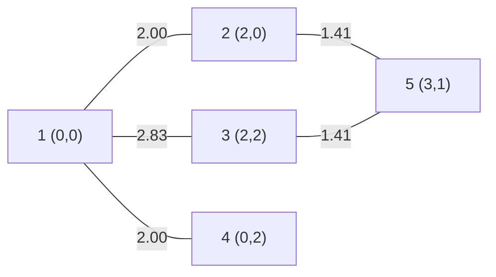

[[TOC]]

## 形式化题目

平面上有 $n$ 个点，第 $i$ 个点的坐标是 $(x_i, y_i)$。再给出 $m$ 条连线，每条连线 $(u, v)$ 表示点 $u$ 与点 $v$ 之间可以互相到达，通路的长度为两点的直线距离

$$
w(u, v) = \sqrt{(x_u - x_v)^2 + (y_u - y_v)^2}.
$$

把点看成顶点、把连线看成带权无向边，就得到一张无向带权图。给定起点 $s$ 和终点 $t$，求从 $s$ 沿连线走到 $t$ 的最短路径长度。

题面样例：

| 点 | 坐标 | 点 | 坐标 |
| :-: | :-: | :-: | :-: |
| 1 | $(0, 0)$ | 4 | $(0, 2)$ |
| 2 | $(2, 0)$ | 5 | $(3, 1)$ |
| 3 | $(2, 2)$ | | |

连线为 $(1,2), (1,3), (1,4), (2,5), (3,5)$，起点 $s = 1$、终点 $t = 5$，答案是 `3.41`。

## 正解

### 思路

**先纠正一个最容易踩的误读。** 看到"最短路径"，第一反应往往是从 $s$ 出发做 BFS，数一数经过几条边。但这题的距离不是"走了几步"，而是"走了多长"：题面写明"通路的距离为两点间的直线距离"。连线只决定**谁和谁相连**，真正的边权要用两端点的坐标现算。

题面样例立即能验证这一点。如果按边数算，$1 \to 2 \to 5$ 是两条边；但它的实际长度是

$$
w(1,2) + w(2,5) = \sqrt{2^2 + 0} + \sqrt{(3-2)^2 + (1-0)^2} = 2 + 1.4142\ldots = 3.4142\ldots,
$$

输出保留两位小数正是 `3.41`——一个两位小数，任何"数边数"的写法都只能给出整数。所以本题一定是**带权最短路**，并且第一步的建图必须做对：每条连线 $u \to v$ 的权值是 $w(u, v)$，且两个方向都能走。

**第二步：选算法。** 边权是欧氏距离，非负；图是无向图。求单源最短路的标准选择是 Dijkstra，复杂度 $O(m \log n)$，对本题而言已经足够快。但题目给出的规模是 $n \leqslant 100$——点对总共只有 $10^4$ 数量级，$O(n^3) = 10^6$ 的 Floyd 同样能在一瞬间跑完，而且它对这张图的适配度更高：

- 输入本来就是"坐标 + 连线"，建图只是在矩阵的**两个对称位置**各写一次距离，不需要邻接表、不需要堆；
- 一次算完所有点对，输出时只是查表 `D[s][t]`；
- 这正是本题的标准解法路线。

所以这里采用 **Floyd**：直接在邻接矩阵上做三重松弛，把矩阵从"直接相连的长度"逐步打磨成"任意两点的最短长度"。

Floyd 的核心式子只有一行：

$$
D[i][j] \leftarrow \min\bigl(D[i][j],\ D[i][k] + D[k][j]\bigr).
$$

它的含义是"绕道 $k$ 会不会更近"。$k$ 必须放在最外层循环：第 $k$ 轮结束时，$D[i][j]$ 表示**只允许经过编号 $1 \dots k$ 的点作为中转**时 $i \to j$ 的最短长度。这样每一轮都只在前一轮的结果上增加"可以经过 $k$"这一条新许可，不变量才成立。

下图是这个样例的图结构，边上的数字是算出来的权值，可以看到"边"与"直线距离"的对应关系：

观察重点有两个：一是 $1$ 与 $5$ 之间**没有直接连线**，必须绕道，所以答案只能来自路径拼接；二是 $1 \to 2 \to 5$ 的总长 $2.00 + 1.41 = 3.41$，比 $1 \to 3 \to 5$ 的 $2.83 + 1.41 = 4.24$ 更短，这正是"绕哪条道更近"需要靠松弛来比较的问题。另外注意 $1 \to 2$ 的权值恰好是整数 2，容易让人误以为边权都是整数，而 $1 \to 3$ 的权值 $2.83$ 是小数——边权必须用坐标现算，不能想当然。

**第三步：Floyd 是怎么一步步把答案算出来的。** 把 $1$ 视作起点、看矩阵第 1 行最后一个格子（即 $D[1][5]$）随中转点 $k$ 的变化：

| 轮次（允许中转的集合） | $D[1][5]$ | 说明 |
| :-: | :-: | --- |
| 初始（不允许中转） | $\infty$ | $1$ 与 $5$ 之间没有直接连线 |
| $k \leqslant 1$ 结束 | $\infty$ | 用 $1$ 中转到不了任何新地方 |
| $k \leqslant 2$ 结束 | $\mathbf{3.4142}$ | 经由 $1 \to 2 \to 5$ 首次连通 |
| $k \leqslant 3$ 结束 | $3.4142$ | 候选 $1 \to 3 \to 5 = 4.2426$，更差，保留原值 |
| $k \leqslant 4$ 结束 | $3.4142$ | 候选 $1 \to 4 \to \dots$ 更长 |
| $k \leqslant 5$ 结束 | $3.4142$ | 候选 $D[1][5] + D[5][5] = 3.4142 + 0$，与原值相同 |

表格第 3 行是"首次发现一条通路"，之后每一轮都在验证"再放一个中转点进来会不会更短"，全部失败后 $3.4142$ 就是最终答案。**注意"连通"与"最短路"是两件事**：第 3 行就已经连通了，后面三轮是在确认它已经最短。

**最后一步：按题意输出。** 直接打印 $D[s][t]$ 并保留两位小数即可。

实现上把两件事分开：一个函数只回答"任意两点之间的最短路径长度是多少"，主流程负责读入、调用和输出。矩阵的初始化用 `0.0`（自己到自己）、`INF`（不可达）、连线距离三档；自环 $u = v$ 会写回一个 0，重边会重复写同一个距离，两种情况都不需要额外特判，也不会破坏矩阵含义。

### 代码

@include-code(./main.py, python)

### 复杂度

- 时间：建矩阵 $O(n^2)$，读入连线 $O(m)$，Floyd $O(n^3)$，输出 $O(1)$，总计 $O(n^3)$。$n = 100$ 时约 $10^6$ 次松弛，实测最长的一组数据耗时 0.034 s。
- 空间：距离矩阵 $O(n^2)$，坐标与输入缓冲 $O(n + m)$，总计 $O(n^2)$。

## 总结

本题的全部关键只有一句：**连线给的是拓扑，距离要由坐标算出来**。把每条连线变成一条带权无向边之后，$n \leqslant 100$ 的规模和"只求一对点距离"的需求，让 Floyd 成为最省心的选择——建图是两次对称赋值，答案是一次查表，$O(n^3)$ 在本题规模下只有 $10^6$ 次操作。

三个容易失分的点值得记牢：其一，把"最短路"当成"最少边数"，题面样例的 `3.41` 会立刻暴露这个错误；其二，只登记单向边，导致"走回去"的路整条消失；其三，误以为答案等于 $s$ 与 $t$ 的直线距离——实测第 5 组数据的两点直线距离约 9517.98，正确答案是 16466.66，两者相差很远，因为题目的距离只能沿连线累计。

如果 $n$ 放大到 $10^4$ 甚至更大，Floyd 的 $O(n^3)$ 就不再可行，那时应该换成"只从 $s$ 出发跑一次 Dijkstra"，用邻接表 + 堆把复杂度降到 $O(m \log n)$；在 Python 里就是建图从邻接矩阵换成邻接表，松弛循环换成 `heapq` 的取堆顶与入堆。本题的规模让这个替换没有必要。
