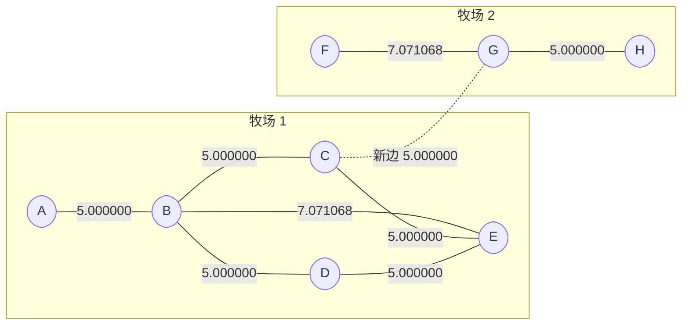

[[TOC]]

## 形式化题目

给定一张 $N$ 个顶点的无向图，顶点 $i$ 有坐标 $(X_i, Y_i)$；直接相连的两点之间距离为欧氏距离 $|p_ip_j|$，两点间的距离定义为最短路径长度。图的各连通分量称为**牧场**，一个牧场的**直径**是其中任意两点距离的最大值。

已知图至少有两个连通分量，要求**恰好**添加一条连接两个不同连通分量的边，使得新牧场的直径最小。若两条路径只在几何上交叉而不共享顶点，不算连通。

以样例为例，两个牧场与候选新边如下（实线为已有路径，虚线为最优新边）：

牧场 1 由 $\{A,B,C,D,E\}$ 组成，牧场 2 由 $\{F,G,H\}$ 组成，两牧场之间没有任何路径。牧场 1 的直径由 $A$ 到 $E$ 贡献：$A-B-E = 5+\sqrt{50}\approx 12.071068$；图中虚线 $C-G$ 就是使新牧场直径最小的那条新边。

## 正解

### 思路

最直接的做法是：先对原图跑一次 Floyd 求出所有点对的最短路，再枚举要加的那条新边，**每枚举一条就把边加进图里重跑一次 Floyd**，算出新直径后取最小。这个做法是"正确"的，但 $O(N^2)$ 次枚举各配一次 $O(N^3)$ 的 Floyd，总复杂度 $O(N^5)$，$N=150$ 时约 $7.6\times 10^{10}$ 次运算，根本跑不完。

问题是：重跑真的必要吗？新边连接的是两个连通分量，它只有两个端点，所以重跑所改动的最短路其实只有**跨分量**那一部分，而这一部分有闭式解。下面两条性质把它讲清楚。

先用一个记号：$R(i)=\max_{v\,\in\,C(i)} d(i,v)$，即 $i$ 到自己所在牧场内最远点的距离，记 $i$ 所在连通分量为 $C(i)$。

**性质 1：加一条边不会让原牧场内部的最短路变短。** 设新边为 $(a,b)$，$a$、$b$ 分属牧场 $C_a$、$C_b$。如果牧场 $C_a$ 里原来某个最短路的更短替代方案用到了新边，它就必须走出 $C_a$、再从新边回来；但新边是连接这两个分量的唯一一条边（否则它们本来就连通），一来一回要走两遍，边权为正，去掉这段反而更短，矛盾。于是**各牧场自己的直径原样保留**，其中最大值

$$D=\max_{i} R(i)$$

是答案无法绕过的下界。

**性质 2：跨分量的点对，路径形状是固定的。** 加新边 $(a,b)$ 之后，对 $u\in C_a$、$v\in C_b$，任何一条 $u\to v$ 的路都必须经过 $(a,b)$，于是

$$d'(u,v)=d(u,a)+|p_ap_b|+d(b,v)$$

固定 $(a,b)$ 时，这一式对 $u$、$v$ 的最坏取值就是各自取"自家最远的点"，因此由跨分量路径贡献的直径是

$$R(a)+|p_ap_b|+R(b)$$

把两个来源合起来：加边 $(a,b)$ 后的新直径恰为 $\max\bigl(D,\; R(a)+|p_ap_b|+R(b)\bigr)$。于是只需要 $O(N^3)$ 一次 Floyd 求出 $d$，再算 $R(i)$，最后 $O(N^2)$ 枚举跨分量的 $(a,b)$：

$$\text{answer}=\min_{\substack{a,b\\ d(a,b)=\infty}}\ \max\Bigl(D,\; R(a)+|p_ap_b|+R(b)\Bigr)$$

用样例核对这个公式。每个点的 $R(i)$ 与逐对候选值如下：

| 牧区 | 牧场 | $R(i)$ |
| --- | --- | --- |
| A | 1 | 12.071068 |
| B | 1 | 7.071068 |
| C | 1 | 10.000000 |
| D | 1 | 10.000000 |
| E | 1 | 12.071068 |
| F | 2 | 12.071068 |
| G | 2 | 7.071068 |
| H | 2 | 12.071068 |

$D=\max_i R(i)=12.071068$。再枚举跨牧场点对，前几小的候选是：

| 新边 $(a,b)$ | $R(a)$ | $\lvert p_ap_b\rvert$ | $R(b)$ | $R(a)+\lvert p_ap_b\rvert+R(b)$ |
| --- | --- | --- | --- | --- |
| C–G | 10.000000 | 5.000000 | 7.071068 | **22.071068** |
| B–G | 7.071068 | 10.000000 | 7.071068 | 24.142136 |
| E–G | 12.071068 | 7.071068 | 7.071068 | 26.213203 |
| C–F | 10.000000 | 11.180340 | 12.071068 | 33.251408 |

最小值出现在 `C–G`，$\max(12.071068,\,22.071068)=22.071068$，与样例输出一致。加边后新牧场的直径确实是 `F` 到 `D`：$F\!-\!G$（$\sqrt{50}$）、$G\!-\!C$（$5$）、$C$ 再走两条长度为 $5$ 的路到达 $D$，合计 $7.071068+5+10=22.071068$。

这里必须单独强调一点，它是本题最容易写错的地方：**$\max$ 里的 $D$ 不能省**。当两个牧场各自很小、彼此也很近，而别的牧场直径更大时，会有 $R(a)+|p_ap_b|+R(b)<D$；真实数据 `travel7` 就是这种情形：它的 $D=39796.392691$ 大于最小候选 $22693.893986$，答案只能取 $D=39796.392691$。

代码里的名字与上面公式的对应关系是：`span` 就是 $d$（`inf` 表示两个牧区分属不同牧场），`far[i]` 就是 $R(i)$，`diameter` 就是 $D$，`bridge` 就是 $\min_{d(a,b)=\infty} R(a)+|p_ap_b|+R(b)$，最后 `max(diameter, bridge)` 保留 6 位小数输出。

核心循环是 Floyd 的向量化写法：第 $k$ 轮先把第 $k$ 列整列取出来（这一轮里它不会被改写），再让每一行整体取出 $\min\bigl(d[i][j],\, d[i][k]+col[j]\bigr)$，`d[i][k]` 为 `inf`（不连通）的行直接跳过。边界上，$N=2$ 且两点无边时 $D=0$、候选只有 $|p_0p_1|$ 一个，公式照样成立；某个牧场只有孤立一点时它的 $R=0$，等价于"贴着这个点连过去"。

另外两个实现细节也值得说明：

- **邻接矩阵必须逐位读**，不能当成整数 token。`01000000` 会被 Python 解析成整数 `1000000`，行首的 `0` 直接消失，全 `0` 行更是变成 $0$ 位都没有；数据里也确实有实心行（`travel0.in` 第 33 行是 30 个连续的 `1`）。代码用字节切片 `row[j : j + 1]` 精确取出第 $j$ 位。
- **距离要先开方再 Floyd**。"用平方距离省掉开方"在这里是错的：边权要参与加法，$(x+y)^2\ne x^2+y^2$，改成平方距离会把样例算成 `11.180340`。所以只在建边时开方一次，Floyd 全程用真实距离，输出时格式化为 6 位小数。

### 代码

@include-code(./main.py, python)

### 复杂度

- 时间复杂度：$O(N^3)$，Floyd 贡献全部主要开销；求 $R(i)$ 与枚举新边都是 $O(N^2)$。
- 空间复杂度：$O(N^2)$，用于存储最短路表与邻接矩阵。

## 总结

- 牧场 = 连通分量，牧区距离 = 分量内最短路，牧场直径 = 分量内最大点对距离。
- 加边不会改变原分量内部的最短路，所以原有最大直径 $D$ 是答案下界，必须用 `max` 保留。
- 跨分量点对的路径被新边唯一决定，最坏情况只取决于 $R(i)=$ "到本牧场最远点的距离"：
  $\text{answer}=\min_{a,b\text{ 跨分量}}\max\bigl(D,\,R(a)+|p_ap_b|+R(b)\bigr)$。
- 关键是把"枚举新边 + 重跑 Floyd"的 $O(N^5)$ 换成"一次 Floyd + $R$ 表"的 $O(N^3)$。
- 两个易错点：01 邻接矩阵要逐位读；距离要在建边时就开方，不能拿平方距离做 Floyd。
