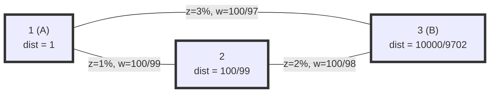

[[TOC]]

## 形式化题目

给定 $n$ 个点（$1 \leqslant n \leqslant 2000$）的带权无向图：$m$ 条边 $(x, y, z)$，$z$ 为百分数且 $z < 100$。钱沿着一条路径 $v_0 \to v_1 \to \cdots \to v_k$ 转账时，每经过一条边 $(v_{i-1}, v_i, z_i)$，这笔钱就被扣掉当次金额的 $z_i\%$（手续费从转账金额里扣，不是额外掏钱）。给定起点 $A$、终点 $B$（保证两者直接或间接可达），问 $A$ 至少要转出多少钱，才能让 $B$ **到账恰好 100 元**。答案精确到小数点后 8 位。

"到账 100 元"是固定值，要最小化的是起点的本金，所以这是一个把每条转账边看成"钱会缩水的管道"、求最优转账路线的最优化问题。

## 正解

### 思路

**朴素做法**：枚举 $A$ 到 $B$ 的所有路径，对每条路径算出 $A$ 需要的转出金额，取最小。但路径条数随边数指数增长（同一条路还能来回绕圈），$n \leqslant 2000$、$m$ 近 $10^5$ 时完全不可行。瓶颈在于"按路径枚举"：路径的代价没法在枚举过程中高效地共享。

**第一步观察——手续费可以换算成"放大因子"**。一条手续费 $z\%$ 的边，如果想让对面到手 $t$ 元，自己必须转出 $t \cdot \frac{100}{100-z}$ 元：出账先被扣掉 $z\%$，剩下的 $t \cdot \frac{100-z}{100} \cdot \frac{100}{100-z} = t$ 正好到账。这个比值只跟 $z$ 有关、和 $t$ 无关，且恒大于 $1$。于是每条边抽象成一个乘法因子

$$w = \frac{100}{100-z} > 1 .$$

**第二步观察——路径的代价是因子的连乘**。把路径 $A = v_0, v_1, \dots, v_k = B$ 从 $B$ 端往回推：$v_{k-1}$ 要转出 $100 \cdot w_k$，$v_{k-2}$ 要转出 $100 \cdot w_k \cdot w_{k-1}$，一路乘到 $A$：

$$\text{A 的最少转出金额} = 100 \times \prod_{i=1}^{k} w_i .$$

要最小化转出金额，就是要**最小化路径上因子的乘积**。

**第三步观察——连乘最小 ⟺ 对数和最小**。所有 $w_i > 1$，取对数后 $\ln w_i > 0$；对数是严格递增的双射，所以

$$\min \prod_i w_i \iff \min \sum_i \ln w_i .$$

右端正是**非负边权最短路**，Dijkstra 适用。也可以不真的取对数，直接在倍数上跑 Dijkstra：松弛条件 `factor * w < dist[v]` 与对数域的加法松弛比较的是同一组路径的同一大小关系，而 Dijkstra 的贪心归纳只需要"松弛算子单调、边权不减小"（$w > 1$ 保证越乘越大），因此乘法版本同样正确。本解选乘法版本，代码更短，还省掉输出前把 $e^{d}$ 变回倍数的一步浮点运算。

**算法**：邻接表 + 二叉堆 Dijkstra，`dist[A] = 1.0`（不转账金额不变），答案为 `dist[B] * 100`。重边、自环都无需特判：松弛自动取到最小因子，自环只会把乘积变大。

用样例核对这套模型：$A=1, B=3$。直连边 $(1,3,z{=}3)$ 的因子是 $\frac{100}{97} \approx 1.030928$；中转 $1 \to 2 \to 3$ 的因子是 $\frac{100}{99} \cdot \frac{100}{98} = \frac{10000}{9702} \approx 1.030716$，反而更小——手续费低的两段接力胜过手续费高的一段直达。所以答案 $100 \cdot \frac{10000}{9702} \approx 103.07153164$，与样例一致。

### 代码

@include-code(./main.py, python)

### 复杂度

- 时间复杂度：$O(m \log m)$。堆 Dijkstra 中每条边至多触发一次成功松弛入堆；$n \leqslant 2000$、$m \approx 10^5$ 时最大测例实测 0.09 s，低于 1 s 限制。与 C++ 正解（$O(n^2)$ 朴素或 $O(m \log m)$ 堆实现）同阶，没有为 Python 换成暴力。
- 空间复杂度：$O(n + m)$。邻接表 + 距离数组，最大测例实测峰值 61.5 MB，低于 128 MB 限制。
- 精度：因子连乘至多 $n-1 \approx 2000$ 次，double 相对误差累计远小于第 9 位四舍五入门限 $5 \times 10^{-9}$，`.8f` 输出与真值一致（10 组真实数据逐字节一致）。

## 总结

一句话：把"手续费 $z\%$"换算成放大因子 $\frac{100}{100-z}$，"最少花多少"就变成"$A$ 到 $B$ 的最小因子连乘路径"；因为所有因子都大于 $1$，这在对数域里是非负权最短路，直接跑（乘法）Dijkstra，答案乘 100 保留 8 位小数。这道题最值得记住的转化有两处：**从终点倒推"到手 $t$ 元要出账 $t \cdot \frac{100}{100-z}$"**，以及**用取对数把连乘最优化变成求和最优化**——后者是所有"乘积最优化"问题的通用钥匙。样例还顺带提醒：直连不一定是最好的，两段低手续费的接力可以胜过一段高手续费的直达。

## 图示解析

先看单条边的语义：手续费 $z\%$ 意味着出账 $c$ 元、到账 $c \cdot \frac{100-z}{100}$ 元。反过来要让到账凑足 $t$ 元，出账必须是 $t \cdot \frac{100}{100-z}$ 元：

| 出账 $c$ | 手续费 $z$ | 被扣 $c \cdot z\%$ | 到账 $c \cdot \frac{100-z}{100}$ |
| :---: | :---: | :---: | :---: |
| $100/(100-z)$ | $z\%$ | $z/(100-z)$ | $1$ |

也就是说，**每过一条边金额都会按 $\frac{100-z}{100}$ 缩水**；从 $B$ 倒着看，每退过一条边就要按 $\frac{100}{100-z}$ 补回去。

再看样例转账网络的结构与边因子（点旁标注的 $\mathrm{dist}$ 是 Dijkstra 算出的"让该点到账 1 元、$A$ 至少要出的倍数"，最优路线用粗边表示）：

最优路线是 $1 \to 2 \to 3$（图上全部三点了，粗边即路径本身）：Dijkstra 的两步过程如下表。

| 步骤 | 堆顶（取出的点） | 松弛结果 |
| :---: | :--- | :--- |
| 初始 | — | $\mathrm{dist}[1] = 1$ |
| 1 | 点 $1$ | $\mathrm{dist}[2] \leftarrow 1 \cdot \frac{100}{99} \approx 1.010101$；$\mathrm{dist}[3] \leftarrow 1 \cdot \frac{100}{97} \approx 1.030928$ |
| 2 | 点 $2$（倍数最小） | $\mathrm{dist}[3] \leftarrow \frac{100}{99} \cdot \frac{100}{98} = \frac{10000}{9702} \approx 1.030716$（覆盖直连值） |
| 3 | 点 $3$ | 取出即最终答案：$100 \times \frac{10000}{9702} \approx 103.07153164$ |

注意第 2 步：$\frac{10000}{9702} \approx 1.030716 < \frac{100}{97} \approx 1.030928$，两段低手续费的接力把直连边的倍数**覆盖**掉了——这正是样例答案走中转的原因。因为每条边因子都大于 $1$，往回绕只会让倍数更大，堆顶取出的点不会再被改进，Dijkstra 的贪心因此成立。
