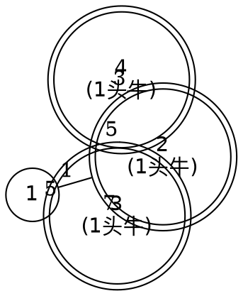

[[TOC]]

## 形式化题目

给出一个 $P$ 个顶点、$C$ 条无向带权边的图（顶点编号 $1 \sim P$，边权 $D > 0$），
以及 $N$ 个顶点上的标记（第 $i$ 头奶牛所在的牧场 $\text{cow}_i$，同一个顶点上可能有多头牛）。
求

$$\min_{1 \le x \le P} \sum_{i=1}^{N} \mathrm{dist}(\text{cow}_i,\, x)$$

其中 $\mathrm{dist}(u, v)$ 是图上 $u$ 到 $v$ 的最短路径长度（边权和）。
题面保证 $1 \le N \le 500$，$2 \le P \le 800$，$1 \le C \le 1450$，$1 \le D \le 255$。

样例：$N=3$ 头牛分别在牧场 $2, 3, 4$，边为
$1\!-\!2\,(1)$、$1\!-\!3\,(5)$、$2\!-\!3\,(7)$、$2\!-\!4\,(3)$、$3\!-\!4\,(5)$，
答案为 $8$（糖放在 $4$ 号牧场）。

## 正解

### 思路

**一句话本质**：枚举糖放在哪个牧场（$P$ 个候选），对每个候选跑一次单源最短路得到它到所有
牧场的最短距离，再按"每个牧场上有几头牛"加权求和，取最小值。

下面从最朴素的想法推起。

#### 朴素做法与它的瓶颈

最直接的想法是三层枚举：枚举糖的位置 $x$，枚举每头牛 $i$，再想办法算出
$\mathrm{dist}(\text{cow}_i, x)$。麻烦出在最后一层。

**问题？** 能不能不做最短路，直接用两点之间的直连边？

不能。看样例：$2$ 号和 $3$ 号之间有一条长 $7$ 的道路，但绕 $2 \to 1 \to 3$ 只需
$1 + 5 = 6$。如果按直连边算，放 $2$ 号会误得 $0 + 7 + 3 = 10$，而正确答案是
$0 + 6 + 3 = 9$——**奶牛当然走最短路，不走指定的那条边**。所以必须真正求最短路。

那么"求最短路"这一步该怎么做？很自然的候选是全源最短路 Floyd：

```text
for k in 1..P:
    for i in 1..P:
        for j in 1..P:
            d[i][j] = min(d[i][j], d[i][k] + d[k][j])
```

**问题？** Floyd 在这里够用吗？

复杂度是 $O(P^3)$。本题 $P \le 800$，于是 $800^3 \approx 5.1 \times 10^8$ 次内层判断。
C++ 里勉强能过，但在 Python 里每次内层判断还要做一次列表下标访问和 `min`，
实际执行时间远超 $1000\ \text{ms}$ 的限制。

**更关键的是：我们根本不需要 $P \times P$ 的距离矩阵。** 本题要的只是"每个源到 $N$ 头牛
所在点的距离之和"，是一次性的标量。Floyd 花大力气算出了所有点对的完整矩阵，其中绝大
部分（任意两点之间的距离）我们连看都不会看一眼。这是典型的"算多了"。

#### 观察：图很稀疏，需求是"逐源"

看数据规模：$P = 800$，$C = 1450$。边数只有点数不到两倍，平均度数
$2C/P \approx 3.6$——这是稀疏图（实测最大测试点最大度数仅 $11$）。

同时，需求结构是"**每个点都当一次源**"：$P$ 个候选牧场，每个候选需要一次"从它出发到
所有点的距离"。这正是**跑 $P$ 次单源最短路**的形状，而不是"一次性求全源矩阵"的形状。

稀疏图上单源最短路的正确工具是**堆优化 Dijkstra**：每次 $O\big((C + P)\log P\big)$。

#### 优化：$P$ 次堆优化 Dijkstra

边权全部为正（$1 \le D \le 255$），Dijkstra 的贪心正确性成立。跑 $P$ 次后总复杂度为

$$O\Big(P \,(C + P)\log P\Big) \approx 800 \times 2250 \times 10 \approx 1.8 \times 10^{7}$$

比 Floyd 的 $5.1 \times 10^8$ 低了**一个多数量级**，而且这个量级在 Python 里只需约
$0.35\ \text{s}$（实测最大测试点）。

#### 两个落地细节

**细节一：按"牛的头数"加权，而不是逐头牛求和。** 题面明确说"一个牧场不一定只有一头牛"。
用 `Counter` 统计每个牧场上有几头牛，一次 Dijkstra 后只需遍历**有牛的牧场**做加权求和：

$$\sum_{i=1}^{N} \mathrm{dist}(\text{cow}_i, x) \;=\; \sum_{v\,:\,\text{cnt}[v] > 0} \text{cnt}[v] \cdot \mathrm{dist}(v, x)$$

两个式子在数学上恒等（把相同位置的项合并），但后者的求和粒度是"牧场数"而非"牛的头数"，
语义更贴合题意。

**细节二：不可达要跳过，不要让"无穷大"参与求和。** 题面并没有保证图连通。如果某头牛
所在的牧场从候选源 $x$ 不可达，那么 $x$ 就不是一个合法答案，必须**跳过**它；若让
$\infty$ 进入求和，会得到 `inf` 而污染最小值比较。

#### 算法流程

```text
读入 N, P, C
读入 N 头牛的位置 → cows
建邻接表：每条无向边 (a, b, w) 双向加入 adj[a], adj[b]
cnt = Counter(cows)                       # 每个牧场的牛数

best = +∞
for src in 1..P:
    dist = Dijkstra(src)                  # dist[v] = src 到 v 的最短路
    if 存在有牛的牧场 v 使 dist[v] 不可达:
        continue                          # 该候选非法
    total = Σ_v cnt[v] * dist[v]
    best = min(best, total)

输出 best
```

#### 样例推演

样例的牧场地形（双圈节点表示该牧场有牛，边上是道路长度）：



把 $P = 4$ 个候选分别跑一次 Dijkstra，结果汇总如下（✅ 标记最小值）：

| 糖放在 | 到2号(×1) | 到3号(×1) | 到4号(×1) | 总距离和 |
| --- | --- | --- | --- | --- |
| 1 | 1 | 5 | 4 | **10** |
| 2 | 0 | 6 | 3 | **9** |
| 3 | 6 | 0 | 5 | **11** |
| 4 ✅ | 3 | 5 | 0 | **8** |

重点看第 2 行：直连边 $2\text{–}3 = 7$，但**最短路**是 $2 \to 1 \to 3 = 1 + 5 = 6$，
所以放 $2$ 号的总和是 $0 + 6 + 3 = 9$；再用第 4 行比较，放 $4$ 号得
$3 + 5 + 0 = 8$ 最小。与样例输出 `8` 以及题面"放在 4 号牧场最优"一致。

（插一句：表里 $1$ 号、$3$ 号、$4$ 号都能让奶牛走，但只有 $4$ 号取到 $8$。
题面说"放在 4 号牧场最优"，指的是**最小值唯一**，并不表示其他位置不可行。）

### 代码

`dijkstra(src, adj)` 回答"从 src 出发到所有牧场的最短距离"；`UNREACHABLE = -1` 是
不可达的占位标记，使得到达性判断不必依赖浮点 `inf`。`solve()` 只做读入、枚举与输出。

@include-code(./main.py, python)

### 复杂度

- 时间复杂度：$O\big(P\,(C + P)\log P\big)$。$P$ 次堆优化 Dijkstra，每次
  $O\big((C+P)\log P\big)$。最大数据下约 $1.8 \times 10^7$ 次基本操作，
  实测最大测试点约 $0.35\ \text{s}$，远低于 $1000\ \text{ms}$ 限制。
  对比：Floyd 的 $O(P^3) \approx 5.1 \times 10^8$ 在 Python 中不可接受。
- 空间复杂度：$O(C + P)$，即邻接表与单次距离数组；每次 Dijkstra 的距离数组用完即弃，
  不保存 $P \times P$ 的距离矩阵。

## 总结

本题的核心不是"最短路模板"，而是**看清需求的数据形状**：要的是"每个源到 $N$ 个标记点的
距离和"，不是"全源距离矩阵"。由此得到两条判断：

1. **别用 Floyd。** $P = 800$ 时 $O(P^3)$ 在 Python 中会超时，而我们只需要一次性标量，
   不必付出求全源矩阵的代价。
2. **用 $P$ 次堆优化 Dijkstra。** 图稀疏（$C = 1450 \approx 1.8P$），边权为正，
   $O\big(P(C+P)\log P\big)$ 比 Floyd 低一个多数量级，是本题的稀疏图正解，
   与 C++ 标准解同阶。

另外两个易错点：同牧场多牛必须**按头数加权**求和；图可能不连通，**不可达的候选源要跳过**，
不能让"无穷大"进入最小值比较。

实测内容详见 `problem-analysis-workspace/` 中的推导文档与可视化脚本
（`viz_render.py` 可重跑并打印样例对照表）。
