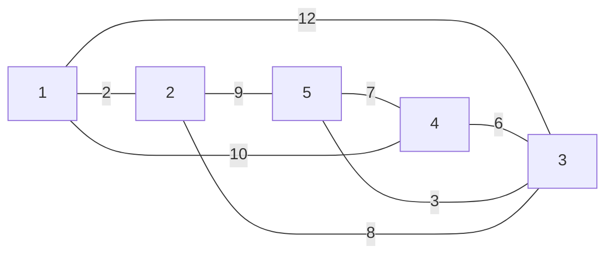
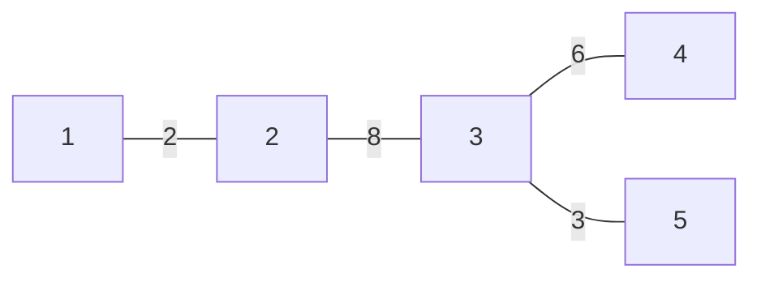

[[TOC]]

## 形式化题目

给定无向连通图 $G=(V,E,w)$，$|V|=n$（$1 < n \leqslant 100$），每条边 $e=(i,j)$ 带造价 $w_e$。求一个边子集 $T \subseteq E$，使得 $(V,T)$ 连通且 $\sum_{e \in T} w_e$ 最小，输出 $T$ 中每条边的两个端点（共 $n-1$ 行，小端点在前，整体按字典序）——即求**最小生成树（MST）**并按指定格式输出其边集。

样例是 5 个城市、8 条候选边（下图标出了每条边的造价）：

图中节点是城市编号、边上的数字是造价。5 个城市只要 4 条边就能连通，样例选的是 $\{1\text{-}2,\ 2\text{-}3,\ 3\text{-}4,\ 3\text{-}5\}$，总造价 $2+8+6+3=19$——注意被放弃的 $1\text{-}3$（12）、$4\text{-}1$（10）都是"贵而且能用更便宜的边绕过去"的典型。

## 正解

### 思路

这道题是最小生成树的直接应用，没有值得单独分层的朴素做法，因此按直接正解型组织。核心是 Kruskal 贪心：**把所有边按造价从小到大排序，依次尝试每条边——若它两端的城市还没连通就选它，已经连通就跳过，选满 $n-1$ 条边为止**。

为什么"每步挑最便宜的、不形成环的边"是对的？观察任意时刻已选边集：它构成一个森林 $F$。当边 $(u,v)$ 到来且 $u,v$ 不在同一棵树里时，$(u,v)$ 恰好是跨越"$u$ 所在树"与"其余城市"这个划分的、当前最便宜的边——如果存在更便宜的跨边，它排序在前、早该被处理：要么它当时被选中（那两棵树早已合并，与"异根"矛盾），要么它当时两端已同根（森林只增不减，现在仍同根，还是矛盾）。数学上这叫**割性质（cut property）**：跨任何划分的最小边必在某棵 MST 中。于是每一步的选择都"不会错"，归纳下去选出的 $n-1$ 条边就是一棵最小生成树。

"是否连通"用**并查集**维护：每个连通块是一棵树，`find(x)` 沿父指针找到根，路径压缩让每次查询几乎 $O(1)$。选一条边就是把两个块合并（`father[ru] = rv`）；跳过一条边的原因是它两端同根——此时加上它必成环，且环上其他边权都不大于它，它永远不会进入最优解。

样例上的完整过程（端点已归一化、边已按权排序）：

| 序 | 边（权） | 扫描前的连通块 | 动作 | 已选森林 |
| --- | --- | --- | --- | --- |
| 1 | 1-2（2） | $\{1\},\{2\},\{3\},\{4\},\{5\}$ | 选中，合并 $\{1,2\}$ | 1-2 |
| 2 | 3-5（3） | $\{1,2\},\{3\},\{4\},\{5\}$ | 选中，合并 $\{3,5\}$ | 1-2，3-5 |
| 3 | 3-4（6） | $\{1,2\},\{3,5\},\{4\}$ | 选中，合并 $\{3,4,5\}$ | 1-2，3-5，3-4 |
| 4 | 2-3（8） | $\{1,2\},\{3,4,5\}$ | 选中，合并全部 | 1-2，3-5，3-4，2-3 |
| — | 其余边 | 已成 4 条 = $n-1$ | 提前退出 | 输出前按 $(u,v)$ 排序 |

表中第 4 行选完 2-3 后恰好凑满 $n-1=4$ 条，算法立刻停止——后面 2-5（9）、4-1（10）等更贵的边根本不会被看。最后按 $(u,v)$ 字典序排序输出，得到样例的 `1 2 / 2 3 / 3 4 / 3 5`。选出的树如下：

与前面的原图对比：$5\text{-}4$（7）被 3-4（6）替代、$1\text{-}3$（12）被 2-3（8）替代，每条未选边的两端都能沿更便宜的路径互相到达。

**本题真正的陷阱不在算法，而在输出。** MST 的边集并不唯一：当若干条边权值相同时，任选其中一种"凑足各权值配额"的方案都是最小生成树，而这题要求输出与官方答案逐行一致。实测 ROJ 数据里同权边约占九成（如 problem1 有 2893 条边、2597 条权值重复），我尝试了 $(w,u,v)$、$(w,v,u)$、按输入正序/逆序四种稳定排序 key，全部在第 1、2 组数据就与官方输出失配。原因是官方数据由题目自带的 std.cpp 生成，它用的是**手写快速排序**——这种排序在相等权元素之间也会交换（不稳定），同权边的最终顺序由输入顺序和轴枢位置共同决定，任何稳定排序都无法复现。所以 `main.py` 把 std 的快排逐语句移植过来：轴枢取区间中点元素的权、双指针扫描、相等也交换、递归两段。这不是风格偏好，而是"对评测负责"的必要复现。并查集同样保留 std 的递归 `find` + 路径压缩写法，$n \leqslant 100$ 下递归深度安全。

### 代码

@include-code(./main.py, python)

### 复杂度

- 时间复杂度：快排平均 $O(e \log e)$（最坏 $O(e^2)$，数据未触发），主循环 $e$ 次均摊近似 $O(\alpha(n))$ 的并查集操作，输出排序 $O(n \log n)$；总计以 $O(e \log e)$ 为主，$e \approx 6300$ 实测 0.02 s。
- 空间复杂度：$O(e + n)$，边表与并查集数组。

## 总结

一本通例 4-9 的城市公交网建设就是最小生成树的模板题：Kruskal 用"排序 + 并查集"把'连通且最省'翻译成一次线性扫描，割性质保证了每步贪心都安全。本题的额外一课是**MST 的不唯一性**——真实数据同权边占九成，任何"讲道理"的稳定排序都选出了另一棵同样最小的树；要让输出与官方答案逐行一致，必须连同 std 的不稳定手写快排一起复现。Python 侧 10 组真实数据全部 PASS，单组 0.015–0.020 s、峰值内存 ≤ 16.4 MB，远在 1000 ms / 128 MB 限制之内。
