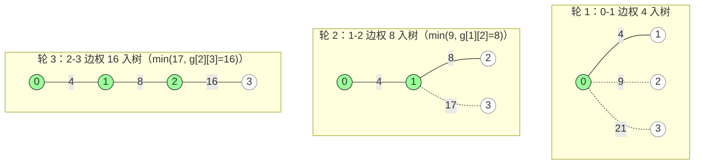

[[TOC]]

## 形式化题目

给定 $n$ 个点的无向完全图（$3 \leqslant n \leqslant 100$）的邻接矩阵，第 $i$ 行第 $j$ 列是点 $i$ 与 $j$ 之间的边权（对角线为 $0$，边权不超过 $100000$）。求这棵最小生成树的边权总和。

## 正解

### 思路

先看朴素做法行不行：在 $n$ 个点的完全图里枚举所有生成树有 $n^{n-2}$ 棵（Cayley 公式），$n = 100$ 时约 $10^{196}$ 棵，完全不可行；而"每次随便挑一条能连通新点的边"这种随意贪心也不成立——它会把树引向远处，错过近处更便宜的接入点。瓶颈在于没有利用边权的局部结构。

而"连通所有农场、总长最短"其实就是最小生成树（MST）的字面定义，识别出模型本题就解决了一大半。MST 的 cut 性质恰好补上贪心需要的结构保证：把点集划分成"已进树 / 未进树"两半时，横跨两半的最短边一定属于某棵 MST——每一步都可以放心地做同一个贪心动作：**把距离当前树最近的树外点拉进树**，永不反悔。

剩下的问题是选哪条实现路线：输入给的是**邻接矩阵**，完全图有 $\binom{n}{2}$ 条边，是典型的稠密图——Prim 的数组版恰好是 $O(n^2)$，与"把矩阵读进来"这件事本身同阶，不可能有更优的复杂度；Kruskal 还要先把矩阵摊成边表再排序，反而多一步。所以直接用 Prim。

整个算法只需要维护一个数组：$\text{dis}[j]$ 表示树外点 $j$ 到当前树的最短边权。新点 $k$ 进树时，其余树外点的距离只会因为 $k$ 的出现而变小，所以只需用矩阵第 $k$ 行做一次松弛：

$$\text{dis}[j] \gets \min(\text{dis}[j],\ g[k][j])$$

下面用 4 个点的样例走一遍完整过程（初始树只有农场 $0$）：

实线是已选入生成树的边，虚线是该轮"树外点到树"的候选边。每轮被拉进树的点用绿色标出，它到树的那条最短边就是本轮的答案增量。逐轮的 $\text{dis}$ 数组变化如下（`INF` 表示该点已在树中、不再参与选取）：

| 轮次 | 入树点 | 选中边权 | 松弛后 dis[0..3] | 累计答案 |
| --- | --- | --- | --- | --- |
| 初始 | $0$（起点） | — | `INF, 4, 9, 21` | $0$ |
| 1 | $1$ | $4$ | `INF, INF, 8, 17` | $4$ |
| 2 | $2$ | $8$ | `INF, INF, INF, 16` | $12$ |
| 3 | $3$ | $16$ | `INF, INF, INF, INF` | $28$ |

表格里最值得注意的是第三列：点 $3$ 的距离从 $21$（到起点 $0$）被松弛到 $17$（到点 $1$），再松弛到 $16$（到点 $2$）——"到树的距离"始终只是一个数，新点入树时用它的行做一遍 $\min$，历史信息全部被吸收。这正是 Prim 只需 $O(n)$ 空间维护距离、$O(n^2)$ 时间完成全部松弛的原因。

实现上有两个容易踩的坑，都由同一条不变量堵住——**已入树的点必须始终是 $\infty$**：初始时 $\text{dis}[0]$ 要置 $\infty$（否则第一轮会白选起点）；松弛时对角线上的 $g[k][k] = 0$ 会把刚入树的点拉回 $0$，所以松弛那一行要同时对树内点强制置回 $\infty$。

另外读入时注意：矩阵虽然逻辑上是 $n$ 行，但实际数据按 80 字符折行，行结构与逻辑无关，必须把整个输入当 token 流一次读完（`read().split()`），按行读反而会出错。

### 代码

@include-code(./main.py, python)

### 复杂度

- 时间复杂度：$O(n^2)$。读矩阵 $O(n^2)$；Prim 共 $n-1$ 轮，每轮"找最小"加"松弛"各 $O(n)$。$n \leqslant 100$ 时约 $10^4$ 次运算，与正解同阶。
- 空间复杂度：$O(n^2)$，即距离矩阵本身；`dis`、`in_tree` 均为 $O(n)$。

## 总结

- 题面是 MST 的字面定义；枚举生成树（$n^{n-2}$ 棵）不可行，而 cut 性质保证了"选距离树最近的点拉入"的贪心永不反悔。
- **邻接矩阵输入 + 稠密图**决定了选 Prim 数组版而非 Kruskal。
- Prim 的循环不变量：$\text{dis}[j]$ 始终是树外点 $j$ 到当前树的最短边权；新点入树时用它的行做一遍 $\min$ 松弛即可维护。
- 正确性来自 cut 性质：跨"树内 / 树外"切口的最短边可以安全入树，贪心永不反悔。
- 实现坑点：树内点必须恒为 $\infty$（起点初始化 + 松弛时屏蔽 $g[k][k]=0$）；折行矩阵要按 token 流读入。
