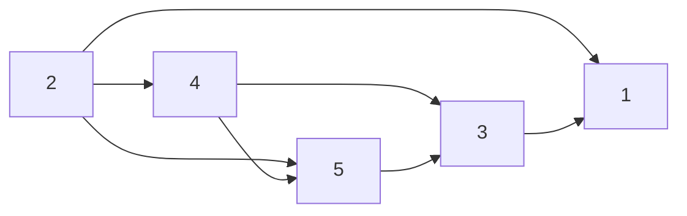

[[TOC]]

## 形式化题目

把每个人看作有向图中的一个节点；若 u 是 v 的父亲，则建立一条有向边 u → v。
家族关系构成一个有向无环图（DAG）。题目要求输出该 DAG 的一个拓扑序：对于每条边 u → v，u 在序列中必须出现在 v 之前。

## 正解

### 思路

直接对辈分 DAG 做 Kahn 拓扑排序。

1. 根据每行的儿子列表建图，并统计每个节点的入度。
2. 把所有入度为 0 的节点加入队列——这些人是当前没有未输出父辈的人，可以安全输出。
3. 每次取出队首节点 u 加入答案，并遍历 u 的所有儿子 v：把 v 的入度减 1；若 v 的入度变为 0，说明 v 的所有父辈都已输出，把 v 入队。
4. 队列为空时，输出的序列就是合法序列。

> 家族关系是真实的父子关系，不会出现 A 是 B 父亲、B 又是 A 父亲的情况，因此图一定是 DAG，必然存在合法拓扑序。

### 样例推演

样例对应的有向图如下：

各节点初始入度：

| 节点 | 1 | 2 | 3 | 4 | 5 |
| --- | --- | --- | --- | --- | --- |
| 入度 | 3 | 0 | 2 | 1 | 2 |

执行过程：

1. 只有 2 入度为 0，输出 2；删除 2→4、2→5、2→1。
2. 4 入度变为 0，输出 4；删除 4→5、4→3。
3. 5 入度变为 0，输出 5；删除 5→3。
4. 3 入度变为 0，输出 3；删除 3→1。
5. 1 入度变为 0，输出 1。

得到序列 `2 4 5 3 1`，与样例输出一致。

### 代码

@include-code(./main.py, python)

### 复杂度

设 N 为家族人数，M 为父子关系总数。

- 时间复杂度：建图 O(N + M)，Kahn 算法每个节点出队一次、每条边被访问一次，也是 O(N + M)。总体 O(N + M)。
- 空间复杂度：邻接表、入度数组、队列、答案数组均为 O(N + M)。

## 总结

本题本质上是 DAG 的拓扑排序。把“父亲→儿子”的辈分关系建为一条有向边后，用 Kahn 算法维护入度，每次输出入度为 0 的节点，即可保证所有先辈都在后代之前出现。
