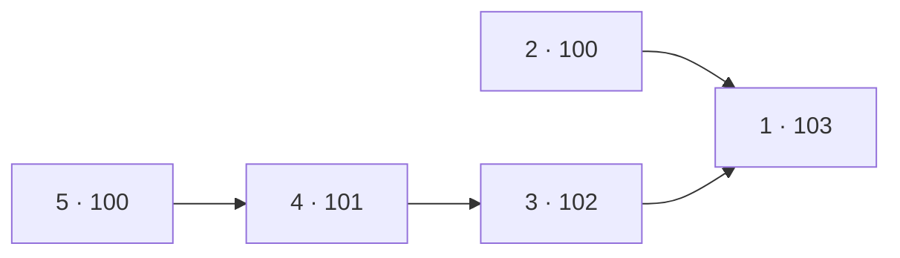

[[TOC]]

## 形式化题目

给定 n 个变量 $pay[1..n]$，每个变量都是不小于 100 的整数；再给定 m 条约束
$pay[a] \geqslant pay[b] + 1$，即第 a 号员工的奖金必须严格高于第 b 号员工。
判断是否存在同时满足全部约束的整数解；若存在，输出所有变量之和的最小值；
若不存在，输出 `Poor Xed`。

样例只有唯一约束 $pay[1] \geqslant pay[2] + 1$：让 $pay[2]$ 取下界 100，
$pay[1]$ 就至少是 101，总和 $101 + 100 = 201$，与样例输出一致。

## 正解

### 思路

**先把“有没有解”说清楚。** 把每条意见写成差分形式
$pay[a] \geqslant pay[b] + 1$。如果存在环
$a_1 > a_2 > \cdots > a_k > a_1$，沿环把不等式累加起来得到
$pay[a_1] \geqslant pay[a_1] + k$，矛盾——所以**约束成环当且仅当无解**，
此时输出 `Poor Xed`；无环时整张图是一个 DAG，解一定存在。

**再看最优解长什么样。** 朴素做法是多轮枚举意见做松弛（Bellman-Ford 式）：
只要某条意见不成立就把 $pay[a]$ 抬到 $pay[b]+1$，直到全部成立。它最坏要
做 O(n·m) 次检查，在 $n = 10000,\ m = 20000$ 下太慢；瓶颈在于每个点被反复
重算。其实每个点只需在**所有前驱都定型后计算一次**，而“前驱全部定型”正是
拓扑排序里入度归零的含义：

1. 把每条意见反向建边 $b \to a$（b 奖金低、a 奖金高），统计入度。
2. 没有任何前驱的人取下界 100；其余人取
   $pay[v] = \max(pay[u]) + 1$（u 为 v 的全部前驱）。
3. 沿反向边方向做 Kahn 拓扑排序：点 u 出队时遍历后继 v，用
   `pay[v] = max(pay[v], pay[u] + 1)` 抬高 v，v 入度归零后再入队。
4. 为什么这样最小：任意可行解都必须让 v 比每个前驱至少高 1 元，所以
   $\max(pay[u]) + 1$ 是 v 绕不开的硬下界；按拓扑序归纳，每个人恰好取到
   这个下界，分量都最小，总和必然最小。
5. 若出队点数少于 n，说明有点永远入不了队，即图中有环，输出 `Poor Xed`。

下面用一组小数据展示反向图与最终奖金：约束为 $1>2,\ 1>3,\ 3>4,\ 4>5$，
反向边是 $2 \to 1,\ 3 \to 1,\ 4 \to 3,\ 5 \to 4$，节点标注的是最终 $pay$。

边的方向就是“比谁低”：源点 2 和 5 没有更低的人要超过，取下界 100；
点 1 同时压在 2 和 3 之上，要取两者中更高的那条链
（$3 \to 1$ 使它从 101 抬到 103），这正是 `max` 起作用的地方。

同一个小数据在 Kahn 循环里的执行过程如下（源点 2、5 按编号先后入队，先入先出）：

| 出队顺序 | 节点 | 出队时的 pay | 触发的更新 |
| --- | --- | --- | --- |
| 1 | 2 | 100 | $pay[1] = 101$ |
| 2 | 5 | 100 | $pay[4] = 101$ |
| 3 | 4 | 101 | $pay[3] = 102$ |
| 4 | 3 | 102 | $pay[1] = 103$ |
| 5 | 1 | 103 | 无后继 |

每个点恰好出队一次，出队时它的 $pay$ 已经由全部前驱抬到位、之后不再变化；
5 个点全部出队（`done = 5 = n`），故有解，总和为
$103 + 100 + 102 + 101 + 100 = 506$。题面样例同理：$2 \to 1$ 一条边，
2 出队把 $pay[1]$ 抬到 101，输出 201。

### 代码

@include-code(./main.py, python)

### 复杂度

设员工数为 n，意见条数为 m：

- 时间复杂度：建图 O(m)，Kahn 主循环每个点出队一次、每条边被访问一次 O(n + m)，
  求和 O(n)，总计 O(n + m)，与 C++ 正解同阶。
- 空间复杂度：邻接表 O(n + m)，入度数组、奖金数组、队列各 O(n)，总计 O(n + m)，
  远小于 128 MB 限制。

## 总结

把“奖金更高”的意见反向建边，约束图就从“必须判断的不等式组”变成了 DAG 上
的递推：入度归零意味着所有前驱已定型，此时 $pay[v] = \max_{u}(pay[u]) + 1$ 恰好
是 v 的硬下界。Kahn 拓扑排序一遍同时完成环检测与递推——出队点数少于 n 即有环，
输出 `Poor Xed`；否则每人取到分量最小值，总奖金即为最小。
