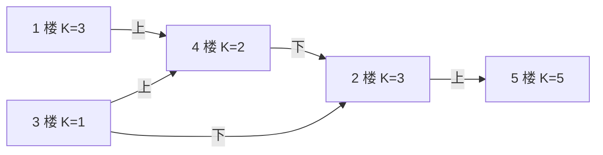

[[TOC]]

## 形式化题目

楼有 $N$ 层，编号 $1 \dots N$，第 $i$ 层上写有数字 $K_i$（$0 \leqslant K_i \leqslant N$）。电梯当前在 $i$ 层时，只有两种有效移动：

- 上：到达 $i + K_i$，仅当 $i + K_i \leqslant N$；
- 下：到达 $i - K_i$，仅当 $i - K_i \geqslant 1$。

每次有效移动算一次按键。给定起点 $A$ 与终点 $B$（$1 \leqslant A, B \leqslant N$），求从 $A$ 到 $B$ 的最少按键次数；若无法到达输出 $-1$。

输入样例：

```
5 1 5
3 3 1 2 5
```

输出样例：

```
3
```

样例解释：从 1 楼按「上」走 $1 + K_1 = 4$ 楼，再按「上」走 $4 + K_4 = 6 > 5$ 越界故不行、按「下」走 $4 - K_4 = 2$ 楼，最后从 2 楼按「上」走 $2 + K_2 = 5$ 楼，共 3 次。图中的转移关系如下（节点上标出该层的 $K_i$，只画有效边）：



观察这张图：每条边的代价都是 1，$1 \to 4 \to 2 \to 5$ 是一条长度为 3 的路径，而 5 楼的两个按钮都越界，是出度为 0 的死胡同——电梯的移动规则恰好构成一张无权有向图，这正是最短路的模型。

## 正解

### 思路

**第一步：把题面翻译成图。** 把每一层楼看成一个顶点；$i$ 到 $i - K_i$（若 $i - K_i \geqslant 1$）和到 $i + K_i$（若 $i + K_i \leqslant N$）各连一条**有向边**，每条边的代价都是 1 次按键。于是「从 $A$ 到 $B$ 最少按几次」= 「无权有向图中 $A$ 到 $B$ 的最短路径长度（边数）」。

**第二步：朴素做法的瓶颈。** 最直接的是维护数组 `dist[i]`（从 $A$ 到 $i$ 目前已知的最少按键数），反复扫全部楼层，只要能从某个已到达的 $i$ 走到 $j$ 就把 `dist[j]` 放松成 `dist[i] + 1`，直到一整轮没有任何更新。这本质是 Bellman-Ford 在无权图上的形式，正确但有两处浪费：边权全是 1，导致多数楼层会被反复重扫；而且每轮都从头扫全表，最坏要 $O(N)$ 轮才收敛，总代价 $O(N^2)$。

**第三步：用边权全为 1 这一性质换成 BFS。** 既然每条边代价相同，最先被发现的路径一定最短，可以直接用队列按「距离递增」的顺序处理：

- `dist[A] = 0`，$A$ 入队；
- 出队楼层 $u$，枚举两个候选 $u - K_u$ 与 $u + K_u$；
- 候选落在大楼内（$1 \leqslant \text{nxt} \leqslant N$）且尚未访问过，就令 `dist[nxt] = dist[u] + 1` 并入队。

关键性质是**第一次到达即最短**：如果 `nxt` 还能被更短的路径到达，那它应该在距离更小的那一层就被发现，与「此刻才第一次发现」矛盾。因此每个楼层只需入队一次，总代价降到 $O(N)$。

以样例 $N = 5, A = 1, B = 5, K = [3, 3, 1, 2, 5]$ 为例，BFS 逐层扩展的过程如下表（「本轮出队」是当前距离的楼层，「新确定距离」是这一轮首次被访问到的楼层）：

| 步骤 | 本轮出队 | 新确定距离 | 出队后队列 |
| --- | --- | --- | --- |
| 初始 | — | `dist[1] = 0` | `[1]` |
| 1 | 1 | `dist[4] = 1`（$1+3$；$1-3$ 越界） | `[4]` |
| 2 | 4 | `dist[2] = 2`（$4-2$；$4+2$ 越界） | `[2]` |
| 3 | 2 | `dist[5] = 3`（$2+3$；$2-3$ 越界） | `[5]` |
| 4 | 5 | 无（$5 \pm 5$ 均越界） | `[]` |

表中「本轮出队」是当前距离最小的楼层，「新确定距离」是这一轮首次被访问到的楼层；每个楼层只被写入一次，第 3 步写入的 `dist[5] = 3` 就是答案。若目标始终没出现在任何一轮里（例如所有 $K_i = 0$），`dist[B]` 保持 -1，直接输出 -1，正是题面对不可达的要求。

实现上有两个细节值得注意：

- **越界与 $K_i = 0$ 一并处理。** $K_i = 0$ 时两个候选都等于 $i$，已被访问，所以不会误入队，也不会死循环；而 `1 <= nxt <= n` 这一个判断同时挡掉了下越 0 与上越 $N$。
- **`dist` 数组兼作 visited。** 用 `-1` 表示「未访问」，未访问才入队，既省掉一个标记数组，输出时 -1 又恰好是题面要求的不可达标记；$A = B$ 时 `dist[A] = 0` 直接输出 0。

### 代码

BFS 被抽成 `fewest_presses`：`jumps` 是 1-indexed 的 $K$ 数组，`dist` 是距离数组（用 -1 兼作未访问标记），队列用 `deque` 以保证 $O(1)$ 出队；返回值直接就是答案（不可达时仍是 -1）。`solve` 只负责读入与输出。

@include-code(./main.py, python)

### 复杂度

- 时间复杂度：$O(N)$：每个楼层最多入队一次，出队时只枚举 2 个后继，所以总操作数与边数同阶；读入也是 $O(N)$。朴素松弛做法的每轮 $O(N)$、最多 $O(N)$ 轮，共 $O(N^2)$。
- 空间复杂度：$O(N)$：`jumps` 与 `dist` 各长 $N + 1$，队列最多同时存放所有楼层。

## 总结

这道题的模型转换是全部难点：**「上下移动的层数由当前楼层决定」并不妨碍它是一张静态无权图**，只要把每层楼的两个按钮各自对应成一条出边，问题就变成无权图单源最短路，从而用 BFS 在第一次到达时直接确定答案。

做题时可以按三步走：

1. 建图：$i \to i \pm K_i$，出界的按钮直接不存在；
2. BFS：`dist[A] = 0` 入队，出队时枚举 2 个后继，落在 $[1, N]$ 且未访问才写入距离；
3. 输出 `dist[B]`：可达则是最少按键次数，不可达保持 -1。

两个容易踩的坑是：$K_i = 0$ 时不能因为「候选等于自己」而死循环（靠 visited 判断自然规避），以及 $A = B$ 要输出 0 而不是 -1。
