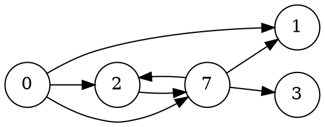

[[TOC]]

## 形式化题目

给定十进制整数 $n$（$n \leqslant 2000$）和 $k$ 条规则（$k \leqslant 15$），每条规则形如 $x \to y$（$y \neq 0$）。一次变换：从 $n$ 的十进制表示中选一个数位，若该位数字等于某条规则的 $x$，可把它替换成对应的 $y$。求对 $n$ 施加 $0$ 次或多次变换，能得到的**不同整数**的个数（含 $n$ 本身）。

## 正解

### 思路

#### 从朴素做法说起

最直接的做法是把整个整数当作状态，从 $n$ 出发 BFS：每次取出一个状态，枚举每条规则和每个数位，替换出新的整数，没见过就入队并计数。状态数不超过 $10^4$（$n \leqslant 2000$，最多 4 位），每组状态转移 $L \cdot k \leqslant 60$ 次，总量很小，能够通过本题。

但这个做法把"计数"和"枚举"混在一起：它逐个生成所有能产生的整数，却从未利用本题最关键的结构——**规则的作用是按位独立的**。选中第 $i$ 位做一次变换时，用哪条规则、变成什么，与其它位当前是什么数字毫无关系。

#### 按位独立：把规则建成图

把数字 $0 \sim 9$ 看成 $10$ 个节点，每条规则 $x \to y$ 是一条有向边。一次变换就是"选中一位、沿一条出边走一步"；任意次变换就是该位沿有向边走若干步。于是：

$$R(d) = \text{数字 } d \text{ 在规则图上走 } 0 \text{ 步或多步能到达的数字集合（含自身）}$$

第 $i$ 位（初始数字 $s_i$）在整个变换过程中的所有可能取值，恰好就是 $R(s_i)$——每个值都能单独取到（只在这一位上走出对应路径），也不可能取到集合外的值。

$R(d)$ 是有向图的**传递闭包**，$10$ 个点的规模，用 Floyd 思想即可：若 `mid ∈ reach[d]`，则 `mid` 能到的地方 `d` 也都能到。

#### 乘法原理计数

既然每一位独立地从 $R(s_i)$ 中选一个终值，不同整数恰好对应不同的选择组合：

$$\text{答案} = \prod_{i=1}^{L} \lvert R(s_i) \rvert$$

- **不同组合给出不同整数**：变换不改变位数；又因为规则保证 $y \neq 0$，非零位永远不会变成 $0$，首位保持非零，所以没有前导零带来的"串不同但整数相同"的歧义。
- **每个可达整数都对应一组选择**：把它产生过程中的每一步变换按位归并，就是每位各自的一条路径。

用样例验证：$n = 234$，规则 $2 \to 5$、$3 \to 6$：

| 数字 $d$ | $R(d)$ | 大小 |
| --- | --- | --- |
| $2$ | $\{2, 5\}$ | $2$ |
| $3$ | $\{3, 6\}$ | $2$ |
| $4$ | $\{4\}$ | $1$ |

答案 $= 2 \times 2 \times 1 = 4$，即题面的 $234, 534, 264, 564$，与样例一致。

再看规则成链的数据 `1000`，规则 $0 \to 1 \to 2 \to \cdots \to 8$：$R(0) = \{0, 1, \dots, 8\}$ 共 $9$ 个，$R(1) = \{1, \dots, 8\}$ 共 $8$ 个，答案 $= 8 \times 9^3 = 5832$，与官方数据一致。

#### 规则图与闭包示例

下图是数据 `produce5` 的规则图（$n = 7070$）：

在这张图上求闭包：$R(0) = \{0,1,2,3,7\}$（$0$ 一步到 $1,2,7$，经 $7$ 再到 $3$），$R(7) = \{1,2,3,7\}$（$7 \to 2 \to 7$ 成环，但没有任何边指向 $0$），$R(2) = \{1,2,3,7\}$。于是答案 $= 4 \times 5 \times 4 \times 5 = 400$。

观察重点是：**边不指向 $0$**（$y \neq 0$ 的约束）使得 $0$ 只能作为起点；而环（$7 \to 2 \to 7$）对闭包毫无影响——集合天然去重。这正说明为什么求闭包比 BFS 枚举整数更省事：图的结构（环、重边、自环）都被闭包这一步消化了。

### 代码

@include-code(./main.py, python)

### 复杂度

- 时间复杂度：求闭包为 $O(10^3)$（10 个节点的传递闭包，Floyd 式合并），计数为 $O(L)$，总计 $O(k + 10^3 + L)$，与 $n$ 的数值无关。
- 空间复杂度：$O(10^2)$，闭包集合总元素数不超过 $10 \times 10$。

对比朴素 BFS 的 $O(10^L \cdot L \cdot k)$：本题 $L \leqslant 4$ 时两者都是常数级，但闭包法的复杂度与 $L$ 无关，即使位数更多也不受影响。

## 总结

- 本题的核心观察是**按位独立**：每次变换只改一位且与其它位无关，于是"整数计数"退化为"每位可选数字个数"的乘法原理。
- $k$ 条规则建成的 $10$ 节点有向图上求**传递闭包**，得到每位可达集合 $R(d)$，答案为 $\prod \lvert R(s_i) \rvert$。
- $y \neq 0$ 的约束保证了变换过程中不会产生前导零歧义，使"串的组合数"与"不同整数个数"严格相等。
- Python 实现要点：`n` 按字符串逐位处理；闭包用 `set` 的 `|=` 合并（等价 Floyd）；`math.prod` 一行完成乘法原理。
