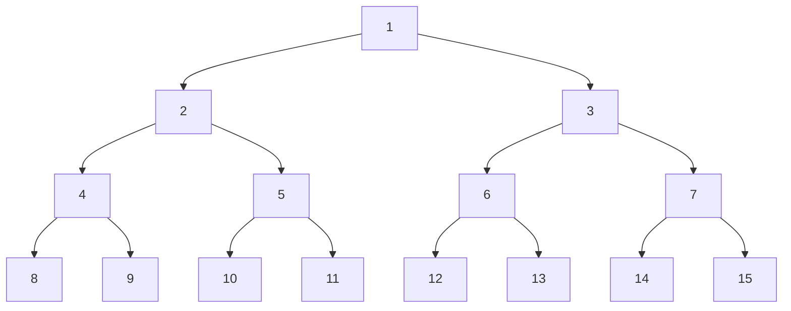

[[TOC]]

## 形式化题目

给定深度 $D$ 的满二叉树，节点按层序编号：根是 $1$，节点 $k$ 的左孩子是 $2k$、右孩子是 $2k+1$。深度为 $D$ 的叶子编号落在 $[2^{D-1}, 2^D)$。

每个节点带一个布尔标记，初始全为 $\mathrm{false}$。依次落下第 $1, 2, \dots, I$ 个小球，每个球从根出发：访问节点 $k$ 时翻转它的标记——若翻转前为 $\mathrm{false}$ 则走左孩子 $2k$，若翻转前为 $\mathrm{true}$ 则走右孩子 $2k+1$；重复直到落在叶子上。

求第 $I$ 个小球停下的叶子编号。

## 暴力解法

### 思路

最直接的做法就是照题面模拟：开一个长度为 $2^D$ 的布尔数组当作所有节点的标记，初始全为 $\mathrm{false}$；对每个球从根 $k=1$ 出发重复 $D-1$ 次：

```
go_right = state[k]          # 标记为 true 走右，false 走左
state[k] = not state[k]      # 访问后翻转
k = 2 * k + go_right
```

$I$ 个球都走完后，最后一个球停下的 $k$ 就是答案。这正是数据仓 `std.cpp` 的做法。题目保证 $I$ 不超过叶子数，即 $1 \leqslant I \leqslant 2^{D-1}$，而 $D \leqslant 20$，所以最多要模拟 $2^{19}$ 个球、每球下降至多 $19$ 层。

下面是 $D=4$ 的树结构与层序编号；题面样例的三个球分别沿 $1 \to 2 \to 4 \to 8$、$1 \to 3 \to 6 \to 12$、$1 \to 2 \to 5 \to 10$ 下落。



图中方框内是节点编号，叶子在最下一行。注意相邻层的编号关系 $k \to 2k,\ 2k+1$：一旦知道每一层走左还是走右，叶子编号就能直接算出来，不必真的存下整棵树。

### 代码

暴力解法与正解共享同一套推导——正解只是把 $I$ 次重复迭代坍缩成一次——因此本文不单独提供暴力代码文件，略去实现，只保留上面的伪码。

### 复杂度

- 时间复杂度：$O(I \cdot D)$。最坏 $524288 \times 20 \approx 1.05 \times 10^7$ 次节点访问。
- 空间复杂度：$O(2^D)$，即那份标记数组。

### 瓶颈

**我们只要第 $I$ 条路径，暴力却算了 $I$ 条。** 每个球都从根重新走一遍完整高度，而每一步能做出的判断其实只取决于一个问题：*我是到达这个节点的第几个球*。树本身是固定结构，与"第几个球"无关，所以把 $I$ 次下落重复执行是纯粹的浪费。

## 正解

### 思路

抓住上面那个问题，逐个节点回答它。设第 $j$ 个到达节点 $k$ 的球在 $k$ 处：

- 节点 $k$ 初始为 $\mathrm{false}$，每来一个球翻转一次，所以第 $j$ 个球到达时标记已被翻转 $j-1$ 次，其值为 $(j-1) \bmod 2$；
- 标记为 $\mathrm{false}$ 走左、为 $\mathrm{true}$ 走右，于是

$$\text{第 } j \text{ 个到达 } k \text{ 的球走左} \iff j \text{ 为奇数}$$

关键在于这个判断**只在 $k$ 自己的到达序列里成立**，不依赖任何其它节点的状态。于是"第几个到达"这个序号成了唯一需要传递的状态。

对第 $I$ 个球从根开始追溯：所有球都必须经过根，所以它就是第 $I$ 个到达根的球。$I$ 为奇数则走左，偶数则走右。接下来要算它在下一层的序号：到达根的 $I$ 个球中，第 $1,3,5,\dots$ 个走左，共 $\lceil I/2 \rceil$ 个；第 $2,4,6,\dots$ 个走右，共 $\lfloor I/2 \rfloor$ 个。所以

- 走左时，它是左子树里第 $\lceil I/2 \rceil$ 个球；
- 走右时，它是右子树里第 $\lfloor I/2 \rfloor$ 个球。

两支可以合成一个式子：令 $L = I \bmod 2$（$1$ 表示走左），则子序号是 $\lfloor (I+L)/2 \rfloor$，子节点编号是 $2k + (1-L)$。

用 $D=4$ 展开全部 $8$ 个球验证这套规则（`L` 表示走左、`R` 表示走右）：

| 第 $I$ 个球 | 逐层方向 | 叶序号 |
| --- | --- | --- |
| 1 | L L L | 8 |
| 2 | R L L | 12 |
| 3 | L R L | 10 |
| 4 | R R L | 14 |
| 5 | L L R | 9 |
| 6 | R L R | 13 |
| 7 | L R R | 11 |
| 8 | R R R | 15 |

每列的含义：中间列是该球从根到叶的三次走向，末列是它停下的叶子编号。可以读出两件事：前三个球与题面描述完全一致；$I$ 从 $1$ 到 $8$ 恰好不重不漏地走遍全部 $8$ 个叶子（$8,9,\dots,15$ 各出现一次），这正是题面"$I$ 不超过叶子数"时序号与叶子一一对应的体现。

### 代码

@include-code(./main.py, python)

### 复杂度

- 时间复杂度：$O(D)$。从 $I$ 出发下降 $D-1$ 层，每层只做位运算和加减；$D \leqslant 20$，最多 19 轮。相比暴力的 $O(I \cdot D)$ 少掉了 $I \leqslant 2^{19}$ 这个因子。
- 空间复杂度：$O(1)$。只维护当前节点编号和当前序号两个整数，不建树、不开标记数组。

## 总结

- 满二叉树的层序编号满足 $k \to 2k,\ 2k+1$，所以"某条从根到叶的路径"和"叶子编号"一一对应：只要知道每层走左还是走右，编号就能一次算完。
- 本题的可加结构是每个节点独立的判据：**到达该节点的第奇数个球走左，第偶数个走右**。这一条把"整棵树的状态表"压缩成"一个序号"。
- 已知第 $I$ 个球在某节点的序号 $I'$，它在子树的序号是 $\lceil I'/2 \rceil$（走左）或 $\lfloor I'/2 \rfloor$（走右）——就是集合按奇偶分桶后的组内序号，因此每层只需折半。
- 复杂度从 $O(I \cdot D)$ 降到 $O(D)$，空间从 $O(2^D)$ 降到 $O(1)$；这是"只求第 $I$ 个"的通用优化：让被重复的循环自指，而不去重放它。
- 实现上 `2 * node + (1 - go_left)` 与 `(index + go_left) >> 1` 各自用一次运算吃下"走左/走右"两支，是本题代码能压到 20 行出头的原因。
