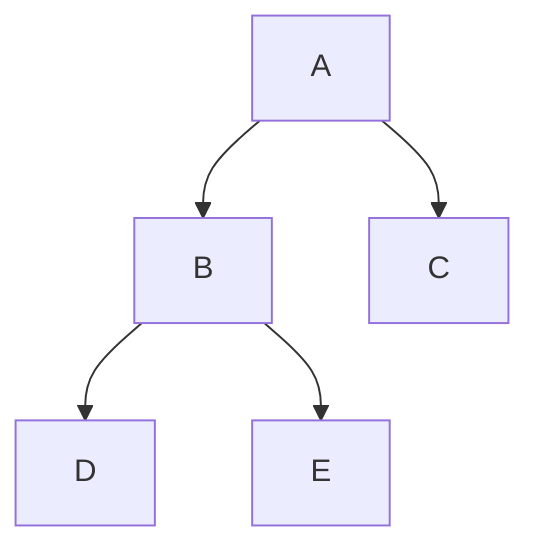

[[TOC]]

## 形式化题目

给出一棵二叉树的**中序遍历**和**层序遍历**两个字符串（结点用互不相同的字母表示），
求这棵树的**先序遍历**字符串。例如中序 `DBEAC`、层序 `ABCDE` 的树如下，
其先序为 `ABDEC`：

图中 A 是层序 `ABCDE` 的第一个字符，也是整棵树的根；它的左子树在中序里对应区间
`DBE`，右子树对应 `C`——这正是下面递归要复用的切分方式。

## 正解

### 思路

熟悉「中序 + 先序还原二叉树」的读者都知道：先序的第一个字符是整棵树的根，根在中序
中的位置把序列切成左、右子树两段，递归即可。本题把先序换成了层序，"根在序列开头"
不再成立，于是关键问题只有一个：**层序里哪个字符是当前子树的根？**

答案是层序遍历的一个基本性质：**祖先在层序中一定排在子孙前面**——层序按深度从浅到
深访问，任何结点都不可能先于它的父亲出现。因此对任意一棵子树来说，它的根是「层序中
最早出现的、属于该子树的结点」。

配合中序的另一个性质——**一棵子树的中序遍历是整条中序序列的一段连续区间**——递归
只需传递区间端点：

1. 若区间为空，子树为空，返回。
2. 取区间内字符中层序排名最小者作为根，输出它（先序 = 根在前）。
3. 根把中序区间切成左右两段：左边递归是左子树，右边递归是右子树。

以样例为例（字符后括号内是它在层序中的排名）：

| 中序区间 | 区间内字符（层序排名） | 根 | 切分 | 输出 |
| --- | --- | --- | --- | --- |
| `[0,5)` | D(3) B(1) E(4) A(0) C(2) | A | mid=3 → 左`[0,3)` 右`[4,5)` | A |
| `[0,3)` | D(3) B(1) E(4) | B | mid=1 → 左`[0,1)` 右`[2,3)` | B |
| `[0,1)` | D(3) | D | mid=0 → 左右皆空 | D |
| `[2,3)` | E(4) | E | mid=2 → 左右皆空 | E |
| `[4,5)` | C(2) | C | mid=4 → 左右皆空 | C |

第一行：整个区间 `[0,5)` 内 A 的层序排名 `0` 最小，所以 A 是整棵树的根；它在中序
里位于下标 3，把区间切成左子树 `DBE` 和右子树 `C`。第二行：左子树区间内 B 的排名
`1` 最小（D 是 3、E 是 4），B 是左子树的根——尽管 B 在层序里排在 A、C 之后。每行
的输出顺序拼起来正是先序 `ABDEC`。

朴素做法怎么找这个根？直观写法是双重扫描：外层按层序从头枚举字符，内层检查
它是否落在当前中序区间里，找到的第一个就是根；然后对左右区间分别递归（原题的
C++ 标程就是这样写的）。这个写法正确，但“外层枚举 + 内层查找 + 标记变量”把
「区间内层序排名最小」这个一句话概念拆成了好几行过程式代码。

表达上的优化：预建一张 `rank` 表（字符 → 层序排名），把“层序最早出现”变成可直接
比较的键，找根就折叠成一行 `min`：在当前中序区间内取 `rank` 最小的字符。复杂度
仍是每个区间 $O(区间长)$、总计 $O(n^2)$，与朴素写法同阶——没有换算法，只是让代码
与推导逐字对应。

### 代码

@include-code(./main.py, python)

### 复杂度

时间复杂度：每个递归结点花 $O(区间长)$ 找根与定位切分点，最坏（链状树）$O(n^2)$，
与 C++ 标准解法同阶；$n \leqslant 1000$ 级别的数据下远低于 1s 限制（真实数据单点
约 0.018 s）。若需要 $O(n)$ 重建，可利用层序"同层先左后右"的性质用队列按层分派
左右子树，但本题规模下没有必要。

空间复杂度：`rank` 表与输出列表共 $O(n)$；递归深度最坏为树高 $O(n)$。

## 总结

本题是「中序 + 另一序列还原二叉树」家族的成员：中序负责切分左右，另一序列负责定
根。换成层序后，定根依据从"序列第一个字符"变成"区间内层序排名最小的字符"，其正确
性来自层序中祖先必先于子孙。实现上 `rank` 表 + `min` 把这个概念折叠成一行，递归体
天然按"根 → 左 → 右"输出先序。数据仓 5 组真实评测点全部逐字节一致（含大小写混合
的用例，`rank` 按 dict 查找与字典序无关）。
