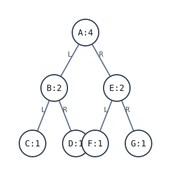

[[TOC]]

## 形式化题目

给定长度相同的两个字符串 $pre$ 与 $ino$，二者字符集合相同且**两两不同**，分别是一棵二叉树的先序序列与中序序列。要求唯一确定这棵树 $T$，并对 $T$ 的每个结点 $v$ 定义长度

$$
\mathrm{len}(v)=
\begin{cases}
1, & v \text{ 是叶结点}\\[2pt]
\mathrm{len}(\mathrm{left}(v))+\mathrm{len}(\mathrm{right}(v)), & v \text{ 有孩子}
\end{cases}
$$

按先序顺序输出：每个结点 $v$ 占一行，该行由 $v$ 的字符重复 $\mathrm{len}(v)$ 次构成；行数等于结点数。

输入样例：

```
ABCDEFG
CBDAFEG
```

输出样例：

```
AAAA
BB
C
D
EE
F
G
```

样例对应下面这棵树，圆圈里写成「字母:长度」，方便直接核对每行该重复几次：



观察这张图：四个叶子 $C, D, F, G$ 的长度都是 1；它们的父结点 $B$ 与 $E$ 各有一个长度 1 的左右孩子，于是长度 $1+1=2$；根 $A$ 的两个孩子长度都是 2，于是 $2+2=4$。**长度是自底向上累积的量，而输出顺序是自顶向下的先序**——这一点决定了实现要分成「算长度」和「按先序输出」两件事，且算长度必须先于输出。

## 正解

### 思路

**第一步：把题面拆成两件事。** 题面那句「假设叶结点的长度为 1，一个非叶结点的长度等于它的左右子树的长度之和」是**长度的定义**，与遍历无关；而「从根结点开始，有左子树就递归输出左子树，有右子树就递归输出右子树」正是**先序遍历**的顺序。于是任务就是：

1. 由先序 + 中序重建二叉树；
2. 用先序顺序遍历，每个结点先算出它的长度，再打印「字母 × 长度」。

由归纳容易看出，长度还有一个更直观的等价说法：**$\mathrm{len}(v)$ 就是子树 $v$ 里叶结点的个数**（叶子的子树只有它自己一个叶子；内结点把左右两侧的叶子数相加，两侧叶子集合不相交）。这条等价说明长度是可以「数」出来的量，不需要额外维护什么状态。

**第二步：朴素做法的瓶颈。** 最直观的写法是按递归重建二叉树：先序的第一个字符是根，在中序串里**从左往右扫**找到根的位置 $k$，$k$ 左边是左子树的中序、右边是右子树的中序，再相应地切出先序的两段，递归下去；给每个结点记录左右儿子后，再做一次后序遍历求长度、一次先序遍历输出。

这个做法正确，但有两处浪费：

- **每次切分都要线性扫中序串找根。** 共 $n$ 个结点、每次最多扫过整段中序，最坏（链状树）是 $O(n^2)$。
- **树被物化了两次。** 为每个结点开 `left/right` 数组、再维护结点编号与字符的对应关系；而事实上「先序起点 $pl$、中序起点 $il$、子树大小 $n$」这三个下标已经**唯一描述**了一棵子树，不需要把它变成对象。

**第三步：换成下标递推 + 字典查根。** 两个问题一起解决：

- 预处理 `pos = {字符: 中序下标}`。因为字符两两不同，`pos[pre[pl]]` 一步就给出根在中序里的位置，切分从 $O(n)$ 变成 $O(1)$；
- 不建树，直接把「结点」换成三元组 $(pl, il, n)$，把「结点长度」换成函数 $\mathrm{length}(pl, il, n)$：

$$
\mathrm{length}(pl, il, n)=
\begin{cases}
0, & n=0 \quad(\text{空子树})\\[2pt]
1, & n=1 \quad(\text{叶})\\[2pt]
\mathrm{length}(pl{+}1,\ il,\ L)+\mathrm{length}(pl{+}1{+}L,\ k{+}1,\ n{-}1{-}L), & \text{否则}
\end{cases}
\qquad
\begin{aligned}
k &= pos[pre[pl]]\\
L &= k - il
\end{aligned}
$$

其中 $L$ 是左子树大小（根在中序里的位置减掉起点），$n-1-L$ 是右子树大小。**把 $n=0$ 单独定为返回 0** 这一条很关键：它让「只有一个孩子」不必写成两支——缺失的那一侧自然贡献 0，题面的「左右子树长度之和」自动退化成「唯一那个孩子的长度」。

**第四步：输出与重用。** 输出写成同构的 `walk(pl, il, n)`：先产出根那一行 `pre[pl] * length(pl, il, n)`，再递归左、右。这里的顺序就是先序，与题面完全对应。

注意 `walk` 输出根那一行时就需要根的长度，而根的长度依赖整棵子树，所以每个结点都会触发一次 `length` 调用。给 `length` 加上 `@cache` 记忆化后，每个三元组只真正计算一次、其余调用 $O(1)$ 命中缓存，总复杂度回到 $O(n)$。

**关于缓存键的一个坑：** 必须按 $(pl, il, n)$ 三元组缓存，不能只按 $il$。`il` 只说明「中序起点」，同一个中序起点可能属于两棵不同的右子树；只有加上先序起点 $pl$ 才能锁定一棵唯一的子树（$pl$ 定下根字符，$il$ 与 $n$ 定下范围）。

以样例 `ABCDEFG / CBDAFEG` 为例，递推过程如下表（每行是一次 `length` 调用，`L` 是左子树大小）：

| 调用 $(pl, il, n)$ | 根 $pre[pl]$ | $k=pos[根]$ | $L=k-il$ | 结果 |
| --- | --- | --- | --- | --- |
| $(0, 0, 7)$ | `A` | 3 | 3 | $2 + 2 = 4$ |
| $(1, 0, 3)$ | `B` | 2 | 2 | $1 + 1 = 2$ |
| $(2, 0, 2)$ | `C` | 0 | 0 | $0 + 1 = 1$ |
| $(2, 1, 1)$ | `D` | 1 | 0 | 叶，$1$ |
| $(5, 4, 3)$ | `E` | 5 | 1 | $1 + 1 = 2$ |
| $(6, 4, 1)$ | `F` | 4 | 0 | 叶，$1$ |
| $(6, 6, 1)$ | `G` | 6 | 0 | 叶，$1$ |

表中第三列 $k$ 就是字典一步查到的主角，$L = k - il$ 直接给出左子树大小；第一行的 $4$ 正是输出第一行 `AAAA` 的长度，其余各行同理。这棵树上每个三元组只被计算一次，7 次调用得到全部 7 个长度。

**几个实现细节：**

- **右子树的两个起点怎么算。** 先序起点 = `pl + 1 + L`（跳过根和整个左子树）；中序起点 = $k + 1$，写成 `pos[pre[pl]] + 1`。两个都只查一次字典，`left_n` 先存成局部变量复用。
- **空子树用 $n = 0$ 表示**，不用哨兵字符，因而不依赖字符集内容。
- **读入用 `sys.stdin.read().split()`**，一次拿到两个串，顺带忽略 CRLF 与末尾空行。
- **输出收集到列表后一次打印**，避免 $n$ 次 `print` 的开销；`walk` 对每个结点恰好产出一行，所以输出行数必然等于结点数。

### 代码

`length` 是「这棵子树的根长度是多少」，`walk` 是「按先序产出这棵子树的每一行」，两者共用同一套下标切分规则；`solve` 只做读入、调用与输出。

@include-code(./main.py, python)

### 复杂度

- 时间复杂度：$O(n)$。建 `pos` 是 $O(n)$；`length` 对 $n$ 个三元组各计算一次、每次做 $O(1)$ 的字典查询与算术；`walk` 访问 $n$ 个结点，其中对 `length` 的调用全部命中缓存。对比朴素实现：每个子树线性扫中序找根会退化到 $O(n^2)$。
- 空间复杂度：$O(n)$。`pos` 字典与 `length` 缓存各 $O(n)$，`out` 存 $n$ 行；递归栈深度最坏为 $O(n)$（链状树，本题数据 $n \leqslant 12$）。
- 输出本身的字符量：所有行的字符数之和为 $\sum_v \mathrm{len}(v)$，链状树上可达 $O(n^2)$——但那是题目要求打印的内容，不是算法的额外开销。

## 总结

这道题把两个经典套路缝在了一起：

1. **先序 + 中序唯一重建二叉树**：先序首字符定根，中序中根的位置把序列切成左右两半，递归下去。字符互不重复是「切分点唯一」的前提。
2. **树的长度（叶子计数）自底向上、输出顺序自顶向下**：算长度用后序式递归（先知道孩子才能算父亲），输出用先序式递归，两套递推共用同一个下标切分规则。

关键在于**不要把树物化**：$(pl, il, n)$ 三元组已经唯一确定一棵子树，用字典把「中序找根」从线性扫描降到 $O(1)$，再加上 `@cache` 记忆化，整体就是 $O(n)$ 的。

三个容易踩的坑：

- **缓存键必须是三元组。** 只按中序起点缓存会把不同的子树混为一谈。
- **`n == 0` 要返回 0。** 有了这条，单孩子结点（包括只有左孩子或只有右孩子）不必分情况讨论。
- **输出顺序是先序，不是按长度排序。** 样例里长度 2 的 `B` 排在长度 1 的 `C` 前面，正说明输出跟着先序走。
