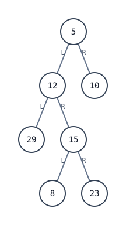

[[TOC]]

## 形式化题目

给定一棵 $n$（$n \leqslant 100$）个结点的二叉树，用孩子链表（邻接表）存储：第 $i$ 个结点记录它的值与左、右儿子编号（$0$ 表示空），根没有直接给出。给定要查找的值 $x$，按**中序顺序**（左子树 $\to$ 根 $\to$ 右子树）访问这棵树，求值为 $x$ 的结点在访问序列中排第几个（名次从 $1$ 数起）。

题面样例对应的树如下（结点上的数字是值，不是编号）：

图中按中序读出的序列是 $29, 12, 8, 15, 23, 5, 10$，值 $15$ 落在第 $4$ 位，所以样例输出 $4$。

## 正解

### 思路

**一句话本质**：把题面的三列读成孩子链表，找出根，然后按中序顺序一路访问，数到值等于 $x$ 的结点就把计数报出来。

先看朴素做法：写一个递归 `dfs(u)`——先递归左儿子，访问 $u$ 时计数器加一并检查值是否等于 $x$，再递归右儿子。这就是中序遍历的定义本身。$n \leqslant 100$，而 $O(n)$ 已是下界（每个结点至少要看一次），**朴素做法即最优解，没有可以消除的瓶颈**，因此本题是单层直解，没有独立的暴力层。真正要处理的是三个结构细节：

**问题？根在哪里？** 输入只给出"谁是谁的儿子"。树里除根以外每个结点都恰好被列为一次儿子，所以把所有出现过的儿子编号收进集合 `linked`，$1 \sim n$ 中唯一不在集合里的编号就是根。

**问题？能不能按值二分（当成 BST 查）？** 不能。样例的值是 `5 12 10 29 15 8 23`，不满足左小右大——题面只要求"中序查找"，这是一棵普通二叉树，中序序列完全由**结构**决定，与值的大小无关，只能老实遍历。

**问题？计数和遍历怎么组织？** Python 里把中序写成生成器：`yield from` 左子树、`yield` 自己、`yield from` 右子树——**书写的顺序就是中序定义本身**。调用点用 `enumerate(序列, 1)` 让第 $i$ 次产出天然带上名次 $i$，再用 `next(... if 值 == x)` 命中即停，连整条序列都不必生成完。

样例的中序名次表（列从左到右就是访问顺序，上行是名次、下行是该位置的结点值）：

| 中序名次 | 1 | 2 | 3 | 4 | 5 | 6 | 7 |
| --- | --- | --- | --- | --- | --- | --- | --- |
| 结点值 | 29 | 12 | 8 | 15 | 23 | 5 | 10 |

观察：遍历从最左的 $29$ 开始，走完整棵左子树后回溯到根 $5$，最后才进右子树的 $10$；值 $15$ 在第 $4$ 列，故输出 $4$。名次只取决于树的形状——它是结构性答案，这也是不能拿值去做搜索的原因。

### 代码

`VALUE` / `CHILD` 是下标即结点编号的邻接表；`linked` 收集儿子编号用于找根；生成器 `inorder` 的三个 `yield` 就是中序定义；最后 `enumerate` + `next` 一行完成"计数 + 命中即停"。

@include-code(./main.py, python)

### 复杂度

- 时间复杂度：$O(n)$——建表扫 $n$ 行、找根最多比较 $n$ 次、中序每个结点恰好产出一次。
- 空间复杂度：$O(n)$——两张表加儿子集合，递归栈 $O(h)$，$h \leqslant n \leqslant 100$。
- 实测 8 组真实数据全部一致，单组约 $0.019$ s、峰值内存约 $14.7$ MB，相对 1000 ms / 128 MB 的限制没有 TLE/MLE 风险。

## 总结

本题是"输入格式即模型"的入门题：三列表格就是孩子链表，除根外每个结点恰好当一次儿子，于是**找根 = 找没当过儿子的编号**；中序名次也不必先生成数组再查下标——把中序写成 `yield` 顺序即定义的生成器，`enumerate` 计数、`next` 命中即停，$O(n)$ 拿到答案。两个容易踩的坑：根没有在输入里直接给出，以及值并不构成 BST、不能按值二分。实测 8/8 组真实数据通过。
