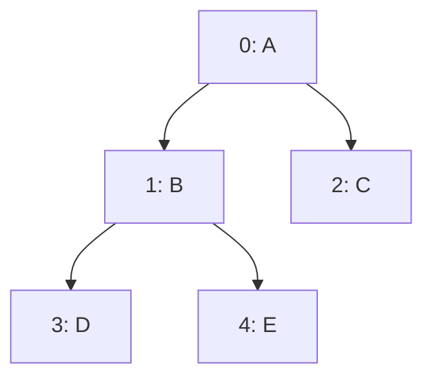

[[TOC]]

## 形式化题目

给定一棵二叉树的**顺序存储**串 $s$：结点按层、从左到右依次写出，空位置记作 `#`。

定义树是**对称**的：对每个结点 $u$，$u$ 的左孩子存在当且仅当 $u$ 的右孩子存在。
等价地说，每个结点要么孩子齐全，要么没有孩子。

判断该树是否对称。

样例 `ABCDE` 对应的树：

```text
        A
       / \
      B   C
     / \
    D   E
```

$A$ 的孩子齐全，$B$ 的孩子齐全，$C$ 是叶子，因此对称，输出 `Yes`。

注意“对称”指的是**结构完整**，不是镜像对称——不要求左孩子的值与右孩子相等，
只要求左右孩子同时存在或同时不存在。

## 正解

### 思路

最直接的想法是先把顺序存储还原成树：位置 $k$ 的左孩子在 $2k+1$、右孩子在 $2k+2$，
于是可以 BFS 建出孩子指针，再逐个结点检查“有左没右 / 有右没左”。

但这样做只是把下标里**本来就有的信息**抄进指针里，还额外付出队列和指针的空间。
判据完全由下标决定，可以直接在字符串上完成。

关键观察是：**每两个相邻位置 $(2k+1,\,2k+2)$ 恰好是一对兄弟。**

| 兄弟对下标 | 对应的父亲 | 父亲下标 |
| --- | --- | --- |
| $(1,2)$ | 根 | $0$ |
| $(3,4)$ | 位置 $1$ 的结点 | $1$ |
| $(5,6)$ | 位置 $2$ 的结点 | $2$ |
| $(2k+1,\,2k+2)$ | 位置 $k$ 的结点 | $k$ |

反过来，位置 $k$ 的两个孩子正好落在 $(2k+1,\,2k+2)$，
所以“逐结点检查孩子是否成对”与“逐对相邻位置检查”是同一件事。

一对兄弟只有三种形态：

- `##`：兄弟同为空，父亲没有孩子，合法；
- 两个都非空：父亲孩子齐全，合法；
- 一个空一个非空：父亲只有一个孩子，非法，答案即 `No`。

顺序存储的末尾常省略孩子不写，右侧补 `#` 只会多出若干 `##` 这样的“同空”对，
既不制造也不掩盖非法对，所以可以直接补齐再扫，不必特判越界。

用 Mermaid 看 `ABCDE` 的下标与兄弟对划分：



串 `ABCDE` 补齐为 `ABCDE#####` 后，兄弟对依次是 $(1,2)=\texttt{BC}$、
$(3,4)=\texttt{DE}$、$(5,6)=\texttt{\#\#}$、$(7,8)=\texttt{\#\#}$，
每一对要么都非空、要么都为空，因此输出 `Yes`。

对照 `ABC#D#E`：兄弟对 $(3,4)=\texttt{\#D}$ 一空一非空，违反条件，输出 `No`。

> 实现细节：不要写 `s[i] == '#' == s[i+1]`。Python 会把它解析成链式比较
> “`s[i]=='#'` 且 `'#'==s[i+1]`”，与“两个都是 `#`”含义不同，会得到错误答案。

### 代码

@include-code(./main.py, python)

### 复杂度

设串长为 $n$。

- 时间复杂度：扫描 $\left\lceil \dfrac{n-1}{2} \right\rceil$ 对兄弟，每对 $O(1)$ 判断，共 $O(n)$。
- 空间复杂度：补齐后的串长 $2n$，为 $O(n)$。

## 总结

顺序存储的二叉树不必真正建树：下标 $k$ 的左右孩子固定在 $2k+1$ 与 $2k+2$，
因此**每对相邻位置 $(2k+1,2k+2)$ 就是一对兄弟**。把“每个结点孩子成对”
翻译成“每对兄弟同空或同非空”，一次线性扫描即可判定，
时间 $O(n)$、空间 $O(n)$，与建树做法同阶但常数和代码量都更小。

边界上只需注意两点：末尾缺失的孩子补 `#` 不会影响结论；判断兄弟是否都为空时
不能用 Python 的链式比较。

## 图示解析

```text
输入串 s（顺序存储，根在 0）
        │
        │  位置 k 的孩子 = 2k+1, 2k+2
        ▼
把 s 右侧补 # 到长度 2n
        │
        ▼
枚举兄弟对 (1,2) (3,4) (5,6) ...        ← range(1, n, 2)
        │
        ├─ 出现「一空一非空」 ──► No
        └─ 全部「同空或同非空」 ─► Yes
```
