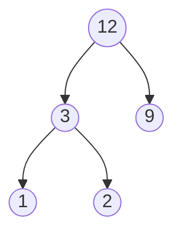

[[TOC]]

## 形式化题目

给定 $n$ 堆果子，第 $i$ 堆重量为 $a_i$。每次操作任取两堆合并为一堆，代价为两堆重量之和；共合并 $n-1$ 次。求最小总代价。

## 正解

### 思路

先看合并的结构：任何一种合并方案都对应一棵二叉树——$n$ 个初始堆是叶子，每次合并产生一个内部结点，其权值为两子之和。观察一个叶子被计入总代价的次数：它每次随祖先一起被合并就累加一次自身的重量，所以

$$\text{总代价} = \sum_{i=1}^{n} a_i \times d_i$$

其中 $d_i$ 是第 $i$ 堆对应的叶子深度。这正好是**哈夫曼树**的带权路径长度：重量越大的堆应当深度越小（越晚参与合并），重量越小的堆应当越早合并。

由此得到贪心策略：**每次取出当前最小的两堆合并，把新堆放回去**，重复 $n-1$ 次。

为什么这样做最优？考虑交换论证：设某最优方案中第一次合并的不是最小的两堆 $x \le y$。总代价表达式中，$x,y$ 合并得越早，二者的 $d_i$ 越大；把最小两堆先合并，相当于让最小的权值取得最大的深度，任何方案里深度总和是固定的分配问题，把更小的权配更大的深度只会更优（经典的哈夫曼最优性证明）。反过来，若某方案第一次合并的两堆不是最小的两堆，可以交换两堆的配对使代价不增，故贪心解不劣于最优解。

样例 `1 2 9` 的过程：

| 步骤 | 取出两堆 | 合并新堆 | 本次体力 | 累计体力 |
| --- | --- | --- | --- | --- |
| 1 | 1 + 2 | 3 | 3 | 3 |
| 2 | 3 + 9 | 12 | 12 | **15** |

实现上用小根堆（`heapq`）：初始把 $n$ 个数堆化；每次弹出两个最小值，累加其和，再把和推回堆中，直到只剩一堆。共 $n-1$ 轮，每轮 $O(\log n)$。

### 代码

@include-code(./main.py, python)

### 复杂度

- 时间：$O(n \log n)$（堆化 $O(n)$，之后 $n-1$ 次弹出/插入各 $O(\log n)$）。
- 空间：$O(n)$ 堆数组。

$n \le 30000$，答案保证小于 $2^{31}$，Python 大整数天然无溢出问题。

## 总结

本题是哈夫曼树模型的入门题：合并代价可改写为「权值 × 叶子深度」的带权路径长度，最优策略就是反复合并最小的两堆。凡是「每次合并两堆、代价为两堆之和」的问题，都等价于建哈夫曼树，直接用小根堆模拟即可。

## 图示解析

样例 `1 2 9` 对应的哈夫曼合并树（深度大的权值小，总代价 = $1\times2+2\times2+9\times1=15$）：

