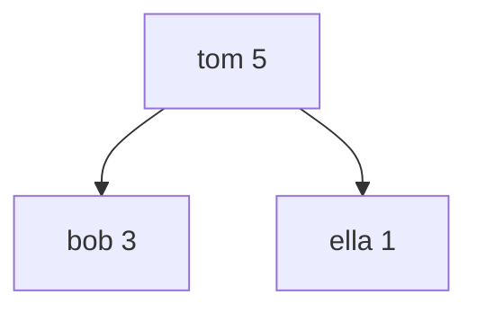

[[TOC]]

## 形式化题目

维护一个初始为空的**患者集合**，每名患者由姓名与一个优先级（整数，所有患者的优先级互不相同）标识。依次处理 $n$ 个操作：

- 加入一名患者；
- 取出并从集合中删除**当前优先级最大**的患者，报告其姓名与优先级；若集合为空，报告空。

要求按顺序对每个"取出"操作输出报告结果。优先级互不相同，保证"最大者"唯一。

### 样例过程

下表逐个操作展示集合的变化与输出（样例输入共 7 个操作）：

| 操作 | 集合内的患者（按优先级） | 输出 |
| --- | --- | --- |
| pop | （空） | `none` |
| push bob 3 | bob 3 | — |
| push tom 5 | bob 3，tom 5 | — |
| push ella 1 | tom 5，bob 3，ella 1 | — |
| pop | bob 3，ella 1 | `tom 5` |
| push zkw 4 | zkw 4，bob 3，ella 1 | — |
| pop | bob 3，ella 1 | `zkw 4` |

观察重点：每次"取出"拿走的都是**当时集合中优先级最大**的人，与来排队的先后顺序无关——整个问题唯一关心的信息就是"当前最值"。而集合本身只经历插入和删除最值两种变化。

## 正解

### 思路

**朴素做法。** 用数组保存所有患者：加入直接追加，每次取出时线性扫描找优先级最大者再删除。单次取出最坏 $O(n)$，取出可达 $n$ 次，总代价 $O(n^2) \approx 10^{10}$，必然超时。瓶颈在于：相邻两次取出之间往往只插入一个人，却每次都把"当前最大"从全量数据里重新算一遍，上一次的信息被全部丢弃。

**优化：用大根堆维护"最大值"。** 查询只关心最值，这正是**优先队列**（二叉大根堆）的标准场景。大根堆是一棵满足"父节点优先级 $\geqslant$ 子节点"的完全二叉树，因此堆顶永远是全局最大：

上图是样例中 push bob 3、tom 5、ella 1 之后的堆：每个父节点都不小于其子节点，堆顶 tom 5 就是全局最大。取走堆顶后，把末尾元素补到根上向下调整；插入则把新元素放到末尾向上调整。于是：

- 加入：末尾放新元素，向上调整，$O(\log n)$；
- 取出：取走堆顶 $O(1)$，向下调整 $O(\log n)$。

每次操作只改动 $O(\log n)$ 个位置而不是全部数据——"当前最大"始终待在手边，不必重算，总复杂度降为 $O(n \log n)$。

**Python 落地。** `heapq` 只提供最小堆，把比较键取负即可：堆中存 $(-优先级, 姓名)$，最小堆顶就是优先级最大者。优先级互不相同，元组比较在第一维就能分出胜负，姓名从不参与比较。空集合时取出操作输出 `none`。

### 代码

@include-code(./main.py, python)

### 复杂度

- 时间 $O(n \log n)$：每个操作至多一次堆调整；$n \leqslant 10^5$ 时约 $1.7 \times 10^6$ 次基本堆操作。
- 空间 $O(n)$：堆内至多同时有 $n$ 名患者。

`heapq` 的堆操作核心由 C 实现，实测官方 10 组数据单组最大 0.064s，远在 1s 限制之内。

## 总结

- "反复插入 + 反复取最值"是优先队列的标志性场景：朴素做法的 $O(n^2)$ 瓶颈来自反复重算最大值，堆把它摊到每次 $O(\log n)$。
- Python 的 `heapq` 是最小堆；"键取负"把最小堆当大根堆用，是不改变算法本身的标准技巧。
- 同样的算法在 C++ 中就是 `std::priority_queue`（默认大根堆）上 `push` 与 `top`/`pop`，与本解一一对应。
