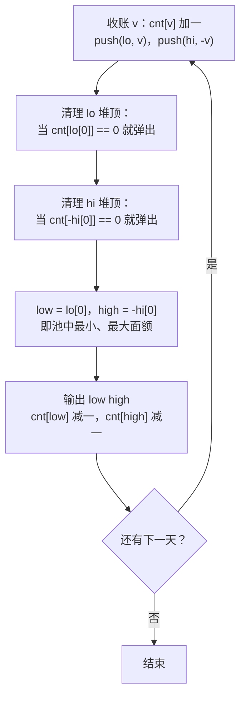

[[TOC]]

## 形式化题目

维护一个初始为空的账单多重集合（同一面额可以出现多张）。共进行 $N$ 轮，第 $i$ 轮：

1. 向集合中插入给定的 $M_i$ 个正整数面额；
2. 从当前集合中取出并删除面额最小的一张和面额最大的一张（两张不同的账单，面额可以相同），按"最小 最大"的顺序输出这两个面额。

题目保证每轮第 2 步执行前集合中至少有 2 张账单。求这 $N$ 轮依次输出的 $2N$ 个面额。

下表用题面样例走一遍这 4 轮，注意账单池是**跨天累积**的——第 4 天没有新账单（$M=0$），付出的是前几天剩下的 5 和 7：

| 轮次 | 当天新账单 | 付款前的账单池 | 当天输出 | 付款后的账单池 |
| --- | --- | --- | --- | --- |
| 1 | 3 6 5 | {3, 5, 6} | 3 6 | {5} |
| 2 | 8 2 | {2, 5, 8} | 2 8 | {5} |
| 3 | 7 1 7 | {1, 5, 7, 7} | 1 7 | {5, 7} |
| 4 | （无） | {5, 7} | 5 7 | （空） |

看第 3 轮：新账单 7 1 7 进池后池里有两个 7，付掉的是最小 1 和最大 7，另一个 7 留到第 4 天。这说明"最小/最大"是**按张**取出，不是把某个面额一次清空。

## 正解

### 思路

**朴素做法与瓶颈。** 最直接的做法是用数组把所有未支付账单存起来，每天付款前从头扫一遍找最小和最大。设某天付款前池中有 $P$ 张账单，这一天就要 $O(P)$；池子每天净增最多 98 张，$P$ 可以一直涨到总账单数 $K=\sum M \leqslant 1.5\times 10^6$，而 $N=15000$ 天累加起来最坏 $O(N\cdot K)$，在 $10^{10}$ 量级。瓶颈在于**每次取最值都重新扫描全池**，而实际上取最值的操作总共只有 $2N$ 次、插入只有 $K$ 次——操作次数很小，是"单次操作太贵"。

**换模型：双端优先队列。** 全场模拟只有三种操作：插入、取删最小、取删最大，这正是双端优先队列的标准接口，每种操作 $O(\log K)$ 即可完成。C++ 里一个 `multiset` 就够了；Python 标准库没有平衡树，只有单端的 `heapq`，于是让**两个堆分工**：`lo` 按面额建小根堆，管最小端；`hi` 把面额取相反数建小根堆，等效大根堆，管最大端。

**两堆的同步难题与懒删除。** 付出一张账单时，另一个堆里它的条目还在；如果每次都去对方堆里把对应条目搜出来删掉，单次又是 $O(K)$，退化回朴素。注意到取最值只关心**堆顶**：付账时只把面额计数 `cnt[v]` 减一，堆里的"过期条目"原地不动，等它自己浮上堆顶、妨碍取最值时才弹出——这就是懒删除。每张账单的条目至多被延迟弹出一次，均摊仍是对数级。

每轮付款流程如下，注意最后一步只减计数、不真的从堆里删：

**为什么堆顶清理后一定对。** 关键不变式：只要 `cnt[v] > 0`，堆里就一定还有 $v$ 的条目——因为条目只会在"`cnt` 为 0 时作为堆顶"被弹出，弹出后计数想再变正就必须伴随一次新的插入。于是清理后 `lo[0]` 的计数大于 0，而任何比它小的未付面额若有条目就该排在更前面，矛盾，故 `lo[0]` 就是最小面额；`-hi[0]` 对称。付款时 `low` 和 `high` 可能相同（池里剩下的全同面额），`cnt` 连减两次恰好对应两张账单。

### 代码

@include-code(./main.py, python)

### 复杂度

每张账单进两堆各一次、至多被弹出两次，`Counter` 操作 $O(1)$，总时间 $O(K\log K)$，$K \leqslant 1.5\times 10^6$，与 `multiset` 正解同阶。两堆与计数器共 $O(K)$ 空间。本地跑官方 10 组数据（最大 $N=15000$、$74$ 万张账单）单组 0.16–0.22s、峰值内存 83MB，均在题面 1s / 128MB 限制内。

## 总结

把"每天取最小和最大"翻译成双端优先队列的接口后，题目就变成了标准数据结构题。Python 标准库没有平衡树，用"小根堆 + 相反数大根堆"拼出两端，再用面额计数器做懒删除同步两堆——付账只减计数，过期堆顶浮上来才真正弹出。这个"计数器 + 懒删除"组合是处理"两个视图共享一份可重集合"时的通用技巧。
