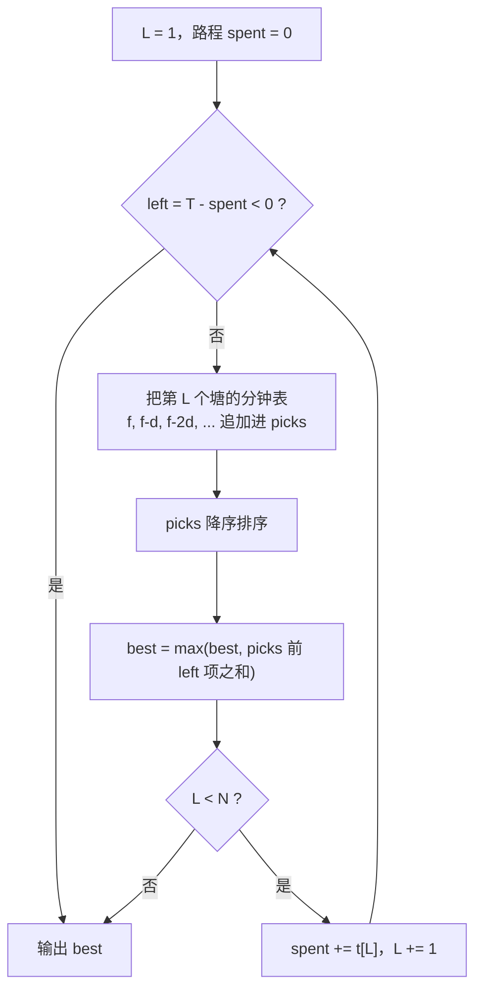

[[TOC]]

## 形式化题目

鱼塘排成一排，编号 $1..N$。第 $i$ 个鱼塘第 1 分钟能钓到 $f_i$ 条鱼，此后在这个鱼塘每多钓一分钟，
每分钟的钓鱼量就再减少 $d_i$（$d_i \geqslant 1$），减到非正数后该鱼塘再也钓不到鱼。
从第 $i$ 个鱼塘走到第 $i+1$ 个要花 $t_i$ 分钟，且只能向右走。
总时间为 $T$，每一次钓鱼都占用整数分钟，求最多能钓到的鱼数。

也就是说，在第 $i$ 个鱼塘连续钓 $c$ 分钟的收入是等差数列前 $c$ 项和

$$
g_i(c)=\sum_{k=0}^{c-1}\max(f_i-k\,d_i,\ 0)=c f_i-\frac{c(c-1)}{2}d_i \quad (c \leqslant \lceil f_i/d_i\rceil)
$$

要在"走到的鱼塘"和"各塘分钟数"的约束下最大化 $\sum_i g_i(c_i)$。

先看样例：$N=5$，$f=[10,14,20,16,9]$，$d=[2,4,6,5,3]$，$t=[3,5,4,4]$，$T=14$。

| 最远走到第 $L$ 个塘 | 路程 $\sum_{i<L}t_i$ | 可用于钓鱼的分钟 | 收益最高的那几份 | 合计 |
| --- | --- | --- | --- | --- |
| 1 | 0 | 14 | 10 8 6 4 2 | 30 |
| 2 | 3 | 11 | 14 10 10 8 6 6 4 2 2 | 62 |
| 3 | 8 | 6 | 20 14 14 10 10 8 | **76** |
| 4 | 12 | 2 | 20 16 | 36 |
| 5 | 16 | $-2$ | 时间不够，走不到 | — |

表格每行表示"最远走到第 $L$ 个塘"这一种路线：路程时间固定，总时间减掉路程就是能用来钓鱼的分钟数；
第四列是该路线下 $1..L$ 号塘所有"某一分钟能钓到的鱼数"里最大的那几个，把它们加起来就是这条路线的最好成绩。
注意第 3 行只有 6 分钟可钓，取的 6 个值是 20、两个 14、两个 10 和 8——分别是 3 号塘钓 3 分钟、2 号塘钓 2 分钟、1 号塘钓 1 分钟。

## 正解

### 思路

**朴素做法与瓶颈。** 最直接的做法是把"每一分钟在哪个塘下竿"整体枚举。
状态是每个塘各钓了几分钟，最坏有 $O(T^N)$ 种，$N<100$ 时完全不可行。
瓶颈在于把**时间分配的顺序**也当成了决策，而收益其实只取决于各塘的分钟数。

**关键观察一：路线只由"最远走到哪"决定。** 只能向右走、不折返，
所以走到的鱼塘必定是前缀 $\{1,\dots,L\}$，路上耗时恒为 $\text{travel}(L)=\sum_{i<L}t_i$。
只要枚举 $L=1..N$，路程就固定了，剩下的 $\text{left}(L)=T-\text{travel}(L)$ 分钟**怎么分都行**——
池塘之间的先后顺序不影响收益。于是问题按 $L$ 拆成 $N$ 个互相独立的小问题。

**关键观察二：每个塘提供的是一串递减的"分钟收益"。** 在 $i$ 号塘钓第 $k+1$ 分钟的即时收益是
$f_i-k\,d_i$，因为 $d_i \geqslant 1$，这串数严格递减，最多到 $\lceil f_i/d_i\rceil$ 项就降到非正数：

$$
i\ \text{号塘的分钟表}= \bigl[f_i,\ f_i-d_i,\ f_i-2d_i,\ \dots,\ f_i-(c_i-1)d_i\bigr],\qquad c_i=\left\lceil \frac{f_i}{d_i}\right\rceil
$$

于是"在 $i$ 号塘钓 $c$ 分钟"等价于"取走这张表的前 $c$ 项"。

**合并：取前 $\text{left}(L)$ 大。** 把 $1..L$ 号塘的分钟表全部合并、降序排列，
取前 $\text{left}(L)$ 项求和，就是这条路线的最好成绩。之所以可以直接取"前 $k$ 大"而不用管
"同一张表要从前往后取"：表内递减，如果选了某个值而同一张表里更大的值没选，
把小的换成大的仍是合法选择且和不变小。

**为什么 $L$ 递增时列表可以一直留着。** 从 $L$ 走到 $L+1$ 只是"能钓的塘变多了"，
没有任何删除操作，所以备选池 `picks` 只增不减：每轮追加新塘的分钟表再重排即可，
不必对每个 $L$ 从头重建。

**与标准解法的关系。** 常见的写法是大根堆 $L$ 路归并：每次弹堆顶、累加、
把该塘收益减去 $d_i$ 再压回，等价于每次取全局当前最大。它在本题成立的根据就是"每张表递减"。
要注意的是堆里**必须把塘号一起存**：若只存收益、靠下标反查塘号，两个塘当前收益相同时
会取到错误的 $d_i$，答案就错了（例如 $f=[8,23,11,25,22]$、$d=[9,1,8,4,1]$、$k=5$，
正确结果是 113，反查写法会给出 100）。本文的实现直接把表展开排序，从根上避开这个坑，
复杂度与堆解同阶。

### 代码

@include-code(./main.py, python)

### 复杂度

设 $S=\sum_i\lceil f_i/d_i\rceil \leqslant N\cdot 1000=10^5$ 是所有分钟表的总长度。
外层枚举 $L$ 最多 $N$ 轮，每轮追加至多 $1000$ 项并整体排序 $O(S\log S)$，
再取前 $k$ 项求和 $O(T)$，总时间 $O(N\cdot S\log S)$，与标准堆解法同阶。
空间 $O(S)$ 存备选池。
实测官方 10 组数据单组最慢 0.019s、峰值内存 14.7MB，远在 1s / 128MB 之内。

## 总结

本题的解法可以浓缩成一句话：**先把"路线"和"分钟分配"解耦，再把分钟分配变成一次排序取前 $k$ 大。**

- 枚举最远走到第 $L$ 个塘，路程 $\text{travel}(L)$ 一确定，剩下的时间就是可以自由分配的预算；
- 每个塘的收益递减，所以它的贡献就是一张递减的"分钟收益表"；
- 各表合并取前 $k$ 大即为该路线最优，因为表内递减让"从前往后取"的约束自动满足。

这个"把时间预算摊平成备选收益、再贪心取最大的若干项"的套路，
在"能选的项目分成若干条递减链、链内必须从前往后取"的问题里都适用。
