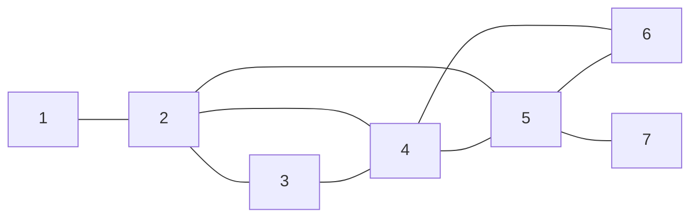

[[TOC]]

## 形式化题目

给定一个无向连通图 $G$（$F \leqslant 1024$ 条边，顶点编号 $1 \sim 500$，可能有重边、无自环以外的限制），求一条**欧拉路径**——每条边恰好经过一次——并把它表示为依次经过的 $F+1$ 个顶点。多解时输出序列**字典序最小**的一条。数据保证有解。

## 正解

### 思路

「每条边恰好走一次」正是欧拉路径的定义。连通图存在欧拉路径当且仅当奇度顶点个数为 $0$（欧拉回路）或 $2$（路径，两个奇度点分别是两端）。题目保证有解，所以不需要判无解，只需要**构造出字典序最小**的那条。

**第一步：选起点。** 若有两个奇度点，欧拉路径必须以它们为两端，起点只能取较小的那个；若没有奇度点，任何点出发都存在欧拉回路，取最小顶点即可。

**第二步：贪心 + Hierholzer。** 每到一个顶点，贪心地走当前编号最小的可用邻点。担心贪心走进"死胡同"（把某个点剩余的边切断）？关键在于：如果贪心选小邻点后走进了死胡同，那个死胡同点的剩余度数此刻必为奇——它注定是整条欧拉路径的**终点**。Hierholzer 算法恰好利用这一点：沿贪心方向一路入栈，走不动时出栈记录，出栈点若是"提前走完"的点，它的剩余边会在回溯拼接时被后面的环补上，最终结果仍是合法欧拉路径。因此"每步取当前最小可行邻点"得到的就是字典序最小的欧拉路径。

具体流程（迭代版 Hierholzer）：

1. 每个点的邻接表**升序排序**；
2. 栈顶为 $v$：若 $v$ 还有剩余邻点，取出最小的 $u$，把边 $(v,u)$ **双向删除**，$u$ 入栈；
3. 若 $v$ 没有剩余邻点，$v$ 出栈加入 `path`；
4. `path` 反转即为答案。

先看样例的图结构（1 出发，两个奇度点是 1 和 7，起点取 1）：

图中每条边恰好被走一次，答案 `1 2 3 4 2 5 4 6 5 7`。注意走到 6 时 6 的边已走完，先出栈；随后 5、4…依次回溯出栈，反转后得到完整路径。

| 步骤 | 栈顶动作 | 说明 |
| --- | --- | --- |
| 1→2→3→4 | 一路取最小邻点入栈 | 贪心向深处走 |
| 顶点 2（第二次） | 无剩余邻点，出栈 | 路径的"中段"先定下来 |
| 5、4、6 | 6 走完出栈，5、4 继续走剩余边 | 回溯中拼接子回路 |
| 7 | 走完出栈 | 终点（另一个奇度点）最后出栈 |

`path` 逆序弹出，反转即字典序最小的答案。

### 代码

@include-code(./main.py, python)

### 复杂度

- 建图与排序：$O(F \log F)$。
- Hierholzer 每条边进出栈各一次；Python 用 `list.pop(0)` / `remove` 删边为 $O(F)$，总计 $O(F^2) \approx 10^6$（$F \leqslant 1024$），瞬间完成；C++ 用排序 + 指针或多重集合可做到 $O(F \log F)$。
- 空间 $O(F)$。

## 总结

本题是欧拉路径的模板变体，考点有两个：一是把"每条栅栏恰好经过一次"识别为欧拉路径，用奇度点个数确定起点；二是"字典序最小"这一附加条件——把邻接表排序后每步贪心取最小邻点，配合 Hierholzer 的回栈拼接即可，不需要任何额外的搜索或 DP。

## 图示解析

### 样例欧拉路径走法

上面的 Mermaid 图展示原图无向结构；下表给出最终答案与每条边的对应关系，验证每条边恰好出现一次：

| 边 | 在路径中的位置 |
| --- | --- |
| (1,2) | 第 1 步 |
| (2,3) | 第 2 步 |
| (3,4) | 第 3 步 |
| (4,2) | 第 4 步（回到 2） |
| (2,5) | 第 5 步 |
| (5,4) | 第 6 步 |
| (4,6) | 第 7 步 |
| (6,5) | 第 8 步 |
| (5,7) | 第 9 步（终点 7） |

观察重点：路径两端 1 和 7 正是全图仅有的两个奇度点；中间点 2、4、5 各有偶数度，进多少次就出多少次。
