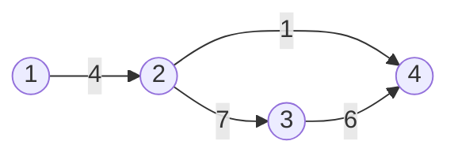

[[TOC]]

## 形式化题目

给定 $n$（$1 \leqslant n \leqslant 100$）个点和 $m$ 条无向带权边（权为正整数天数）。消息从点 $1$ 出发，沿边并行传播：一个点在时刻 $t$ 收到消息后，可以立刻同时向所有邻接点派信使，经过边 $(u,v)$ 需 $w(u,v)$ 天。求所有点都收到消息的最早时刻；若有点不可达输出 $-1$。

样例：边 `1-2(4)`、`2-3(7)`、`2-4(1)`、`3-4(6)`，答案为 $11$。

## 正解

### 思路

先理清"并行传播"的时间语义。每个哨所信使充足，收到消息后可以**同时**向所有邻居送信，所以任意时刻系统中可以有任意多条消息在传递。于是哨所 $v$ 收到命令的最早时刻只取决于它自己：要么 $v=1$，时刻为 $0$；要么某个邻居 $u$ 在 $t(u)$ 时刻收到后立刻派信使，$v$ 在 $t(u)+w(u,v)$ 时刻收到，取最早的那个邻居：

$$ t(v) = \min_{(u,v) \in E} \bigl( t(u) + w(u,v) \bigr), \qquad t(1) = 0. $$

这正是单源最短路的 Bellman 方程：$t(v)$ 就是 $1$ 到 $v$ 的最短路长度。送信整体完成时刻是所有哨所中最晚收到命令的时刻，即

$$ \text{ans} = \max_{1 \leqslant v \leqslant n} t(v). $$

若有 $t(v)=\infty$（图不连通），输出 $-1$。

边权全为正，直接用 Dijkstra：每次从堆中取出当前 $t$ 最小的未确定哨所 $u$，非负边权保证此时 $t(u)$ 已经是最短路长，不会再被更新；再用 $u$ 的所有出边松弛邻居。下面用样例看这一过程（节点标号即哨所号，边标天数）：

上图是样例的通信网络。Dijkstra 从哨所 $1$ 出发：先确定 $t(2)=4$；由 $2$ 松弛得 $t(4)=5$、$t(3)=11$；再弹出 $4$，经边 $4\text{-}3$ 得 $5+6=11$，不比 $11$ 小。最终 $t = [0,4,11,5]$，最晚的是哨所 $3$ 的 $11$ 天，与样例输出一致——命令沿 $1\to2\to3$ 这条最短路传到哨所 $3$ 恰好用了 $4+7=11$ 天。

### 代码

@include-code(./main.py, python)

### 复杂度

堆式 Dijkstra：每个哨所最多入堆 $\deg$ 次，总时间 $O((n+m)\log n)$，空间 $O(n+m)$。$n \leqslant 100$ 远低于 1s 限制，Python 实测约 0.02s 通过全部官方数据。

## 总结

- 并行传播 + 信使充足 $\Rightarrow$ 各哨所收到时刻互相独立，满足最短路 Bellman 方程，本题是裸的单源最短路。
- 答案是 $\max_v t(v)$ 而不是 $t(n)$，别只算最后一个点；不连通要输出 $-1$。
- 边权非负是 Dijkstra 正确性的前提；本题天数 $k \geqslant 1$ 天然满足。
