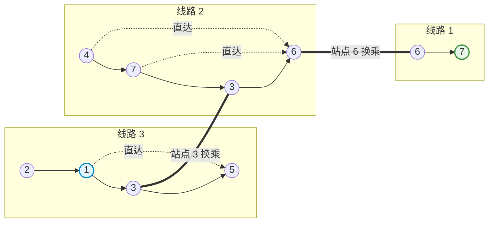

[[TOC]]

## 形式化题目

给定 $M$ 条单向巴士线路与 $N$ 个站点，起点为 $1$，终点为 $N$。每条线路按行驶方向依次给出途径的站点序列 $(s_1, s_2, \dots, s_k)$。在同一线路中，旅客可以从序列中的任意站点乘车直接到达其后方的任意站点，中途不上不下计为 $1$ 次乘车。

若无法直达，可在同一站点下车并转乘经过该站的其他线路。求从站点 $1$ 到站点 $N$ 的最少**换车次数**（换车次数等于乘车总次数减 $1$；若无需换车直达则为 $0$）。若无法到达，输出 `NO`。

## 正解：转换为单位权图的最短路 (BFS)

### 思路

#### 1. 问题转化与建图

换车次数的本质是计算从起点到终点**最少乘坐了几趟车**。
- 若总共乘坐了 $K$ 趟车，则换车次数恰好为 $K - 1$。
- 如果无需乘车（例如起点即为终点），换车次数为 $0$。

在同一条巴士线路中，如果站点 $u$ 出现在站点 $v$ 之前，乘客就可以乘坐该趟车从 $u$ 直达 $v$，这次行程消耗 $1$ 次乘车。
因此，我们可以将每个站点看作图中的一个顶点：
对于每条给定的线路 $(s_1, s_2, \dots, s_k)$，对所有满足 $1 \le i < j \le k$ 的站点对 $(s_i, s_j)$，建立一条从 $s_i$ 指向 $s_j$ 的有向边，边权均为 $1$。

#### 2. 最短路求解

经过上述建图后，问题转化为：在一个所有边权均为 $1$ 的有向图上，求从源点 $1$ 到汇点 $N$ 的最短路径长度。

由于边权全为 $1$，无需使用复杂的 Dijkstra 算法，直接使用队列进行**广度优先搜索（BFS）**即可在线性时间内求出单源最短路：
1. 初始化距离数组 $dist$ 为 $-1$，$dist[1] = 0$，将起点 $1$ 入队。
2. 依次取出队头节点 $u$，遍历 $u$ 的所有出边 $(u, v)$。若 $dist[v] == -1$，则令 $dist[v] = dist[u] + 1$ 并将 $v$ 入队。
3. 当队列为空或遍历到终点 $N$ 时搜索结束。

最终，若 $dist[N] = -1$，说明终点不可达，输出 `NO`；否则最少换车次数为 $\max(0, dist[N] - 1)$。

### 代码

@include-code(./main.py, python)

### 复杂度

- **时间复杂度**：$\mathcal{O}(M \cdot L^2 + N)$，其中 $M$ 为线路条数，$L$ 为单条线路经过的最多站点数（$L \le N$）。建图时对每条线路枚举所有有序点对需要 $\mathcal{O}(L^2)$；BFS 遍历每个点和每条边至多一次，耗时 $\mathcal{O}(V + E)$。在 $M \le 100, N \le 500$ 范围内运行效率极高。
- **空间复杂度**：$\mathcal{O}(M \cdot L^2 + N)$，用于存储图的邻接表以及 BFS 队列和距离数组。

## 总结

1. **乘车问题建图范式**：公交线路问题通常有两种建图视角：一种是“点是车站，同线所有前后站点对直接连边”；另一种是“拆点/线转点（以线路为点或分层图）”。本题中站点数 $N$ 较小，直接对同线前后站点全部连有向边最为直接直观。
2. **权值为 1 的最优解模型**：换乘代价固定时，最小化换乘即为最小化乘车次数，图上每条边权为 1，直接用 BFS 即可保证最优性。

## 图示解析

以样例数据为例：
- 线路 1：`6 -> 7`
- 线路 2：`4 -> 7 -> 3 -> 6`
- 线路 3：`2 -> 1 -> 3 -> 5`

乘车路径选择为：
1. 在站点 $1$ 乘坐线路 3 直达站点 $3$（乘车 $1$ 次）；
2. 在站点 $3$ 下车换乘线路 2，坐到站点 $6$（乘车第 $2$ 次，换乘 $1$ 次）；
3. 在站点 $6$ 下车换乘线路 1，坐到终点 $7$（乘车第 $3$ 次，换乘第 $2$ 次）。

总乘车次数为 $3$，最少换车次数为 $3 - 1 = 2$。
