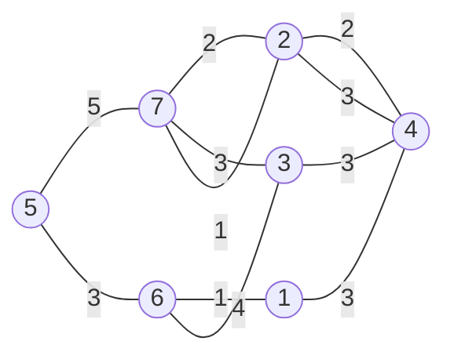

[[TOC]]

## 形式化题目

给定一张 $T$ 个点、$C$ 条边的无向图。第 $i$ 条边连接 $Rs_i$ 与 $Re_i$，边权为 $Ci_i$，且 $1 \leqslant Ci_i \leqslant 1000$。求点 $Ts$ 到点 $Te$ 的最小总边权和，即

$$\min_{P: Ts \rightsquigarrow Te} \sum_{e \in P} w(e)$$

其中 $P$ 取遍所有从 $Ts$ 到 $Te$ 的路径。数据保证至少存在一条这样的路径。

注意题面允许重边：样例中 $2\text{--}4$ 出现了两次（权 $2$ 和 $3$），$7\text{--}2$ 也出现了两次（权 $2$ 和 $1$）。

## 正解

### 思路

**第一步：建模。** 把每个城镇看成图上的一个点，每条道路看成一条**无向**边（题目说道路双向连通），边权就是通过费用。于是问题变成一张 $T$ 个点、$C$ 条边的带权无向图上的**单源最短路**：求 $Ts$ 到 $Te$ 的最小总边权和。

**第二步：排除朴素做法。** 最直觉的想法是枚举所有 $Ts \to Te$ 的路径，取费用最小的那条。但图里存在环（样例中 $2-4-3-7-2$ 就是一个环），路径条数随 $T$ 指数增长，$T = 2500$ 时完全不可行。必须换一个不枚举路径的思路。

**第三步：找到定型条件。** 换个角度，我们不去枚举路径，而是维护一个数组 `dist[v]`，表示"目前已知的 $Ts \to v$ 最小费用上界"，初始时 `dist[Ts] = 0`，其余为无穷大。然后一个一个地把点**定型**（确定它的 `dist` 就是最终答案）。

关键观察是：**当前 `dist` 最小的那个未定点，一定已经定型了。** 论证如下。设未定点 $u$ 的真实最短路径是 $P: Ts = p_0 \to p_1 \to \dots \to p_k = u$，取其中第一个尚未定型的点 $p_i$（$i \geqslant 1$，因为 $Ts$ 一开始就定型了）。于是 $p_0, \dots, p_{i-1}$ 都已定型，当 $p_{i-1}$ 定型时边 $(p_{i-1}, p_i)$ 已经被松弛过，所以

```text
dist[p_i] <= dist[p_{i-1}] + w(p_{i-1}, p_i)   // 松弛保证，且 dist[p_{i-1}] 已是最短路长
         = 最短路 P 上到 p_i 的前缀长度
         <= 最短路 P 的总长 = dist[u]          // 边权非负，前缀不长于全长
```

也就是说，存在一个未定点 $p_i$ 满足 `dist[p_i] <= dist[u]`。既然 $u$ 是 `dist` 最小的未定点，就有 `dist[p_i] = dist[u]`，而 `dist[p_i]` 又对应一条真实路径、不可能是估计值偏小，故 `dist[u]` 恰好等于真实最短路长，$u$ 已经定型。

这条性质成立的根本原因是**边权非负**（本题 $Ci \geqslant 1$），上面推导中"前缀长度 $\leqslant$ 总长"这一步才成立。如果存在负权边，绕道就可能更便宜，这个论证立刻失效。

**第四步：堆优化。** 直接按第三步做，每轮要花 $O(T)$ 扫描找出 `dist` 最小的未定点，总复杂度 $O(T^2 + C)$。把"找最小"交给小根堆，就得到堆优化的 Dijkstra：

1. 堆中初始放入 `(0, Ts)`。
2. 每次弹出堆顶 `(d, u)`。
3. 如果 `d != dist[u]`，说明 `u` 已经在这条记录之后被更短的路径更新过，这条是**过期记录**，丢弃。这样就不需要实现 decrease-key，同一个点可以有多条堆记录。
4. 否则 `u` 定型。遍历 `u` 的所有出边 `(v, w)`，如果 `d + w < dist[v]`，就更新 `dist[v]` 并把 `(dist[v], v)` 压入堆。
5. 由于非负权下弹出的 `d` 单调不减，**第一次弹出终点时**它的 `d` 就是最终答案，可以直接返回，不必跑完整个图。

**重边的处理**：建图时每条道路在两个方向的邻接表里各存一次，重边也就各存一次。松弛时同一个邻居会被尝试多次，较小的那个自然胜出，等价于预先只保留最小边——不需要单独去重。

下面用样例看一下这个过程。样例图（7 个点、11 条边，去重后 9 条）以及每次成功松弛的结果：



起点 $Ts = 5$，终点 $Te = 4$。竖线下标是边权。

| 步骤 | 定型的 u | 松弛到的 v | `dist[v]` 新值 |
| --- | --- | --- | --- |
| 1 | 5 | 7 | 5 |
| 2 | 5 | 6 | 3 |
| 3 | 6 | 1 | 4 |
| 4 | 6 | 3 | 7 |
| 5 | 1 | 4 | 7 |
| 6 | 7 | 2 | 7 |
| 7 | 7 | 2 | 6 |

最后一步体现了重边：从 7 走权为 $2$ 的边到 2 得到 $5+2=7$，随后走权为 $1$ 的那条重边把 `dist[2]` 改进成 $5+1=6$。松弛结束后 `dist` 数组为：

| 城镇 v | 1 | 2 | 3 | 4 | 5 | 6 | 7 |
| --- | --- | --- | --- | --- | --- | --- | --- |
| `dist[v]` | 4 | 6 | 7 | **7** | 0 | 3 | 5 |

`dist[4] = 7`，对应的路径是 $5 \to 6 \to 1 \to 4$，费用 $3 + 1 + 3 = 7$，与题面样例输出一致。

### 代码

@include-code(./main.py, python)

### 复杂度

**时间**：建图 $O(T + C)$。Dijkstra 中每条边最多触发一次成功松弛，因此入堆最多 $C$ 次，堆操作共 $O(C)$ 次，每次 $O(\log C)$；加上弹出终点的提前返回，总复杂度

$$O\big((T + C) \log C\big)$$

取 $T = 2500$、$C = 6200$，约为 $10^5$ 量级的基本堆操作，在 1000ms 内非常宽裕。对比朴素扫描的 $O(T^2 + C)$ 和 Bellman-Ford 的 $O(T \cdot C)$，堆优化去掉了"每轮盲扫全图"的开销。

**空间**：邻接表存 $2C$ 条边、`dist` 数组 $O(T)$、堆最多 $O(C)$ 个元素，总空间

$$O(T + C)$$

实测真实数据峰值约 17MB，远低于 128MB 的限制。

## 总结

- 本题是**单源最短路**的模板题：城镇是点，双向道路是无向边，费用是边权。
- 突破点是"当前 `dist` 最小的未定点必定已经定型"这一性质，而它成立的前提是**边权全为正**（$Ci \geqslant 1$）。
- 实现上用**小根堆 + 惰性删除**替代 decrease-key：同一顶点允许多条堆记录，弹出时用 `d != dist[u]` 判废，代码更短且不损失复杂度。
- 重边无需预处理，多条边都参与松弛、取最小者即可。
- 总复杂度 $O((T + C) \log C)$，空间 $O(T + C)$。

## 图示解析

这张图串起本题从题面建模到得到答案的主线：

```text
题面：城镇 + 双向道路 + 费用
`- 建模：无向带权图，求 Ts -> Te 最小边权和
   `- 朴素枚举所有路径？ 路径数指数级，不可行
      `- 关键观察：边权 >= 1，故 dist 最小的未定点必定定型
         `- 找最小交给小根堆
            `- 弹出即定型，用出边松弛邻居
               `- 重边各存一次，松弛时取小者
                  `- 弹出终点即答案
```

先看每一层解决的到底是哪一个障碍：第二层否掉枚举路径，第三层给出算法成立的依据，第四、五层把它落成 $O((T+C)\log C)$ 的实现。
图中只保留正文已经论证过的关系，具体的松弛过程和 `dist` 数值看 `### 思路` 中的样例表。
