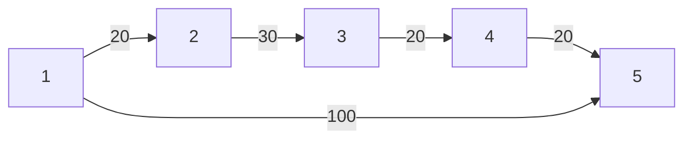

[[TOC]]

## 形式化题目

给定 $n$ 个点、$m$ 条边的**无向带权图**（可能有重边、自环，边权 $0 \leqslant c \leqslant 10^4$），求点 $1$ 到点 $n$ 的最短路长度；不可达输出 `-1`。

## 正解

### 思路

#### 从朴素做法说起

最直接的暴力是 **Bellman-Ford**：反复用每条边 $(a,b,c)$ 去松弛 $dist$ 数组（$dist[b] = \min(dist[b], dist[a]+c)$，反向同理），直到某一轮不再更新。它一定能得到正确答案，但每轮扫描全部 $m$ 条边，最坏要松弛 $n-1$ 轮，复杂度 $O(nm) \approx 2000 \times 10^4 = 2\times 10^7$——虽然能过，但这个上界来自"每一轮可能只让最短路多扩展一条边"，效率明显浪费。

#### 贪心观察：边权非负，就能确定"下一个确定的最短路"

关键性质是**所有边权 $c \geqslant 0$**。设 $S$ 是"最短路已经最终确定"的点集（初始 $S=\{1\}$），$dist[v]$ 是当前只经过 $S$ 中点中转时到达 $v$ 的最短距离。那么在 $S$ 之外取 $dist$ 最小的点 $u$，它的 $dist[u]$ 就已经是真正的最短路：

- 若不然，最短路要先经过 $S$ 外某点 $w$ 再到 $u$，则 $dist[w] + (\text{后面一段}) \geqslant dist[w] \geqslant dist[u]$（边权非负保证"后面一段"不小于 $0$），矛盾。

这就是 **Dijkstra** 的贪心：每次把 $dist$ 最小的未确定点加入 $S$，并用它的出边松弛邻居，重复 $n-1$ 次。朴素实现找最小点是 $O(n)$ 扫描，总共 $O(n^2)$；本题 $n \leqslant 2000$ 也能过，但接下来把 $m \leqslant 10^4$ 的条件用起来。

#### 用小根堆加速"取最小"

"每次取 $dist$ 最小的未确定点"正是小根堆的本职。堆优化 Dijkstra：

1. 把 $(dist,点)$ 二元组放进 `heapq` 小根堆，初始 `(0, 1)`；
2. 弹出堆顶 $(d,u)$：若 $d > dist[u]$，说明这是**过期的旧记录**（$u$ 后来又被更短的路径松弛过），直接跳过——等价于朴素版的"已确定标记"，不必显式维护 visited；
3. 否则 $dist[u]=d$ 已确定，用 $u$ 的每条出边 $(v,w)$ 松弛：若 $d+w < dist[v]$ 就更新并把 $(d+w, v)$ 入堆。

每条边最多引起一次成功松弛入堆，堆操作 $O(m\log m)$，总复杂度 $O((n+m)\log m)$。对"图"上跑 Dijkstra 的过程，可以看这张示意（以样例为例）：

| 出队步骤 | 弹出 $(d,u)$ | 说明 |
| --- | --- | --- |
| 1 | $(0,1)$ | 起点，松弛 2、5：$dist=[\_,0,20,\infty,\infty,100]$ |
| 2 | $(20,2)$ | 2 确定，松弛 3：$dist[3]=50$ |
| 3 | $(50,3)$ | 3 确定，松弛 4：$dist[4]=70$ |
| 4 | $(70,4)$ | 4 确定，松弛 5：$dist[5]=90$（优于 100，100 那份记录过期） |
| 5 | $(90,5)$ | 弹出 $n=5$，答案 $90$，提前结束 |

样例中直接走 $1\to 5$ 是 $100$，而沿 $1\to2\to3\to4\to5$ 是 $20+30+20+20=90$，所以答案是 $90$；边 $(1,5,100)$ 在堆里留下的 $(100,5)$ 记录在弹出时因 $100>90$ 被跳过。

#### 实现细节

- **重边**：邻接表把每条边都存进去即可，松弛时自然会取最小的；**自环**（若有）松弛不了任何东西，无害。
- **建图**：无向边存两次 `adj[a].append((b,c)); adj[b].append((a,c))`。
- **提前结束**：第一次弹出 $u=n$ 时 $dist[n]$ 已最终确定，可直接 `break`；不 break 等全部跑完再取 `dist[n]` 也正确。
- **不可达**：结束时 $dist[n]$ 仍为 $\infty$ 就输出 `-1`。

### 代码

@include-code(./main.py, python)

### 复杂度

- 时间复杂度：$O((n+m)\log m)$，每条边至多一次成功松弛入堆，每次堆操作 $O(\log m)$。
- 空间复杂度：$O(n+m)$，邻接表与堆。

## 总结

- 边权非负是 Dijkstra 正确性的前提：它保证了"当前 $dist$ 最小的未确定点可以直接确定"这一贪心。
- 堆里允许存在过期记录、弹出时用 $d>dist[u]$ 跳过，比给每个点维护"是否在堆中"更简单且正确。
- Python 实现要点：`sys.stdin.buffer.read().split()` 一次读完 token 流；邻接表用"每条边存两次"表达无向图。
