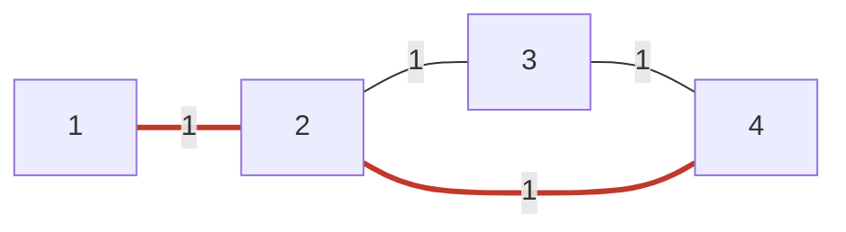

[[TOC]]

## 形式化题目

给定 $N$ 个点、$M$ 条边的带权**无向**图（$N \leqslant 100000$，$M \leqslant 500000$），每条边权 $c_i$ 是不超过 $1000$ 的正整数。图中可能有重边和自环，数据保证 $1$ 与 $N$ 连通。求点 $1$ 到点 $N$ 的最短路径长度，只输出距离值。

样例是一张 4 个点 4 条边的图，加粗的两条边构成最优路线 $1 \to 2 \to 4$：

观察这张图：$2$ 到 $4$ 之间既有长度 $1$ 的直接边，也有绕经 $3$、总长 $2$ 的路线。最短路要求把一个点对之间**所有可能路线**放在一起比较总长，而不是只盯住某条边或某条路——这正是最短路算法要替我们做的全局比较。

## 正解

### 思路

**从朴素做法出发。** 最短路的原始定义是松弛操作：若经过 $u$ 能把到 $v$ 的距离改得更小，就更新

$$\mathrm{dist}[v] = \min\bigl(\mathrm{dist}[v],\ \mathrm{dist}[u] + w(u,v)\bigr).$$

从 $\mathrm{dist}[1] = 0$、其余为 $\infty$ 出发，反复扫描**全部**边做松弛直到不再变化，就是 Bellman-Ford 算法，复杂度 $O(NM)$。本题 $N \leqslant 10^5$、$M \leqslant 5\times10^5$，$NM$ 高达 $5\times10^{10}$，连时限的百分之一都跑不完。

**瓶颈在哪。** 每一轮都无差别扫描所有边，而绝大多数边在当时根本不可能引起有效松弛。改进方向自然有两种：要么"只扫刚变小的点"，要么"给该轮到谁定序"。

- 路线一：把被松弛成功的点塞进队列，下一轮只从它们出发扩展，这就是 SPFA（本题官方标题与标程的做法）。平均很快，但最坏复杂度仍是 $O(NM)$，没有任何保证，Python 实现常数又大。
- 路线二：本题**边权全为正**，这个条件允许更强的贪心——当前候选距离最小的未定型点，它的距离已经不可能再被别的路改小，可以一次性"定型"。用小根堆维护"谁的候选距离最小"，就是堆优化 Dijkstra，复杂度 $O(M\log M)$，有硬保证。

"第一次弹出堆即定型"为什么对？归纳来看：所有边权为正，任何还没定型的点若想把 $u$ 改得更小，路径必须先经过某个距离不小于 $d$ 的点再走正权边，只会更大。所以弹出 $(d, u)$ 时 $d$ 就是 $u$ 的最终最短距离。

**用样例走一遍流程**（点按编号 $1..4$）：

| 步骤 | 弹出 $(d, u)$ | 动作 | $\mathrm{dist}$ 状态 $[1,2,3,4]$ |
| --- | --- | --- | --- |
| 初始 | — | $\mathrm{dist}[1]=0$ 入堆 | $[0, \infty, \infty, \infty]$ |
| 1 | $(0, 1)$ | 松弛 $1\to2$：$0+1<\infty$ | $[0, 1, \infty, \infty]$ |
| 2 | $(1, 2)$ | 松弛 $2\to3$、$2\to4$ 均成功 | $[0, 1, 2, 2]$ |
| 3 | $(2, 3)$ | 松弛 $3\to4$：$2+1=3 > 2$，失败 | $[0, 1, 2, 2]$ |
| 4 | $(2, 4)$ | $u=N$，**直接返回 2** | 答案 $2$ |

表格里有两个值得注意的细节：第 3 步经过 $3$ 绕路到 $4$ 反而更贵，松弛自动淘汰了它；第 4 步 $4$ 被弹出时答案就已确定，不用等堆空——"命中终点提前返回"是完全安全的。

**实现上的三个要点。**

1. **惰性删除**：一个点每被松弛成功一次就压一次堆，堆里会同时存在同一点的多个条目。弹出时若 $d > \mathrm{dist}[u]$，说明这是过期条目，直接跳过。这比手写"可删除堆"简单得多，也是 Python 里最省事的标准写法。
2. **重边与自环不用特判**：无向边在两端各存一条即可；自环因 $c > 0$ 永远满足 $\mathrm{dist}[u]+c > \mathrm{dist}[u]$，松弛条件"严格小于"让它自动失效；重边中较大的一条会在比较中自然落败。
3. **读入规模**：$M = 5\times10^5$ 时输入约 7.8MB，必须 `sys.stdin.buffer.read()` 一次读完再按空白切分，逐行 `input()` 会先死在读入上。

### 代码

@include-code(./main.py, python)

### 复杂度

- 时间复杂度：每次松弛成功压一次堆，无向边两个方向的松弛总次数不超过 $2M$，堆操作 $O(\log M)$，总计 $O\bigl((N+M)\log M\bigr)$，与 C++ 标准堆优化最短路解法同阶。实测最大数据（$N=10^5$，$M=5\times10^5$）本地运行约 0.45s。
- 空间复杂度：邻接表 $O(M)$、`dist` 与堆 $O(N+M)$，合计 $O(N+M)$。Python 对象开销大，实测峰值约 238MB，会超出本题 128MB 内存限制；这是 Python 解法的已知代价（C++ 同算法约 20MB），需要严格卡内存时应换 C++ 或改用扁平数组存边。

## 总结

- 本题是单源最路模板：边权全正 ⟹ 堆优化 Dijkstra 成立；只求 $1\to N$ 的距离值 ⟹ $N$ 第一次出堆即可返回。
- 推导主线：Bellman-Ford 的 $O(NM)$ 全量扫描是瓶颈 ⟹ SPFA"只扫刚变小的点"（官方标程路线，最坏无保证）⟹ Dijkstra"按距离从小到大定型"$O(M\log M)$（本文采用的路线，复杂度有硬保证）。
- 三个实现要点可以直接迁移到任何最短路题：惰性删除过期堆条目、重边自环不特判（严格小于的松弛条件兜底）、大数据一次 `read()` 再切分。
