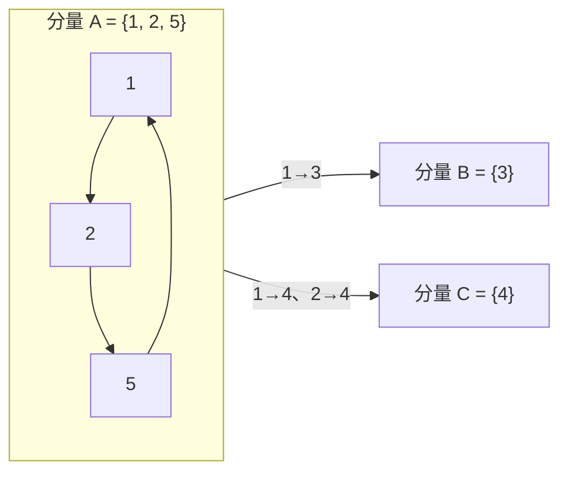

[[TOC]]

## 形式化题目

给定 $n$ 个点和若干有向边：第 $i$ 个点指向 $j$ 表示 $i$ 允许把资料传给 $j$。资料放在某个点上后会沿有向边自动传播，一张光盘覆盖放置点可达的全部点（含放置点自身）。求让所有点都获得资料所需的最少光盘数。

## 正解

### 思路

**第一步：把"拷贝"翻译成可达性。** "若 $A$ 愿意给 $B$、$B$ 愿意给 $C$，则 $A$ 拿到后 $B$、$C$ 都能拿到"——这正是有向图上路径的定义。所以一张光盘放在 $p$ 手里，最终覆盖的恰好是 $p$ 的可达集 $\mathrm{reach}(p)$（含 $p$ 自己）。问题变成：选最少的起点，让它们的可达集之并盖住所有点。

**第二步：找到"必须直接拿光盘"的点。** 强连通分量（SCC）内部互相可达：光盘放在分量内任何一人手里，覆盖效果完全相同。把每个 SCC 缩成一个点，得到一个 DAG。入度为 $0$ 的分量（源分量）拿不到任何人传来的资料——若外部点能把资料传进源分量 $S$，传进来的最后一条边就是一条从其他分量指向 $S$ 的边，与 $S$ 入度为 $0$ 矛盾。因此：

- **下界**：每个源分量必须有人直接持有光盘；不同源分量互相不可达，一张光盘至多覆盖一个源分量，故至少需要（源分量个数）张。
- **上界**：DAG 中任何分量沿边倒退走，总能到达某个入度为 $0$ 的分量；给每个源分量各放一张，资料顺流而下覆盖全部分量，故（源分量个数）张足够。

**答案 = 缩点 DAG 中入度为 $0$ 的强连通分量个数。** 以样例为例（边 $1\to2,1\to3,1\to4,2\to4,2\to5,5\to1$）：

$1\to2\to5\to1$ 构成环，把 $1,2,5$ 缩成源分量 $A$；$B$、$C$ 都有来自 $A$ 的入边，只有 $A$ 入度为 $0$。在 $A$ 中任选一人（如 1 号）放光盘，$1$ 能到 $\{2,3,4,5\}$，全覆盖，答案为 $1$。

**第三步：用 bitset 传递闭包数出源分量。** $n \leqslant 200$，不必写 Tarjan；传递闭包配 Python 大整数（天然 bitset）反而更短更快：

- `reach[i]`：$i$ 能到达的点集（显式并入自环）。
- Floyd 式闭包：若 `reach[i]` 第 $k$ 位为 1，则整行 `reach[i] |= reach[k]`。
- `pred[i]`（能到达 $i$ 的点集）就是闭包矩阵的第 $i$ 列。
- 强连通分量即互相可达的点集：$\mathrm{SCC}(i) = \mathrm{reach}[i] \mathbin{\&} \mathrm{pred}[i]$（两个集合都含 $i$ 自身）。

判定"源"只需要一个位运算：

> $\mathrm{SCC}(i)$ 是源 $\iff \mathrm{pred}[i] \subseteq \mathrm{reach}[i]$，即"所有能到 $i$ 的点，$i$ 反过来也能到"。

若 $\mathrm{SCC}(i)$ 非源，必有外部点 $j$ 能到 $i$ 而 $i$ 到不了 $j$（$j$ 进入该分量的路径存在，$i$ 却无法反向出去），此时 `pred[i] & ~reach[i]` 非空；反之，能到 $i$ 的点全部落在 $\mathrm{SCC}(i)$ 内，说明没有任何外部路径能进入该分量，它是源。

对样例逐人检查（集合均含自环）：

| $i$ | $\mathrm{reach}[i]$（$i$ 能到谁） | $\mathrm{pred}[i]$（谁能到 $i$） | $\mathrm{SCC}(i)$ | $\mathrm{pred}[i] \subseteq \mathrm{reach}[i]$？ |
| --- | --- | --- | --- | --- |
| 1 | $\{1,2,3,4,5\}$ | $\{1,2,5\}$ | $\{1,2,5\}$ | 是 → 源 |
| 2 | $\{1,2,3,4,5\}$ | $\{1,2,5\}$ | $\{1,2,5\}$ | 是 → 源 |
| 3 | $\{3\}$ | $\{1,2,3,5\}$ | $\{3\}$ | 否（$1,2,5$ 能到 $3$，$3$ 到不了他们） |
| 4 | $\{4\}$ | $\{1,2,4,5\}$ | $\{4\}$ | 否（$1,2,5$ 能到 $4$，$4$ 到不了他们） |
| 5 | $\{1,2,3,4,5\}$ | $\{1,2,5\}$ | $\{1,2,5\}$ | 是 → 源 |

同一源分量的所有成员都通过检查且 $\mathrm{SCC}$ 掩码相同，非源分量的成员全部不通过，所以把通过者的 `reach[i] & pred[i]` 放进集合并计数，得到的就是源分量个数——样例去重后只剩 $\{1,2,5\}$，输出 $1$。

### 代码

@include-code(./main.py, python)

### 复杂度

- 时间：闭包为 $n$ 轮 Floyd，每轮 $n$ 次大整数 OR，每次 $O(n/w)$（$w$ 为位密度因子，CPython 约 30），总计 $O(n^3/w)$；取列与源判定各 $O(n^2)$。$n = 200$ 时约几万次字长级运算，实测单组数据约 0.02s，无 TLE 风险。这与本题 $O(n^3)$ 的 Floyd 闭包经典实现同阶；若数据规模更大，应改用 Tarjan/Kosaraju 求 SCC 后统计入度，$O(n+m)$。
- 空间：闭包矩阵 $O(n^2/w)$，约 5KB，远低于 128MB。

## 总结

- 题眼：一张光盘的覆盖范围 = 放置者的可达集；"无法被间接覆盖"的点恰好构成缩点 DAG 的源分量，最少光盘数 = 源分量个数。
- 判定技巧：bitset 闭包下，$\mathrm{SCC}(i) = \mathrm{reach}[i] \mathbin{\&} \mathrm{pred}[i]$，"是否源"化为一次 $\mathrm{pred}[i] \subseteq \mathrm{reach}[i]$ 判断，去重计数即答案。
- 同模型（缩点后数入度 0 分量）是图论常见套路：校园网络选服务器、Popular Cows 等都是它的变体；规模大时换 Tarjan/Kosaraju。
