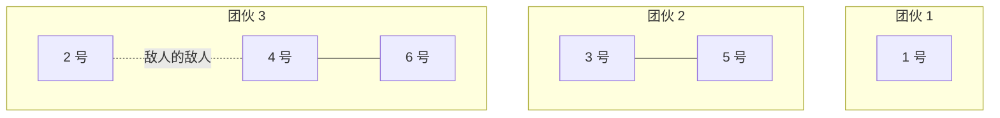

[[TOC]]

## 形式化题目

给定 $n$ 个元素 $1, 2, \dots, n$ 以及 $m$ 条二元关系：
- 关系 1（同类关系）：$x$ 与 $y$ 属于同一集合（朋友）；
- 关系 2（对立关系）：$x$ 与 $y$ 互为对立（敌人）。

满足以下规则：
1. 若 $x, y$ 同属于同一集合且 $y, z$ 属于同一集合，则 $x, z$ 属于同一集合；
2. 若 $x, y$ 互为对立且 $y, z$ 互为对立，则 $x, z$ 属于同一集合。

若无额外推导要求两个元素必须处于同一集合，则它们可以分别处于不同集合。求在满足所有关系的前提下，最多能划分为多少个互不相交的非空集合（即最大团伙数）。

## 题目解析

### 观察与建模

根据题意，朋友关系具有等价关系的传递性，可以直接用并查集进行合并。而敌人关系满足“**敌人的敌人是我的朋友**”，即对立关系的二次对立会变回同类关系。

这是一种典型的**二分对立结构**。对于每个人 $x$，我们可以建立两个域（种类并查集 / 扩展域并查集）：
- **同类域（朋友域）**：编号为 $x$（范围 $1 \sim n$）；
- **对立域（敌人域）**：编号为 $x + n$（范围 $n+1 \sim 2n$）。

关系处理方式如下：
1. **$x$ 和 $y$ 是朋友（$p = 0$）**：
   - 直接将 $x$ 和 $y$ 的朋友域合并，即 `union(x, y)`。
2. **$x$ 和 $y$ 是敌人（$p = 1$）**：
   - $x$ 与 $y$ 的对立域合并：`union(x, y + n)`，表示“$y$ 的敌人是 $x$ 的朋友”；
   - $y$ 与 $x$ 的对立域合并：`union(y, x + n)`，表示“$x$ 的敌人是 $y$ 的朋友”。

通过这样的合并，如果有“$x$ 与 $y$ 是敌人，且 $y$ 与 $z$ 是敌人”：
- $x$ 会与 $y + n$ 合并；
- $z$ 会与 $y + n$ 合并；
- 此时 $x$ 和 $z$ 天然在同一个连通块内，自动完成了“敌人的敌人是朋友”的传递。

### 样例图示

以输入样例为例：
- $n = 6, m = 4$
- `1 1 4`（1 和 4 是敌人）：合并 $1$ 与 $4+6=10$，$4$ 与 $1+6=7$；
- `0 3 5`（3 和 5 是朋友）：合并 $3$ 与 $5$；
- `0 4 6`（4 和 6 是朋友）：合并 $4$ 与 $6$；
- `1 1 2`（1 和 2 是敌人）：合并 $1$ 与 $2+6=8$，$2$ 与 $1+6=7$。

观察此时的连通性：
- 节点 $2$ 与 $1+6=7$ 连通，而节点 $4$ 也与 $1+6=7$ 连通，因此节点 $2$ 和 $4$ 间接成为朋友。
- 又因为节点 $4$ 和 $6$ 是朋友，所以 $\{2, 4, 6\}$ 同属一个团伙。
- 节点 $3$ 和 $5$ 同属一个团伙 $\{3, 5\}$。
- 节点 $1$ 独立成为一个团伙 $\{1\}$。

总共有 3 个团伙：$\{1\}$、$\{3, 5\}$、$\{2, 4, 6\}$。

### 统计答案

由于未被强制关联的人应尽可能独立以使团伙数最大，只需统计前 $n$ 个节点（即每个人自身的朋友域节点 $1 \sim n$）在并查集中有多少个互不相同的根节点（代表元）。

## 代码

Python 版：

@include-code(./main.py, python)

C++ 版（同一算法）：

@include-code(./main.cpp, cpp)

## 复杂度分析

- **时间复杂度**：$\mathcal{O}((n + m) \cdot \alpha(n))$。初始化需要 $\mathcal{O}(n)$，每个关系执行常数次带路径压缩的并查集操作，均摊复杂度为反阿克曼函数 $\alpha(n)$，完全在 $1000\text{ ms}$ 时限内轻松通过。
- **空间复杂度**：$\mathcal{O}(n)$。扩展域并查集数组大小为 $2n + 1$，占用内存极少，符合 $128\text{ MB}$ 的限制。

## 总结

本题是**种类并查集（扩展域并查集）**的经典模板题。核心思想是将具有二元对立关系的问题拆解为“同类域”与“对立域”，通过“$x$ 与 $y$ 的对立域合并”来实现“敌人的敌人是朋友”的自然传递。
