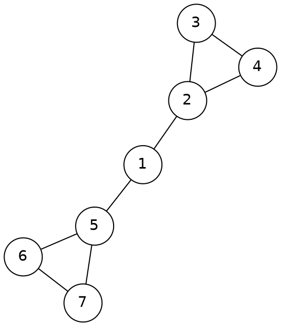

[[TOC]]

## 形式化题目

给定一张 $n$ 个点、无向边的连通图（点 $1..n$，$n \leqslant 1000$），边集由每行的邻接列表给出。对 $0 \leqslant k \leqslant n$ 定义

$$f(k) = \text{子图 } \{k+1, k+2, \ldots, n\} \text{ 的最大连通块大小}, \qquad f(n) = 0 .$$

求最小的 $k$，使得 $f(k) \leqslant \lfloor n/2 \rfloor$。

样例是一张 7 个点的图，$\lfloor n/2 \rfloor = 3$。删掉团伙 $1$ 后剩余图分裂成 $\{2,3,4\}$ 与 $\{5,6,7\}$ 两块，各 3 个团伙，恰好达标：



观察这张图：团伙 $1$ 是一座"桥"，它同时连着左边的团 $\{2,3,4\}$ 和右边的团 $\{5,6,7\}$。
不打击任何团伙时整图连通、最大块为 $7 > 3$；一旦删掉 $1$，两侧立刻断开，最大块降到 $3$。
这说明答案取决于"删掉哪些点能让最大块缩到阈值以下"，而点 $1$ 正是性价比最高的那个。

## 正解

### 思路

**从朴素做法出发。** 最直接的写法是枚举 $k = 0, 1, 2, \ldots$，对每个 $k$ 检验条件是否成立，
第一个成立的 $k$ 即答案。单次检验用并查集扫一遍边、只合并两端编号都 $> k$ 的点，代价 $O(n + m)$；
最坏要检验 $n$ 次，总计 $O\bigl(n(n+m)\bigr)$。本题 $m$ 可达 $O(n^2)$，$n = 1000$ 时约为 $10^9$ 次操作，跑不完。

**瓶颈在哪。** 相邻两次检验之间只差了一个被删掉的点，但每次都要把绝大部分边重新合并一遍。
之所以不能"在原有基础上删点"，是因为并查集只支持合并、不支持分裂——删掉一个点会把一个连通块拆开，
这正是并查集的短板。**既然"删"不好做，就把过程反过来做"加"。**

**关键观察。** 两个性质把问题彻底简化：

1. **单调性**：$k$ 变大意味着删除的点更多、保留的点更少，剩余子图是原剩余子图的子图。
   删点只会让连通块分裂或缩小，所以 $f(k)$ 关于 $k$ **单调不增**。
   于是"$f(k) \leqslant \lfloor n/2 \rfloor$"一旦对某个 $k$ 成立，对更大的 $k$ 都成立；答案就是"首次满足"的那个 $k$。
2. **倒序等价**：删除前缀 $\{1, \ldots, k\}$ 的过程，与从空图开始**倒序添加**后缀 $\{n, n-1, \ldots, k+1\}$ 互为逆过程。

把这两点合起来，就得到本文的做法：让 $i$ 从 $n$ 递减到 $1$，每轮把点 $i$（以及它与已加入点之间的边）加入并查集。
第 $i$ 轮结束时并查集维护的正好是子图 $\{i, \ldots, n\}$ 的连通块划分，即各块大小就是 $f(i-1)$ 的候选值；
由于 $f$ 单调不增，“第一次出现大小 $> \lfloor n/2 \rfloor$ 的集团”只会发生一次，它出现时答案就已经确定了。

**为什么首触发轮次 $i$ 就是答案？** 首触发意味着 $f(i-1) > \lfloor n/2 \rfloor$，即 $k = i - 1$ 不可行；
而轮次 $i$ 之前从未触发，说明对任意 $k \geqslant i$ 都有 $f(k) \leqslant \lfloor n/2 \rfloor$，即 $k = i$ 可行。
不可行的上界加一步就可行，最小可行值正是 $i$。所以一旦触发就能立刻输出返回，不必扫完 $n$ 轮。

**一个容易踩的坑：只需检查 $i$ 所在集团。** 代码每轮只读 `size[root]`（点 $i$ 所在集团的大小），
而不是扫遍所有集团求最大值。这是对的：上一轮（点 $i+1$ 刚加完）未触发，说明那时**每个**集团都 $\leqslant \lfloor n/2 \rfloor$；
本轮加入点 $i$ 只会让它自己所在的集团变大，其它集团原封不动。所以本轮可能出现超标集团的
只可能是 $root$ 这一块，`size[root] > n // 2` 与 $f(i-1) > \lfloor n/2 \rfloor$ 完全等价。

**用样例走一遍倒序过程**（$n = 7$，阈值 $\lfloor 7/2 \rfloor = 3$）：

| 本轮加入 | 集合 $\{i..n\}$ 的各集团大小 | 最大集团 | 超阈值？ |
| --- | --- | --- | --- |
| 7 | 1 | 1 | 否 |
| 6 | 2 | 2 | 否 |
| 5 | 3 | 3 | 否 |
| 4 | 3, 1 | 3 | 否 |
| 3 | 3, 2 | 3 | 否 |
| 2 | 3, 3 | 3 | 否 |
| 1 | 7 | 7 | **是 → 答案 $k = 1$** |

前六轮里 $\{5,6,7\}$ 一直是 3，$\{2,3,4\}$ 侧随加点从 1 涨到 3，都没超过 3；
到最后一轮加入点 $1$ 时它把两团连成 7，首次超过阈值，因此输出 $i = 1$。
这与"删掉团伙 1 后最大块为 3"的答案一致。

**实现上的三个要点。**

1. **邻接表只存大编号邻居**：倒序加入点 $i$ 时，编号更小的点还没进来，因此 $i$ 与 $j < i$ 之间的边
   会在处理 $j$ 时被处理。每条无向边只存一次，既省空间又保证每条边只被访问一次。
2. **按大小合并 + 路径压缩**：`size` 只在代表位置上有效；本轮先把 `root = find(i)` 取出来并保持不变，
   所有合并都朝 `root` 方向挂，轮末读 `size[root]` 一定读到本轮累计值。`other == root` 时跳过，
   顺带挡住重边造成的重复累加。
3. **读入一次切分**：输入规模 $O(n^2)$，用 `sys.stdin.buffer.read().split()` 一次读完再迭代，
   避免逐行 `input()` 的开销。

### 代码

@include-code(./main.py, python)

### 复杂度

- 时间复杂度：每条边只被访问一次，合并总次数不超过 $n - 1$，路径压缩下单次 `find` 均摊 $O(\log n)$，
  总计 $O\bigl((n+m)\log n\bigr)$（包括查找带来的对数因子），与 C++ 标准做法同阶。
  这比枚举 $k$ 的 $O\bigl(n(n+m)\bigr)$ 少了因子 $n$。
  实测最大数据（$n = 1000$）本地单测例约 0.020s、峰值 15.2MB。
- 空间复杂度：邻接表 $O(n + m)$、并查集 $O(n)$，合计 $O(n + m)$。

## 总结

- 本题的核心等价变形：**前缀删点 = 只看后缀**，因此"删 $1..k$"与"从 $n$ 倒着加到 $k+1$"是同一件事的两种方向。
- 关键性质是 $f(k)$ 关于 $k$ **单调不增**，它同时解释了"可以二分答案"和"首触发即答案、可以提前返回"。
- 并查集只支持合并，所以要把删点问题翻成加点问题；这是本题从 $O\bigl(n(n+m)\bigr)$ 降下来的那一步。
- 实现细节可以直接迁移：无向图只存大编号邻居让每条边只访问一次、按大小合并时固定根节点以避免读到脏的 `size`、
  重边自环靠 `other != root` 和 `j > i` 过滤。

## 图示解析

这张图串起本题从建模到得到答案的主线：

```text
输入：n 个团伙 + 联系边
`- 打击 1..k  ==  只看编号 > k 的点
   `- 单调性：k 变大，点更少，最大集团只可能变小
      `- 二分 O(log n) 次判定，每次 并查集 O(n + m)
      `- （本文路线）倒序加点：删 1..k 是加 n..k+1 的逆过程
         `- 第 i 轮集合 {i..n} 的集团 == 删 1..i-1 后的集团
            `- 首个超过 floor(n/2) 的集团出现在第 i 轮  ==>  答案 k = i
```

先确认第一层等价（"打击掉的团伙"就是"不在图里的点"），再顺着分支看两种判定方式：
二分答案每次重建并查集，倒序加点则让并查集只在加点时增长，均摊到一次加点即得答案。
最后一个分支是本题的核心——因为大小超过 $\lfloor n/2 \rfloor$ 的集团一旦出现，它在后续更小的集合里只会继续被削弱，
所以"第一次出现"就锁定了答案。
