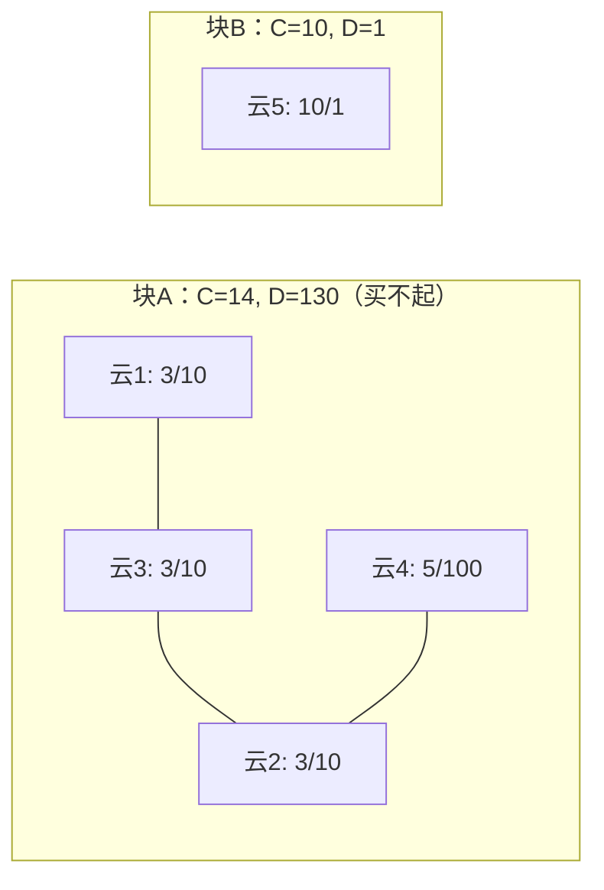

[[TOC]]

## 形式化题目

给定 $n$ 件物品，第 $i$ 件有价钱 $c_i$ 和价值 $d_i$；再给定 $m$ 条无向的"强制搭配"边 $(u,v)$：选中 $u$ 则必须选中 $v$，反之亦然。在总价钱不超过 $w$ 的前提下，求可选到的最大总价值。

## 正解

### 思路

先看搭配约束的本质：约束是**双向且可传递**的。买 $u$ 必买 $v$，买 $v$ 又必买与 $v$ 搭配的所有云……沿着搭配边一路传递下去，最终结论是：

> **买了连通块里的任何一朵云，就必须买下它所在连通块的全部云。**

因此搭配关系把 $n$ 朵云划分成若干连通块，每个连通块只有两种状态：整块买（价钱 $C=\sum c_i$，价值 $D=\sum d_i$），或者整块不买。把每个连通块"缩"成一件物品，问题就变成：

> 若干件物品，每件最多选一次，预算 $w$，最大化总价值——标准 **0/1 背包**。

实现上用**并查集**维护连通块（路径减半 + 按序合并），再对每个根统计 $(C,D)$，最后跑一遍 0/1 背包：$dp[j]$ 表示花费不超过 $j$ 能获得的最大价值，每件物品倒序枚举 $j$ 从 $w$ 到 $C$，转移 $dp[j]=\max(dp[j],\ dp[j-C]+D)$。

以样例说明连通块的缩点结果（边 1–3、3–2、4–2 把 1,2,3,4 连成一块）：

预算 $w=10$：块 A 总价 $14 > 10$ 买不起；块 B 恰好花 $10$ 得价值 $1$，答案为 $1$。

小规模演示背包转移（只保留块 B 一件物品，$C=10, D=1$）：

| $j$ | 0~9 | 10 |
| --- | --- | --- |
| 初始 $dp[j]$ | 0 | 0 |
| 更新后 $dp[j]$ | 0 | $dp[0]+1=1$ |

可见每件物品只让 $j \geqslant C$ 的位置获得一次提升，倒序枚举保证了"只买一次"。

### 代码

@include-code(./main.py, python)

### 复杂度

- 并查集（路径减半）：$O((n+m)\,\alpha(n))$，近似线性。
- 背包：物品数不超过 $n$，状态 $w+1$ 个，共 $O(n \cdot w) \leqslant 10^8$，与 C++ 正解同阶（Python 实测约 2s，存在 TLE 风险）。
- 空间 $O(n+w)$。

## 总结

本题的题眼是识别"强制搭配 = 连通块整选"：双向约束沿边传递，闭包恰好是整个连通块。并查集负责缩点，0/1 背包负责选块，两个基础模型拼起来就是正解。瓶颈不在算法而在背包的 $O(nw)$ 常数，Python 实现需注意倒序枚举与跳过买不起的块。
