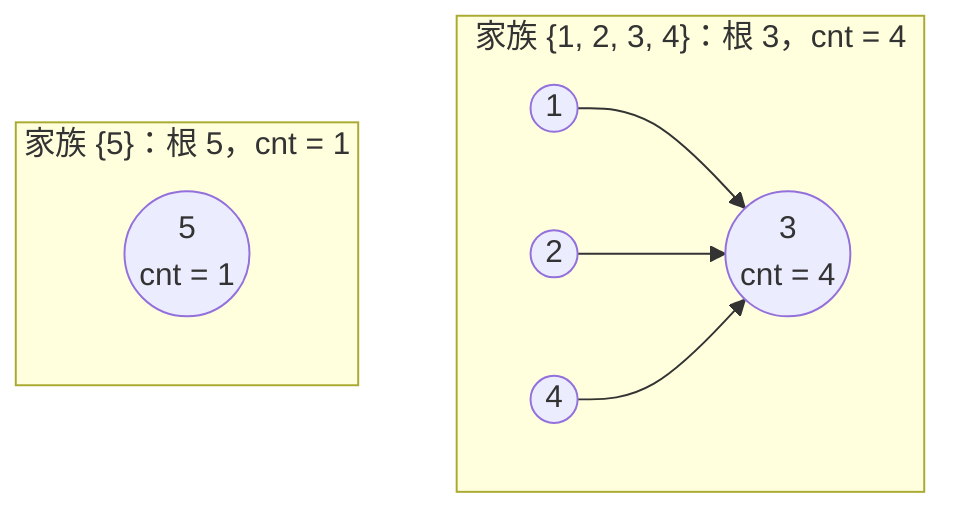

[[TOC]]

## 形式化题目

$n$ 个人（$n \leqslant 100\,000$），编号 $1 \dots n$，初始时每人自成一家族。"亲戚"是等价关系：若 $x$ 与 $y$ 是亲戚、$y$ 与 $z$ 是亲戚，则 $x$ 与 $z$ 也是亲戚；由对称性，$y$ 的亲戚也都是 $x$ 的亲戚。给定 $m \leqslant 200\,000$ 条混合操作：

- `M a b`：宣告 $a$ 与 $b$ 是亲戚——在"人"这张图上添加一条无向边，两个家族合并成一个；
- `Q a`：询问 $a$ 所在家族的人数。

对每条 `Q` 输出一行一个整数，即 $a$ 所在连通块的大小。

## 正解

### 思路

**朴素做法**：把亲戚关系存成邻接表，每个 `Q a` 从 $a$ 出发做一遍 BFS/DFS 数出连通块大小。单次询问 $O(n+m)$，询问最多 $2 \times 10^5$ 次，总量约 $O(nm) \approx 2 \times 10^{10}$，在 1s 时限内必然超时。

瓶颈在于"每次询问都把家族重新数一遍"，而家族人数在两次加边之间根本不会变；同时 `M` 操作只会把两个家族**合并**成一个，永远不会把一个家族拆开。信息只增不减、结构只会合并——这正是并查集的场景。

**并查集建模**：把每个家族表示成一棵"父亲树"——`father[x]` 存 $x$ 的父亲，树根代表整个家族，根的父亲是自己。在根上额外挂一个计数 `cnt[根] = 该家族人数`（初始 `cnt[i] = 1`）。于是两种操作都只需一步"找根"：

- `M a b`：求出两根 $r_a, r_b$；若不同，把小家族整棵挂到大家族根下，`cnt[新根] += cnt[旧根]`——一次加法就完成家族合并；若相同（自合并，如样例的 `M 3 2`、`M 3 1`），跳过，防止人数翻倍。
- `Q a`：输出 `cnt[find(a)]`。

树的形状无关紧要，人数信息跟着根走。为了让树保持扁平，代码用了两个经典优化：**按大小合并**（小挂大，树高不超过 $\log_2 n$）和**路径压缩**（find 时把途经点全部直接挂到根），二者结合使每次操作均摊 $O(\alpha(n))$，近似常数。

用题面样例追踪这 10 条操作，观察 `cnt` 如何只在根处更新（样例与第一组官方数据相同）：

| # | 操作 | 发生了什么 | 各根的 cnt | 输出 |
| --- | --- | --- | --- | --- |
| 1 | `M 3 2` | 2 挂到 3 | cnt[3] = 2 | — |
| 2 | `Q 4` | 4 自己是根 | cnt[4] = 1 | 1 |
| 3 | `M 1 2` | 1 挂到 3（3 侧更大） | cnt[3] = 3 | — |
| 4 | `Q 4` | 根是 3 | cnt[3] = 3 | 1 |
| 5 | `M 3 2` | 已同根，跳过 | 不变 | — |
| 6 | `Q 1` | 根是 3 | cnt[3] = 3 | 3 |
| 7 | `M 3 1` | 已同根，跳过 | 不变 | — |
| 8 | `Q 5` | 5 自己是根 | cnt[5] = 1 | 1 |
| 9 | `M 4 2` | 4 挂到 3 | cnt[3] = 4 | — |
| 10 | `Q 4` | 根是 3 | cnt[3] = 4 | 4 |

执行完毕后，内存里剩下的是这样一片父亲树森林（箭头表示"父亲指针"的方向，人数只记在根上）：

注意三点：人数查询 $O(1)$ 依赖"cnt 只记在根上"这一约定；树的实际形状与合并历史有关，但 `cnt[根]` 永远等于家族人数，与挂接方向无关；`Q 4` 两次答案不同（1 → 4），说明并查集是在线维护的，不是预先建好一张静态表。

!!! warning 官方数据里有一行坏数据 `M 4`
第二组官方数据 `a2.in` 的第 3 行是 `M 4`，少了第二个操作数。官方 `std.cpp` 用 `scanf("%d%d", &a, &b)` 读入：`a` 成功读到 4，第二个 `%d` 遇到下一行的 `M` 匹配失败——此时 C 的局部变量 `b` 保持上一次成功读入的值（第 1 条信息的 2），且这个 `M` 不会被消费，留给下一轮当操作符。本地编译运行官方 std，其输出恰为数据仓的 `a2.out`（`4 4 1 4`）。因此 `main.py` 用 `scanf_int(keep)` 复刻了"匹配失败 → 不消费 token、变量保持原值"的 scanf 语义；若用朴素的逐行 `split()` 解析，这一组要么崩溃要么输出不一致。
!!!

### 代码

@include-code(./main.py, python)

### 复杂度

- 时间：初始化 $O(n)$；每条操作均摊 $O(\alpha(n))$（按大小合并 + 路径压缩，$\alpha$ 是反阿克曼函数，可视作常数），总计 $O(n + m\,\alpha(n))$。$n \leqslant 10^5$、$m \leqslant 2 \times 10^5$ 下远低于 1s 限制（Python 本地实测单组约 0.02s）。
- 空间：`father`、`cnt` 两个长度 $n+1$ 的数组加输出缓冲，$O(n)$。

## 总结

"亲戚"是等价关系，家族就是连通块/等价类；当操作是**动态加边 + 连通块查询**时用并查集：根代表家族、`cnt` 挂在根上，合并即"小挂大 + 人数累加"，查询即"取根 + 读计数"。写代码时两个细节最容易出错：自合并（两根相同）必须跳过，否则 `cnt` 会翻倍；以及本题特有的坏行 `M 4`——要和官方 std 的 scanf 语义逐字节对齐，就得复刻"读取失败保持原值"的行为。同样的算法在 C++ 里就是带 `cnt` 的标准并查集模板（见官方 `std.cpp`），Python 侧只需注意读入与迭代路径压缩。
