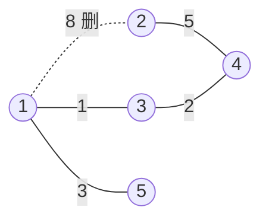

[[TOC]]

## 形式化题目

给定一张 $n$ 个点、$k$ 条边的无向带权图，第 $e$ 条边连接 $i_e, j_e$，权值为 $m_e$。
要求选择边集 $T \subseteq E$，使得：

1. $T$ 中不含任何回路；
2. $T$ 使得 $n$ 个点仍然连通（由题面答案是 $8$ 而非 $19$ 可确认这一条）。

求 $\displaystyle\sum_{e \in E \setminus T} m_e$ 的最大值，即被删掉的边的权值总和的最大值。

## 正解

### 思路

**第一步：把"删"换成"留"。** 每条边只有"删除"和"保留"两种命运，于是

$$\sum_{e \in E \setminus T} m_e \;=\; \sum_{e \in E} m_e \;-\; \sum_{e \in T} m_e$$

右边第一项是常数，只要读入时累加一次即可定下来；要让删边权和最大，就等价于让**保留边权和最小**。

**第二步：看清"保留边"长什么样。** 题面要求剩下的网络"没有回路"，这是说 $T$ 是一张森林，
边数至多 $n-1$。同时 $T$ 还必须让网络保持连通，而 $n$ 个点的连通图至少要有 $n-1$ 条边。
两个界一夹，$|T|$ 只能是 $n-1$：**$n$ 个点、$n-1$ 条边、连通、无环，这正是一棵生成树**。

于是问题化归成教科书式的模型：**求一张图的最小生成树（MST）**，答案就是总边权和减去 MST 的边权和。

**第三步：为什么可以用贪心。** 把边按权值从小到大排序，依次决定"这条边留不留"，
判断标准只有一条：如果它的两个端点已经连通，留下它就会成环，必须删；否则留下它。
这正是 Kruskal 算法。

贪心的正确性直觉是这样的：假设当前最轻的、两端点尚未连通的边是 $e$，若某棵最优生成树 $T^\*$ 不含 $e$，
那么把 $e$ 加进 $T^\*$ 会形成一个圈；圈上每条边的权值都不小于 $w(e)$（因为 $e$ 是最轻的可用边），
把圈上任意一条更重的边换成 $e$，总和不会变大，所以总存在一棵**包含 $e$** 的最优生成树。
删掉一条已有边、加入 $e$，这正是算法在做的事，因此每一步都不会走进死路。

**样例推演。** 样例的 5 个点、5 条边如下，边权的总和为 $8+1+3+5+2 = 19$。
图中实线是 Kruskal 最后保留下来的生成树，虚线是唯一被删除的边 $(1,2)$，边上的数字是权值。



按权升序扫描，并用并查集跟踪"哪些点已连通"：

| 扫描顺序 | 边 $(i,j)$ | $m$ | $i$ 与 $j$ 是否已连通 | 决定 | 累计保留权和 |
| --- | --- | --- | --- | --- | --- |
| 1 | $(1,3)$ | 1 | 否 | 保留 | 1 |
| 2 | $(3,4)$ | 2 | 否 | 保留 | 3 |
| 3 | $(1,5)$ | 3 | 否 | 保留 | 6 |
| 4 | $(2,4)$ | 5 | 否 | 保留 | 11 |
| 5 | $(1,2)$ | 8 | **是** | 跳过（删除） | 11 |

第 4 条边之后已经保留了 $n-1 = 4$ 条边，$1,2,3,4,5$ 全部连通；剩下的最重边 $(1,2)$ 权值 $8$
加上去必然成环，只能删掉。答案 $= 19 - 11 = 8$，与题面一致。

这张表说明了 Kruskal 的两个关键动作：**排序**决定"先挑最轻的"，**并查集**决定"是否成环"。

### 代码

@include-code(./main.py, python)

### 复杂度

- 时间复杂度：$O(n + k \log k)$。瓶颈是对 $k$ 条边排序（Timsort），Kruskal 主循环在路径压缩下
  是 $O(k\,\alpha(n))$，被排序支配。
- 空间复杂度：$O(n + k)$，分别是并查集数组和边表。

## 总结

- **换视角**：删边权和最大 $\to$ 保留边权和最小。凡是"删掉一批、使剩下的满足某性质、并使删掉的最多"
  的题，第一步几乎都是这个互补转换。
- **认模型**：连通 + 无回路 + $n-1$ 条边 $=$ 生成树。"让网络没有回路且保持连通"就是"求生成树"。
- **选算法**：最小生成树用 Kruskal（排序 + 并查集判环），$O(k \log k)$，写起来短且天然适合稀疏图。
- **实现技巧**：把边存成 `(m, i, j)` 三元组，Python 的元组排序直接给出按权升序的顺序，
  连 `key=` 都省了。

## 图示解析

这张图串起本题从建模到得到答案的主线：

```text
输入：n 个点、k 条带权边的无向图
`- 目标转换：删边权和最大 = 总权和 - 保留权和，只需最小化保留权和
   `- 结构识别：无回路 + 连通 + n 个点 => 保留边恰是一棵生成树
      `- 模型落地：求最小生成树(MST)
         `- 算法：Kruskal（边按权升序扫描）
            |- 两端未连通 -> 保留，并查集合并
            `- 两端已连通 -> 成环，必然删除
               `- 输出：总边权和 - MST 边权和
```

沿着这张图自下而上读，每一步都只用到上一步的结论：互补转换把"最大化删边"变成"最小化留边"，
结构识别把"无环且连通"变成"生成树"，最后生成树的最小权值由 Kruskal 的贪心逐步给出。
图中没有出现任何样例的具体数值，也没有依赖数据范围，因此它对任意规模的合法输入都成立。
