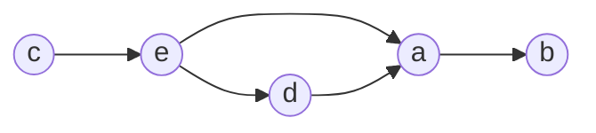
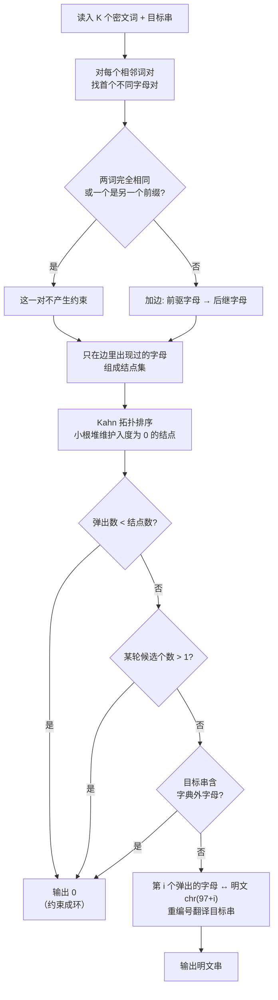

[[TOC]]

## 形式化题目

病毒对全文做同一个**小写字母置换** $\pi$：每个字母被替换成另一个字母，位置、长度、顺序都不变。
因此字典里 $K$ 个被感染的单词 $w_1, w_2, \dots, w_K$ 仍然满足

$$ \pi^{-1}(w_1) < \pi^{-1}(w_2) < \dots < \pi^{-1}(w_K), $$

其中 $<$ 是通常的字符串字典序。给定这 $K$ 个密文单词和一个待还原的密文串 $t$，
求 $\pi^{-1}$ 作用在 $t$ 上得到的明文串；若字典不足以唯一确定这个作用，输出 `0`。

**样例**

| 输入 | 输出 |
| --- | --- |
| 单词 `cebdbac` `cac` `ecd` `dca` `aba` `bac`，待还原 `cedab` | `abcde` |

## 正解

### 思路

**第一步：相邻词对能告诉我们什么。**

字典序是由**首个不同的字符**决定的。设相邻两词 $u, v$ 首个不同的位置是 $j$（下标从 1 开始），
那么 $u < v$ 当且仅当 $\pi^{-1}(u_j) < \pi^{-1}(v_j)$。位置 $j$ 之后的字符完全不参与比较，
提供不了任何信息。

于是每个相邻词对最多贡献**一条**约束：

$$ \text{密的 } u_j \;\longrightarrow\; \text{密的 } v_j
\qquad\text{表示「明的 } u_j \text{ 要排在 } v_j \text{ 前面」} $$

把所有这样的边收集起来，就得到一张 26 个结点以内的**有向图** $G$。

以样例逐对拆开，5 个相邻词对给出 5 条边：

| 相邻词对 | 首个不同位置 | 该位置的密文字母 | 边 |
| --- | --- | --- | --- |
| `cebdbac` , `cac` | 第 2 位 | `e` , `a` | `e` → `a` |
| `cac` , `ecd` | 第 1 位 | `c` , `e` | `c` → `e` |
| `ecd` , `dca` | 第 1 位 | `e` , `d` | `e` → `d` |
| `dca` , `aba` | 第 1 位 | `d` , `a` | `d` → `a` |
| `aba` , `bac` | 第 1 位 | `a` , `b` | `a` → `b` |

把这 5 条边画出来，就是一条链——**链就意味着一句话能数清谁排第几**：

从图中读出的唯一顺序是 `c → e → d → a → b`：`c` 是最小字母，`b` 是最大字母，
`e` 在 `d` 与 `a` 之前，`d` 又在 `a` 之前。这个顺序就是**明文序**。

**第二步：把明文序翻译成答案。**

明文序中第 $i$ 个密文字母（从 0 数起）对应明文字母 `chr(97 + i)`。
把样例的明文序 `c, e, d, a, b` 重编号：

| 位次 | 0 | 1 | 2 | 3 | 4 |
| --- | --- | --- | --- | --- | --- |
| 密文字母 | `c` | `e` | `d` | `a` | `b` |
| 明文字母 | `a` | `b` | `c` | `d` | `e` |

用这张表翻译 `cedab`，得到 `abcde`，与样例一致。

**第三步：怎么判定"字典不完整或出错"。**

这正是本题真正的难点，有三个出口，缺一不可：

1. **约束成环** —— 字典自相矛盾。例如同时要求"明的 `a` 在 `c` 前"和"明的 `c` 在 `a` 前"，
   根本不存在这样的明文序。样例 3 就是这样：`cabdbac`, `ccbdbac` 给出边 `a → c`，
   而 `ccbdbac`, `cac` 又给出边 `c → a`，两条边打成一个环，输出 `0`。
2. **同一层有多个候选** —— 字典给的信息不够多，存在不止一种合法明文序。
   用 Kahn 拓扑排序时，每一轮"入度为 0 的结点"就是当前可以排在最小的字母。
   只要某一轮同时有 $\geqslant 2$ 个这样的结点，把它们的先后对调仍然满足所有约束，
   说明字典无法唯一确定明文序。样例 1 逐轮的候选只有一个：

   | 轮次 | 候选 | 候选个数 | 弹出 | 新入度为 0 | 累计顺序 |
   | --- | --- | --- | --- | --- | --- |
   | 1 | `c` | 1 | `c` | `e` | `c` |
   | 2 | `e` | 1 | `e` | `d` | `c e` |
   | 3 | `d` | 1 | `d` | `a` | `c e d` |
   | 4 | `a` | 1 | `a` | `b` | `c e d a` |
   | 5 | `b` | 1 | `b` | — | `c e d a b` |

   候选个数始终是 1，所以明文序唯一。
3. **待还原串用到了字典没覆盖的字母** —— 例如输入 `1 / e / daead`：字典只有一个字母 `e`，
   而 `d`、`a` 从未在字典里出现过。字典根本没有约束过它们的位置，自然无法还原。

三个出口都用 `0` 表示，与"输出一个 0"的要求一致。

**两个容易写错的地方。**

第一，**只有出现在"首个不同字母对"里的字母才可以进图**。
只在别处当普通字符出现的字母，一条边都不连着它，入度为 0，
会被当成"最小字母"和真正的起点并列，把唯一的解误判成多解。
举个会踩到的例子：字典 `af, de, f` —— 相邻词对给出 `a → d`、`d → f`，
真正被定死的是 `a, d, f` 三者的相对顺序，字母 `e` 只是碰巧出现在 `de` 里；
若把 `e` 也建点，第一轮就有 `a` 和 `e` 两个候选，会错误地输出 `0`。

第二，**要跳过完全相同的相邻词对**。排列是严格递增的，字典里本不该有重复词，
但样例 2 就给了 `dca, dca`。若不跳过而直接去找"首个不同字符"，
`zip` 会一路比到底、返回 `None`，看起来没事；但如果照着"位置从 1 数到 $\max$ 长度"
的写法去实现（参考实现就是这么写的），就会读到词尾之后的越界内容，凭空造出一条边。
显式跳过是最稳的写法。

**为什么每轮只要取"任意一个"入度 0 的结点就够了**：拓扑排序的输出顺序不唯一，
但本题要么有唯一解、要么就是 `0`；用最小堆取最小编号，只是为了让输出稳定、便于复现。

### 代码

@include-code(./main.py, python)

### 复杂度

设字典的总字符数为 $S = \sum_i |w_i|$，字母表大小 $\sigma \leqslant 26$，边数 $E \leqslant \sigma^2$。

- 时间复杂度：$O(S)$ 建图（每个相邻词对扫描一次）+ $O(E \log \sigma)$ 拓扑排序 + $O(|t|)$ 翻译，
  总体 $O(S + \sigma^2 \log \sigma + |t|)$。$K \leqslant 50000$ 时实测约 0.02 秒。
- 空间复杂度：$O(S)$ 存下所有单词，加上 $O(\sigma + E)$ 的图，实测峰值约 15 MB，远低于 128 MB。

## 总结

- 字典序只由**首个不同字符**决定，所以每个相邻词对最多提供一条不等式；
  把所有不等式建图，问题就变成"求拓扑序并判断是否唯一"。
- 判定"字典不完整"用的是 Kahn 拓扑排序的**每轮候选个数**，不是边的总数：
  只有在同一层同时出现两个可选字母时，才真的存在两种合法明文序。
- 判定"字典出错"（成环）用的是"弹出结点数是否等于字母表大小"。
- 两个高频实现陷阱：只有出现在首个不同字母对里的字母才配当图的结点；
  完全相同的相邻词对必须跳过，否则会读越界字符造出假边。
- 待还原串里出现字典外的字母时，字典没有覆盖全部字母，同样输出 `0`。

## 图示解析

下面把整条解题路线串起来：从相邻词对出发建图，在图上做拓扑排序，
再用三个出口判定 `0`，最后用明文序重编号翻译目标串。

读图要点：菱形是三个**独立的出错出口**，任意一个成立都直接输出 `0`，
不能只检查其中一个。左上的分叉决定了哪些字母有资格进图——
这一步走错不会在样例上暴露，但会在"某字母只在无关位置出现"的数据上误判成多解。
最下面的重编号框是本解与"直接输出明文序"写法的区别：答案长度必须与目标串一致。
