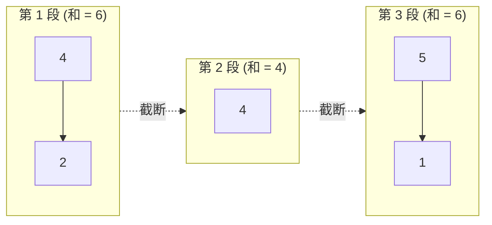

[[TOC]]

## 形式化题目

给定一个包含 $N$ 个非负整数的数列 $A_1, A_2, \dots, A_N$ 和一个正整数 $M$。

要求将该数列划分为若干个非空的连续子段，使得每一段内所有元素之和不超过 $M$。求满足条件的最少分段数量。

## 正解

### 思路

由于数列中的所有数均为非负数（$A_i \geqslant 0$），前缀和随着加入元素单调不减。

直观上，为了使总段数尽可能少，我们应该让每一段“尽可能多地容纳元素”。考虑贪心策略：
从左到右依次扫描数列中的每个元素，维护当前段内的元素之和：
1. 若将当前数加入当前段后，段内总和仍不超过 $M$，则贪心地将其并入当前段；
2. 若加入当前数会导致段内总和超过 $M$，则当前段无法再容纳更多元素，必须在当前数之前切断，另起一个新段，并将新段的初始和设为当前数。

**贪心选择性质与最优性证明**：
设某种划分方案在第 $j$ 段划分出的右边界为 $r_j$。假设当前最优解前 $j-1$ 段的右边界为 $r'_{j-1}$，而贪心解为 $r_{j-1}$，且满足 $r_{j-1} \geqslant r'_{j-1}$。
对于第 $j$ 段，最优解的元素取自区间 $[r'_{j-1} + 1, r'_j]$，其和 $\leqslant M$。
贪心解从 $r_{j-1} + 1$ 开始向右尽可能多地包含元素直到 $r_j$。因为所有数非负且 $r_{j-1} \geqslant r'_{j-1}$，区间 $[r_{j-1} + 1, r'_j]$ 的元素和必然不大于区间 $[r'_{j-1} + 1, r'_j]$ 的元素和，因而该区间和亦 $\leqslant M$。
这说明贪心解所能延伸到的右边界 $r_j$ 绝不会小于 $r'_j$（即 $r_j \geqslant r'_j$）。
由数学归纳法可知，贪心策略在完成每一段后覆盖的前缀长度都大于或等于任意其他方案。因此，贪心策略划分完整个序列所需的总段数必定是最少的。

以输入样例 $N=5, M=6$，数组为 $[4, 2, 4, 5, 1]$ 为例：
- 第 1 段：从 4 开始，$4+2=6 \leqslant 6$，继续看下一个数 4，和为 $6+4=10 > 6$，超出上限。因此第 1 段为 $[4, 2]$。
- 第 2 段：从 4 开始，下一个数 5，和为 $4+5=9 > 6$，超出上限。因此第 2 段为 $[4]$。
- 第 3 段：从 5 开始，$5+1=6 \leqslant 6$，到达序列末尾。第 3 段为 $[5, 1]$。

最终分为 3 段，划分过程如下图所示：

### 代码

@include-code(./main.py, python)

### 复杂度

- **时间复杂度**：$\mathcal{O}(N)$。每个元素仅遍历一次，段内求和与比较判断均为 $\mathcal{O}(1)$ 常数时间操作。
- **空间复杂度**：$\mathcal{O}(N)$。用于存储序列所有元素。

## 总结

本题是基础的连续子段贪心划分模型。因为元素均为非负数且要求连续子段，局部让每一段尽可能往右延伸不仅合法，而且留给后续段的前缀起点更靠右，具备严格的最优子结构。单次线性扫描即可求得最优解。
