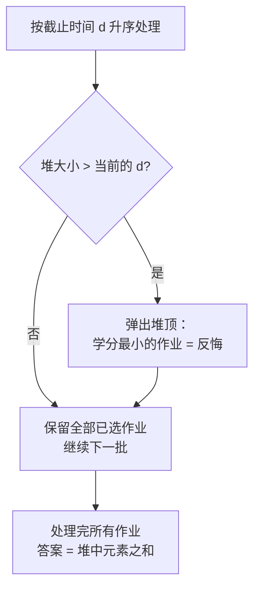

[[TOC]]

## 形式化题目

给定 $n$ 个作业，第 $i$ 个作业有截止时间 $d_i$（正整数，天）和学分 $w_i$。每个作业恰好吃掉一整天，且必须在第 $d_i$ 天结束前（即第 $1 \sim d_i$ 天中的某一天）完成才能获得学分 $w_i$。同一时间只能做一个作业。求能获得的最大总学分。

样例：$n = 7$，$(d, w)$ 依次为 $(1,6),(1,7),(3,2),(3,1),(2,4),(2,5),(6,1)$，答案是 $15$（例如依次完成作业 $2, 6, 3, 1, 7, 5, 4$）。

## 正解

### 思路

**朴素想法。** 一个直观的贪心是：按学分从大到小做，每个作业安排在不晚于其截止时间的、尚未被占用的最晚一天（最晚空闲天）。这个贪心本身是正确的，但如果用"每个作业从头扫一天"的方式找空闲天，单次是 $O(d_i)$，最坏总复杂度 $O(n^2)$，在 $n = 10^6$ 下无法接受；用并查集或链表可以优化到近线性，但还有另一种更容易写对的等价做法——反悔贪心。

**反悔贪心的推导。** 换一个视角：把作业按截止时间 $d$ 从小到大排序，依次"尝试接下"每个作业，维护当前已接下的作业集合 $S$，它必须始终满足合法性：**对任意前缀，已接作业总数不超过对应天数容量**。

按 $d$ 升序处理时，处理完截止时间为 $d$ 的所有作业后，$|S| \leqslant d$ 就是完整的合法条件（更早的截止时间天然被更弱的条件覆盖）。于是每次把当前作业加入 $S$ 后检查：

- 若 $|S| \leqslant d$，仍然合法，直接保留；
- 若 $|S| > d$，必须丢弃一个作业。丢弃谁最优？丢弃当前这个或之前任何一个，效果都是让 $|S|$ 减一；为了让总学分最大，应丢弃 $S$ 中**学分最小**的那个——这就是"反悔"：之前接下的低学分作业让位给更有价值的选择。

**正确性要点。** 交换论证：设最优解 $OPT$ 与贪心解 $G$。按截止时间排序逐位对齐，若在截止时间为 $d$ 的作业上两者选择不同，可证总能把 $OPT$ 中该位置的作业换成 $G$ 所选（或所丢）的作业而不劣——若 $G$ 选了 $OPT$ 没选的作业 $x$，则 $OPT$ 里必有一个 $G$ 没选的 $y$，且 $w_y \leqslant w_x$（否则贪心在第 $y$ 批次容量冲突时会丢 $x$ 而不是留 $x$），互换后 $OPT$ 不减；若 $G$ 丢了 $OPT$ 选的作业，同理被保留的替代者学分不小于它。归纳即得 $w(G) \geqslant w(OPT)$。

**实现。** 用小根堆维护已接作业的学分：

1. 所有作业按 $(d, w)$ 排序（$d$ 升序）；
2. 依次把 $w$ 入堆；若堆大小超过当前 $d$，弹出堆顶（最小学分）；
3. 答案为最终堆中元素之和。

用样例演示该过程（堆按学分小根）：

| 步骤 | 作业 $(d, w)$ | 操作后堆内容（学分） | 说明 |
| --- | --- | --- | --- |
| 1 | $(1, 6)$ | $\{6\}$ | 大小 $1 \leqslant 1$，保留 |
| 2 | $(1, 7)$ | $\{7\}$ | 大小 $2 > 1$，弹出最小的 $6$ |
| 3 | $(2, 4)$ | $\{7, 4\}$ | 大小 $2 \leqslant 2$，保留 |
| 4 | $(2, 5)$ | $\{7, 5\}$ | 大小 $3 > 2$，弹出最小的 $4$ |
| 5 | $(3, 2)$ | $\{7, 5, 2\}$ | 大小 $3 \leqslant 3$，保留 |
| 6 | $(3, 1)$ | $\{7, 5, 2\}$ | 大小 $4 > 3$，新来的 $1$ 即最小，弹出 |
| 7 | $(6, 1)$ | $\{7, 5, 2, 1\}$ | 大小 $4 \leqslant 6$，保留 |

表后观察：最终堆为 $\{7, 5, 2, 1\}$，和为 $15$，与样例一致。注意第 2、4 步的"弹出"就是反悔——第 2 步丢掉先来的 $6$ 保住更大的 $7$，第 4 步丢掉 $4$ 保住 $5$；而被丢的作业对应的天数名额总是可以被后来者补上的，因为堆大小约束始终对着当前最大的截止时间检查。

### 代码

@include-code(./main.py, python)

### 复杂度

排序 $O(n \log n)$，每个作业至多一次入堆一次出堆，总计 $O(n \log n)$ 时间、$O(n)$ 空间。$n \leqslant 10^6$ 时轻松通过（Python 下读入用 `sys.stdin.buffer.read()` 一次性完成）。

## 总结

本题是"反悔贪心"的经典模型：贪心策略允许撤回之前的选择，用堆快速定位"最后悔"的那个（学分最小者）。识别信号是——按某个维度（截止时间）排序逐个决策、有容量约束（每天一个作业）、目标最大化权值和且权值可比较。同类型题目还有"老鼠和猫的交易"" jq 集合"系列；与之等价的另一写法是"学分从大到小 + 并查集找最晚空闲天"，两者复杂度同阶，反悔堆的代码量更短、也更不易写错。

## 图示解析

### 反悔贪心与"按学分贪心"的等价性

图后观察：整条流程只有一个决策点——容量超限时丢谁。因为丢弃任何一个作业都能恢复合法，且各候选对未来的影响完全对称（都只是腾出一个名额），所以丢学分最小的即为最优，这正是与"按学分从大到小、占用最晚空闲天"的贪心等价的原因。
