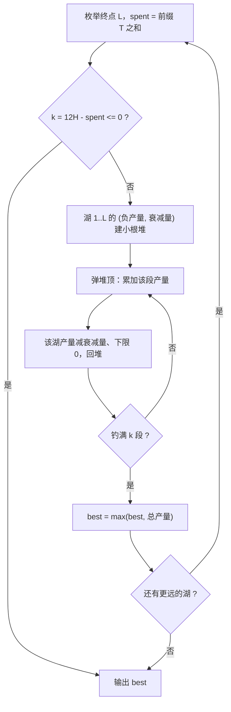

[[TOC]]

## 形式化题目

湖排成一排，编号 $1..n$，只能从左往右走。把总时间 $H$ 小时切成 $12H$ 个「5 分钟段」：

- 在湖 $i$ 钓一段的产量：第一段是 $F_i$，以后每段比上一段少 $D_i$，减到负数按 $0$ 计；
- 从湖 $i$ 走到湖 $i+1$ 占用 $T_i$ 段（即 $5 \times T_i$ 分钟）。

从湖 $1$ 出发，选一个终点湖 $L$，路上的 $\sum_{i<L}T_i$ 段用来走路，剩下的段可以任意分配给
湖 $1..L$ 钓鱼（在某湖可以一段都不钓）。求钓到的鱼总数最大是多少。

样例（$n=3,\ H=1,\ F=[4,5,6],\ D=[1,2,1],\ T=[1,2]$）按"最远走到哪个湖"列出全部路线：

| 最远走到湖 $L$ | 路程（段） | 可钓鱼段数 $k$ | 这条路线的最优取法 | 合计 |
| --- | --- | --- | --- | --- |
| 1 | 0 | 12 | 4 3 2 1（之后全为 0） | 10 |
| 2 | 1 | 11 | 5 4 3 3 2 1 1 | 19 |
| 3 | 3 | 9 | 6 5 5 4 4 3 3 3 2 | **35** |

表格每行是一种"路线"：终点一定，路程就固定，$k = 12H - \sum_{i<L}T_i$ 段全都可以自由分配；
第四列是 $1..L$ 号湖所有"某一段产量"里最大的 $k$ 个，它们的和就是这条路线的最好成绩。
第 3 行的 9 个值恰好对应 3 号湖 4 段（$6,5,4,3$）、2 号湖 2 段（$5,3$）、1 号湖 3 段（$4,3,2$），
正是题面样例解释的方案，所以答案是 $35$。

## 正解

### 思路

**朴素做法与瓶颈。** 最直接的做法是把决策完整枚举：终点选哪、每个湖各钓几段。
这是一个组合数级别的分配方案枚举，$n$ 和 $12H$ 稍大就不可行。瓶颈在于把**段的分配**
当成了搜索空间，而收益其实只取决于各湖的段数，而且每个湖的边际产量是递减的——
这种结构允许逐段贪心，不需要组合枚举。

**关键观察一：路线只由"最远走到哪"决定。** 只能向右走、不折返，所以钓过的湖一定是
前缀 $\{1,\dots,L\}$，走路耗时恒为 $\mathrm{travel}(L)=\sum_{i<L}T_i$，与钓鱼安排无关。
枚举 $L=1..n$，路程固定后，剩下的 $k(L)=12H-\mathrm{travel}(L)$ 段**怎么分、按什么顺序钓都行**，
原问题就拆成了 $n$ 个互相独立的"预算分配"子问题。又因为 $k(L)$ 随 $L$ 单调不增，
一旦 $k(L)\le 0$，更远的湖更没时间钓，可以直接停止枚举。

**关键观察二：每个湖提供一串递减的"段产量"。** 在湖 $i$ 钓第 $k+1$ 段的产量是
$\max(F_i-kD_i,\ 0)$，随 $k$ 非增（$D_i \geqslant 0$，减到 $0$ 后一直保持 $0$）：

$$
i\ \text{号湖的段产量表}= \bigl[F_i,\ \max(F_i-D_i,0),\ \max(F_i-2D_i,0),\ \dots\bigr]
$$

"在湖 $i$ 钓 $c$ 段"等价于"取走这张表的前 $c$ 项"。

**合并：每次取当前最大。** 固定 $L$ 后，把 $1..L$ 号湖的段产量表合并，取最大的 $k$ 项求和
就是这条路线的最优成绩。交换论证：若某方案取了同湖靠后的项却漏了更靠前的项（后者值更大），
交换后总和不变小，故存在最优解恰好是"前 $k$ 大"。实现上用小根堆维护"每湖当前这一段的产量"
（存负数），每段弹堆顶即全局产量最高的湖：累加产量，该湖产量减自己的 $D_i$（下限 $0$）再回堆。

图里值得留意两处：分支 B 之所以敢直接终止，靠的是 $k(L)$ 单调不增（观察一）；
内层 D→E→F 的环每转一圈只消耗一段预算、只更新一个湖，这正是"逐段贪心"的字面含义，
$D_i=0$ 时湖会沿这个环原样压回，也不需要任何特判。

**实现里的一个坑。** 堆元素必须带上"这个产量属于哪个湖"的信息（本文把衰减量随产量一起入堆）。
只存产量、靠字典反查湖号的写法，在两个湖当前产量并列时会配错衰减量：
$F=[8,8]$、$D=[9,1]$、$k=3$ 时正确答案是 $8+8+7=23$，反查写法两次都把 $8$ 归给同一个湖，
第三段只剩 $0$，算出 $16$。

**与展开排序写法的关系。** 也可以把各湖段产量表显式展开、排序后取前 $k$ 大
（同仓库 [鱼塘钓鱼](https://roj.ac.cn/problem/1373) 的做法）。但本题 $D_i$ 允许为 $0$，
此时产量表是常数列，每湖最长要展开 $k$ 项，池子大小 $O(nk)$；堆写法每次只多 $\log n$，
且 $D_i=0$ 时"弹出再原样压回"天然正确，无需特判。

### 代码

@include-code(./main.py, python)

### 复杂度

外层枚举终点最多 $n$ 轮；每轮建堆 $O(n)$，弹/回堆 $k \leqslant 12H$ 次各 $O(\log n)$，
总时间 $O(n \cdot 12H \cdot \log n)$，空间 $O(n)$。
按官方测试数据的范围（$n \leqslant 25$、$H \leqslant 16$，即 $12H \leqslant 192$）估算，
总共约 $2 \times 10^4$ 次堆操作。实测官方 10 组数据单组最慢 0.020s、峰值内存 14.8MB，
远在 1s / 128MB 限制之内。

## 总结

本题的解法可以浓缩成一句话：**先把"路线"和"段分配"解耦，再用堆把段分配变成"反复取当前最大"。**

- 枚举最远走到第 $L$ 个湖：终点一定，路程 $\mathrm{travel}(L)$ 就一定，
  剩下的 $12H-\mathrm{travel}(L)$ 段是可以自由支配的预算；
- 每个湖的段产量递减，"从前往后取"的前缀约束在"取前 $k$ 大"时自动满足；
- 小根堆每次弹全局产量最高的湖，弹 $k$ 次就是最优分配；$D_i=0$ 时同一湖反复产出同一产量，
  堆写法无需任何特判。

对比按分钟计时的同模型题（roj/1373，$d_i \geqslant 1$），本题有两处小变化：
时间单位换成 5 分钟段（总预算 $12H$），以及 $D_i$ 允许为 $0$（产量表不再严格递减、甚至恒定）。
它们都不动摇"解耦 + 贪心取前 $k$ 大"的骨架，只是让堆实现比展开排序更合适——
这也是"递减边际收益 + 预算分配"这类问题的一个通用实现经验：**让堆自己携带身份信息**。
