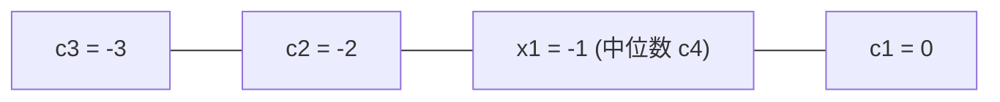

[[TOC]]

## 形式化题目

给定一个长度为 $n$ 的环形序列 $a_1, a_2, \dots, a_n$，满足所有数之和能够被 $n$ 整除。
每次操作可以在相邻元素间传递 $1$ 单位数值，代价为 $1$。
求使序列中所有元素最终均等于平均数 $\bar{a} = \frac{1}{n} \sum_{i=1}^n a_i$ 的最小总代价。

## 正解

### 思路

本题是经典的「环状均分纸牌」问题。

#### 1. 变量定义与平衡方程

设第 $i$ 个人给第 $i-1$ 个人传递了 $x_i$ 颗糖果（其中第 $1$ 个人向第 $n$ 个人传递 $x_1$ 颗；若 $x_i < 0$，表示第 $i-1$ 个人向第 $i$ 个人传递了 $-x_i$ 颗）。

对于第 $i$ 个人，最终持有的糖果数应为平均数 $\bar{a}$：
- 初始拥有 $a_i$ 颗；
- 给了第 $i-1$ 个人 $x_i$ 颗；
- 从第 $i+1$ 个人处得到了 $x_{i+1}$ 颗。

由此可列出每个人的平衡方程：
$$a_i - x_i + x_{i+1} = \bar{a} \quad (1 \leqslant i \leqslant n)$$
其中下标循环，即 $x_{n+1} = x_1$。

每传递一颗糖果的代价为 $1$，因此总代价为：
$$\sum_{i=1}^n |x_i|$$

#### 2. 代数递推与转化

将平衡方程移项变形：
$$x_{i+1} = x_i - (a_i - \bar{a})$$

依次展开所有变量，用自由变量 $x_1$ 表示其余所有 $x_i$：
$$x_1 = x_1 - 0$$
$$x_2 = x_1 - (a_1 - \bar{a})$$
$$x_3 = x_2 - (a_2 - \bar{a}) = x_1 - \sum_{k=1}^2 (a_k - \bar{a})$$
$$\dots$$
$$x_i = x_1 - \sum_{k=1}^{i-1} (a_k - \bar{a})$$

令：
$$c_1 = 0$$
$$c_i = \sum_{k=1}^{i-1} (a_k - \bar{a}) \quad (2 \leqslant i \leqslant n)$$

则有：
$$x_i = x_1 - c_i$$

因此，目标函数可化简为：
$$\sum_{i=1}^n |x_i| = \sum_{i=1}^n |x_1 - c_i|$$

#### 3. 几何模型：数轴上的中位数

上式在几何上等价于：在数轴上有 $n$ 个固定点 $c_1, c_2, \dots, c_n$，我们需要选择一个实数点 $x_1$，使得 $x_1$ 到这 $n$ 个点的距离之和最小。

由绝对值函数的性质可知，$x_1$ 取点集 $c$ 的中位数时距离之和取得最小值。

#### 4. 样例图示推演

以输入样例为例：$n = 4$，糖果数分别为 $[1, 2, 5, 4]$。
- 总糖果数为 $1 + 2 + 5 + 4 = 12$，平均数 $\bar{a} = 3$。
- 计算偏差 $a_i - \bar{a}$：$[-2, -1, 2, 1]$。
- 构造差值序列 $c$：
  - $c_1 = 0$
  - $c_2 = c_1 + (a_1 - \bar{a}) = 0 + (-2) = -2$
  - $c_3 = c_2 + (a_2 - \bar{a}) = -2 + (-1) = -3$
  - $c_4 = c_3 + (a_3 - \bar{a}) = -3 + 2 = -1$
- 得到数组 $c = [0, -2, -3, -1]$。
- 将 $c$ 排序后为 $[-3, -2, -1, 0]$。
- 取中位数 $x_1 = c[4 // 2] = c[2] = -1$。
- 计算总代价：$|-1 - (-3)| + |-1 - (-2)| + |-1 - (-1)| + |-1 - 0| = 2 + 1 + 0 + 1 = 4$。

### 代码

@include-code(./main.py, python)

### 复杂度

- **时间复杂度**：计算平均数与前缀和差值数组 $c$ 耗时 $O(n)$；排序 $c$ 耗时 $O(n \log n)$；累加曼哈顿距离耗时 $O(n)$。总时间复杂度为 $O(n \log n)$。在 $n = 10^6$ 时，Python 运行耗时约 $0.2 \sim 0.3$ 秒，完全在时限内。
- **空间复杂度**：存储原数组与差值数组 $c$ 占用 $O(n)$ 空间。

## 总结

环状均分纸牌相比普通链状问题的难点在于闭环带来的流动自由度。通过设定相邻传递量的未知数并列出平衡方程，我们利用前缀和消元将 $n$ 个关联变量统一表达为 $x_1 - c_i$ 的形式，成功将代数求和极值问题转化为数轴绝对值距离之和极小化问题，最终利用中位数贪心高效求得全局最优解。
