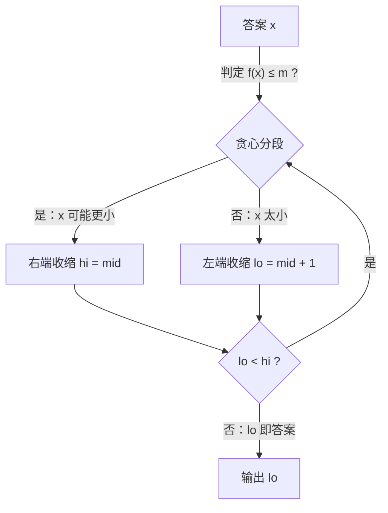

[[TOC]]

## 形式化题目

给定长度为 $n$ 的非负整数数列 $a_1, \dots, a_n$ 与整数 $m$（$m \leqslant n$），把数列
划分成 $m$ 个**连续**的段，最小化所有段和中的最大值。

## 正解

### 思路

直接枚举分段方案是指数级的。换一个方向：**先猜答案，再验证**。

设答案为 $x$，即"每段和都不超过 $x$"。给定 $x$，最少需要几段可以用贪心求出：从左到右
依次累加，当前元素放得进本段就放，放不下就另起一段。这样每一段都尽量装满，得到的段数
$f(x)$ 就是以 $x$ 为上限时的最少段数；只要 $f(x) \leqslant m$，就存在一种合法的分法。

关键观察是**单调性**：$x$ 越大，每段能装下的元素越多，$f(x)$ 只会变少或不变。所以
$f(x) \leqslant m$ 在 $x$ 上具有单调性，可以对 $x$ 二分：

- 下界取 $\max a_i$：任何一段至少要装下一个元素；
- 上界取 $\sum a_i$：整个数列一段分完。

二分中点 $mid$，若 $f(mid) \leqslant m$ 则答案 $\leqslant mid$，收缩右端；否则收缩左端。

用样例「4 2 4 5 1，$m=3$」演示判定过程，下表展示不同上限 $x$ 对应的贪心分段与最少段数：

| 上限 $x$ | 贪心分段 | 最少段数 $f(x)$ | $f(x) \leqslant 3$？ |
| --- | --- | --- | --- |
| 5 | [4] [2] [4] [5] [1] | 5 | 否 |
| 6 | [4 2] [4] [5 1] | 3 | 是 |
| 9 | [4 2] [4 5] [1] | 3 | 是 |
| 15 | [4 2 4 5] [1] | 2 | 是 |

可以看到 $f(x)$ 随 $x$ 增大单调不增，从"否"翻转为"是"的临界点就是答案 $6$，
与样例输出一致。

### 代码

@include-code(./main.py, python)

### 复杂度

- 时间：每次判定 $O(n)$，二分 $O(\log \sum a_i)$ 轮，总计 $O(n \log \sum a_i)$。
  本题 $n \leqslant 10^5$、$a_i \leqslant 10^5$ 量级，非常宽裕。
- 空间：$O(n)$ 存数列。

## 总结

本题是"最大化最小值 / 最小化最大值"类问题的经典范式：**答案本身具有单调性时，二分答案
+ 贪心判定**。贪心判定的正确性来自交换论证——把任何合法方案的第一段右端点右移到贪心
位置仍然合法，逐段调整后段数不会增加。二分结束的条件是左右端点重合，此时 $lo$ 就是
最小的可行上限。

## 图示解析

上图展示二分答案的整体流程：每轮用 $O(n)$ 贪心求出上限 $mid$ 下的最少段数，按可行与
否收缩二分区间。观察重点是"判定可行 → 答案在左半"、"判定不可行 → 答案在右半"这一
单调收缩过程，它保证最终左右端点重合处就是最小的可行上限。
